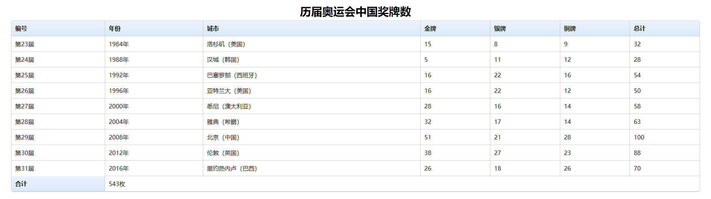

**完整代码：**

```html
<!doctype html>
<html>
    <head>
        <meta charset="utf-8">
        <title></title>
        <style type="text/css">

        * {
            margin: 0;
            padding: 0;
        }
        body { padding: 10px 30px; }

        table {
            *border-collapse: collapse; /* IE7 and lower */
            border-spacing: 0;
            width: 100%;
        }
        caption { /*设置表格标题 */
            padding: 0 0 5px 0;
            text-align: center; 		 /*水平居中*/
            font-size: 30px;		 /*字体大小*/
            font-weight: bold;		 /*字体加粗*/
        }
        /*========bordered table========*/
        .bordered {
            border: solid #ccc 1px;
            -moz-border-radius: 6px;
            -webkit-border-radius: 6px;
            border-radius: 6px;
            -webkit-box-shadow: 0 1px 1px #ccc;
            -moz-box-shadow: 0 1px 1px #ccc;
            box-shadow: 0 1px 1px #ccc;
        }
        .bordered tr {
            -o-transition: all 0.1s ease-in-out;
            -webkit-transition: all 0.1s ease-in-out;
            -moz-transition: all 0.1s ease-in-out;
            -ms-transition: all 0.1s ease-in-out;
            transition: all 0.1s ease-in-out;
        }
        .bordered .highlight,  .bordered tr:hover { background: #fbf8e9; }
        .bordered td,  .bordered th {
            border-left: 1px solid #ccc;
            border-top: 1px solid #ccc;
            padding: 10px;
            text-align: left;
        }
        .bordered th {
            background-color: #dce9f9;
            background-image: -webkit-gradient(linear, left top, left bottom, from(#ebf3fc), to(#dce9f9));
            background-image: -webkit-linear-gradient(top, #ebf3fc, #dce9f9);
            background-image: -moz-linear-gradient(top, #ebf3fc, #dce9f9);
            background-image: -ms-linear-gradient(top, #ebf3fc, #dce9f9);
            background-image: -o-linear-gradient(top, #ebf3fc, #dce9f9);
            background-image: linear-gradient(top, #ebf3fc, #dce9f9);
         filter: progid:DXImageTransform.Microsoft.gradient(GradientType=0, startColorstr=#ebf3fc, endColorstr=#dce9f9);
            -ms-filter: "progid:DXImageTransform.Microsoft.gradient (GradientType=0, startColorstr=#ebf3fc, endColorstr=#dce9f9)";
            -webkit-box-shadow: 0 1px 0 rgba(255,255,255,.8) inset;
            -moz-box-shadow: 0 1px 0 rgba(255,255,255,.8) inset;
            box-shadow: 0 1px 0 rgba(255,255,255,.8) inset;
            border-top: none;
            text-shadow: 0 1px 0 rgba(255,255,255,.5);
        }
        .bordered td:first-child,  .bordered th:first-child { border-left: none; }
        .bordered th:first-child {
            -moz-border-radius: 6px 0 0 0;
            -webkit-border-radius: 6px 0 0 0;
            border-radius: 6px 0 0 0;
        }
        .bordered th:last-child {
            -moz-border-radius: 0 6px 0 0;
            -webkit-border-radius: 0 6px 0 0;
            border-radius: 0 6px 0 0;
        }
        .bordered tr:last-child td:first-child {
            -moz-border-radius: 0 0 0 6px;
            -webkit-border-radius: 0 0 0 6px;
            border-radius: 0 0 0 6px;
        }
        .bordered tr:last-child td:last-child {
            -moz-border-radius: 0 0 6px 0;
            -webkit-border-radius: 0 0 6px 0;
            border-radius: 0 0 6px 0;
        }


        </style>
    </head>

    <body>
        <table summary="历届奥运会中国奖牌数"   class="bordered">
            <caption>
            历届奥运会中国奖牌数
            </caption>
            <thead>
                <tr>
                    <th>编号</th>
                    <th>年份</th>
                    <th>城市</th>
                    <th>金牌</th>
                    <th>银牌</th>
                    <th>铜牌</th>
                    <th>总计</th>
                </tr>
            </thead>
            <tbody>
                <tr>
                    <td>第23届</td>
                    <td>1984年</td>
                    <td>洛杉矶（美国）</td>
                    <td>15</td>
                    <td>8</td>
                    <td>9</td>
                    <td>32</td>
                </tr>
                <tr>
                    <td>第24届</td>
                    <td>1988年</td>
                    <td>汉城（韩国）</td>
                    <td> 5</td>
                    <td>11</td>
                    <td>12</td>
                    <td>28</td>
                </tr>
                <tr>
                    <td>第25届</td>
                    <td>1992年</td>
                    <td>巴塞罗那（西班牙）</td>
                    <td>16</td>
                    <td>22</td>
                    <td>16</td>
                    <td>54</td>
                </tr>
                <tr>
                    <td>第26届</td>
                    <td>1996年</td>
                    <td>亚特兰大（美国）</td>
                    <td>16</td>
                    <td>22</td>
                    <td>12</td>
                    <td>50</td>
                </tr>
                <tr>
                    <td>第27届</td>
                    <td>2000年</td>
                    <td>悉尼（澳大利亚）</td>
                    <td>28</td>
                    <td>16</td>
                    <td>14</td>
                    <td>58</td>
                </tr>
                <tr>
                    <td>第28届</td>
                    <td>2004年</td>
                    <td>雅典（希腊）</td>
                    <td>32</td>
                    <td>17</td>
                    <td>14</td>
                    <td>63</td>
                </tr>
                <tr>
                    <td>第29届</td>
                    <td>2008年</td>
                    <td>北京（中国）</td>
                    <td>51</td>
                    <td>21</td>
                    <td>28</td>
                    <td>100</td>
                </tr>
                <tr>
                    <td>第30届</td>
                    <td>2012年</td>
                    <td>伦敦（英国）</td>
                    <td>38</td>
                    <td>27</td>
                    <td>23</td>
                    <td>88</td>
                </tr>
                <tr>
                    <td>第31届</td>
                    <td>2016年</td>
                    <td>里约热内卢（巴西）</td>
                    <td>26</td>
                    <td>18</td>
                    <td>26</td>
                    <td>70</td>
                </tr>
            </tbody>
            <tfoot>
                <tr>
                    <th>合计</th>
                    <td colspan="6">543枚</td>
                </tr>
            </tfoot>
        </table>
    </body>
</html>
```

**运行效果如下：**
