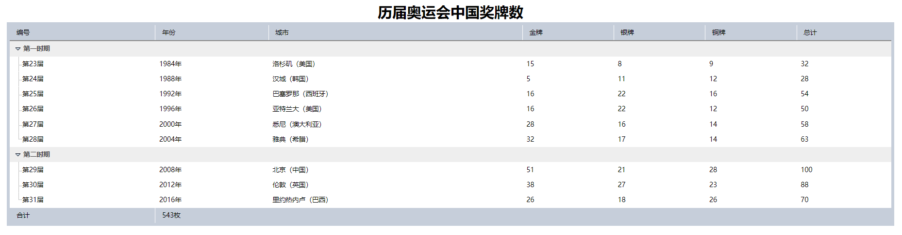

整个表格样式设计包含4个技巧：　

+ 适当修改数据表格的结构，使其更利于树形结构的设计。　

+ 借助背景图像应用技巧来设计树形结构标志。　

+ 借助伪类选择器来设计鼠标经过行时变换背景颜色。　

+ 通过边框和背景色来设计列标题的立体显示效果。

**完整代码：**

```html
<!doctype html>
<html>
    <head>
        <meta charset="utf-8">
        <title></title>
        <style type="text/css">
        body { font-family: "宋体" arial, helvetica, sans-serif; }
        table {
            border-collapse: collapse;
            font-size: 85%;
            line-height: 1.1;
            width: 96%;
            margin: auto;
            border:solid 6px #c6ceda;
        }
        caption { /*设置表格标题 */
            padding: 0 0 5px 0;
            text-align: center; 		 /*水平居中*/
            font-size: 30px;		 /*字体大小*/
            font-weight: bold;		 /*字体加粗*/
        }

        tr:hover, td.start:hover, td.end:hover { background: #FF9; }
        th, td { padding: .6em .6em; }
        thead th,tfoot th, tfoot td{
            font-weight: normal;
            text-align: left;
            padding-left: 1em;
            background: #c6ceda;
            border-color: #fff #fff #888 #fff;
            border-style: solid;
            border-width: 1px 1px 2px 1px;
        }


        tbody tr td:first-child {
            background: url(images/dots1.gif) 18px 54% no-repeat;
            padding-left: 26px;
        }
        tbody tr:first-child td  {
            background: #eee url(images/arrow.gif) no-repeat 12px 50%;
            padding-left: 28px;
            font-weight: bold;
            color: #444;
        }
        tbody tr:last-child td:first-child{
            background: url(images/dots2.gif) 18px 54% no-repeat;
            padding-left: 26px;
        }
        </style>
    </head>

    <body>
        <table summary="历届奥运会中国奖牌数">
            <caption>
            历届奥运会中国奖牌数
            </caption>
            <thead>
                <tr>
                    <th>编号</th>
                    <th>年份</th>
                    <th>城市</th>
                    <th>金牌</th>
                    <th>银牌</th>
                    <th>铜牌</th>
                    <th>总计</th>
                </tr>
            </thead>
            <tbody>
                <tr><td colspan="7">第一时期</td></tr>
                <tr>
                    <td>第23届</td>
                    <td>1984年</td>
                    <td>洛杉矶（美国）</td>
                    <td>15</td>
                    <td>8</td>
                    <td>9</td>
                    <td>32</td>
                </tr>
                <tr>
                    <td>第24届</td>
                    <td>1988年</td>
                    <td>汉城（韩国）</td>
                    <td> 5</td>
                    <td>11</td>
                    <td>12</td>
                    <td>28</td>
                </tr>
                <tr>
                    <td>第25届</td>
                    <td>1992年</td>
                    <td>巴塞罗那（西班牙）</td>
                    <td>16</td>
                    <td>22</td>
                    <td>16</td>
                    <td>54</td>
                </tr>
                <tr>
                    <td>第26届</td>
                    <td>1996年</td>
                    <td>亚特兰大（美国）</td>
                    <td>16</td>
                    <td>22</td>
                    <td>12</td>
                    <td>50</td>
                </tr>
                <tr>
                    <td>第27届</td>
                    <td>2000年</td>
                    <td>悉尼（澳大利亚）</td>
                    <td>28</td>
                    <td>16</td>
                    <td>14</td>
                    <td>58</td>
                </tr>
                <tr>
                    <td>第28届</td>
                    <td>2004年</td>
                    <td>雅典（希腊）</td>
                    <td>32</td>
                    <td>17</td>
                    <td>14</td>
                    <td>63</td>
                </tr>
            </tbody>
            <tbody>
                <tr><td colspan="7">第二时期</td></tr>    
                <tr>
                    <td>第29届</td>
                    <td>2008年</td>
                    <td>北京（中国）</td>
                    <td>51</td>
                    <td>21</td>
                    <td>28</td>
                    <td>100</td>
                </tr>
                <tr>
                    <td>第30届</td>
                    <td>2012年</td>
                    <td>伦敦（英国）</td>
                    <td>38</td>
                    <td>27</td>
                    <td>23</td>
                    <td>88</td>
                </tr>
                <tr>
                    <td>第31届</td>
                    <td>2016年</td>
                    <td>里约热内卢（巴西）</td>
                    <td>26</td>
                    <td>18</td>
                    <td>26</td>
                    <td>70</td>
                </tr>
            </tbody>
            <tfoot>
                <tr>
                    <th>合计</th>
                    <td colspan="6">543枚</td>
                </tr>
            </tfoot>
        </table>
    </body>
</html>
```

**运行效果如下：**



