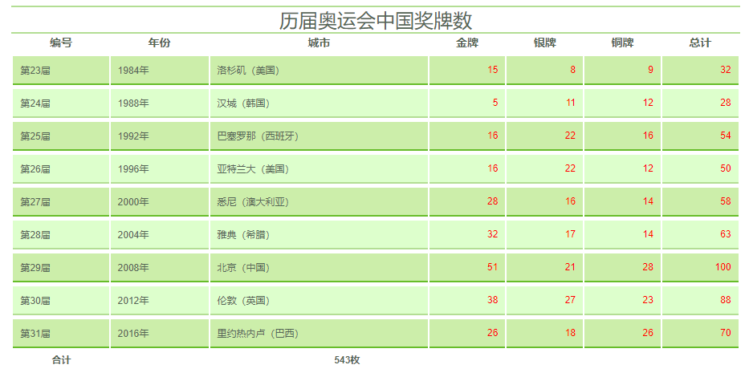

[toc]



<center><b>设计隔行变色的样式效果</b></center>

### 1. 操作步骤

第1步，新建 HTML5 档，设计表格结构。

```html
<table summary="历届奥运会中国奖牌数">
    <caption>
    历届奥运会中国奖牌数
    </caption>
    <col span="3"></col>
    <col span="4" style="color:red; text-align:right"></col>
    <thead>
        <tr>
            <th>编号</th>
            <th>年份</th>
            <th>城市</th>
            <th>金牌</th>
            <th>银牌</th>
            <th>铜牌</th>
            <th>总计</th>
        </tr>
    </thead>
    <tbody>
        <tr>
            <td>第23届</td>
            <td>1984年</td>
            <td>洛杉矶（美国）</td>
            <td>15</td>
            <td>8</td>
            <td>9</td>
            <td>32</td>
        </tr>
        <tr>
            <td>第24届</td>
            <td>1988年</td>
            <td>汉城（韩国）</td>
            <td> 5</td>
            <td>11</td>
            <td>12</td>
            <td>28</td>
        </tr>
        <tr>
            <td>第25届</td>
            <td>1992年</td>
            <td>巴塞罗那（西班牙）</td>
            <td>16</td>
            <td>22</td>
            <td>16</td>
            <td>54</td>
        </tr>
        <tr>
            <td>第26届</td>
            <td>1996年</td>
            <td>亚特兰大（美国）</td>
            <td>16</td>
            <td>22</td>
            <td>12</td>
            <td>50</td>
        </tr>
        <tr>
            <td>第27届</td>
            <td>2000年</td>
            <td>悉尼（澳大利亚）</td>
            <td>28</td>
            <td>16</td>
            <td>14</td>
            <td>58</td>
        </tr>
        <tr>
            <td>第28届</td>
            <td>2004年</td>
            <td>雅典（希腊）</td>
            <td>32</td>
            <td>17</td>
            <td>14</td>
            <td>63</td>
        </tr>
        <tr>
            <td>第29届</td>
            <td>2008年</td>
            <td>北京（中国）</td>
            <td>51</td>
            <td>21</td>
            <td>28</td>
            <td>100</td>
        </tr>
        <tr>
            <td>第30届</td>
            <td>2012年</td>
            <td>伦敦（英国）</td>
            <td>38</td>
            <td>27</td>
            <td>23</td>
            <td>88</td>
        </tr>
        <tr>
            <td>第31届</td>
            <td>2016年</td>
            <td>里约热内卢（巴西）</td>
            <td>26</td>
            <td>18</td>
            <td>26</td>
            <td>70</td>
        </tr>
    </tbody>
    <tfoot>
        <tr>
            <th>合计</th>
            <td colspan="4">543枚</td>
        </tr>
    </tfoot>
</table>
```

第2步，在头部区域 `<head>` 标签中插入一个`<style type="text/css">` 标签，在该标签中输入下面样式代码，定义表格样式和表格标题样式。

```css
table {
    background-color: #FFF;
    border: none;
    color: #565;
    font: 12px arial;
    width: 90%;
    margin: 12px auto;
}
table caption {
    font-size: 24px;
    border-bottom: 2px solid #B3DE94;
    border-top: 2px solid #B3DE94;
}
```

第3步，设计数据行单元格样式。

```css
tbody td, tbody th {
    background-color: #DFC;
    border-bottom: 2px solid #B3DE94;
    border-top: 3px solid #FFFFFF;
    padding: 9px;
}
```

第4步，设计脚注行单元格样式。

```css
tfoot td, tfoot th {
    font-weight: bold;
    padding: 4px 8px 6px 9px;
    text-align: center;
}
```

第5步，设计列标题行样式。

```css
thead th {
    font-size: 14px;
    line-height: 19px;
    padding: 0 8px 2px;
}
```

第6步，为最后4列单元格定义样式。

```css
tbody td+td+td+td{
    color:red;
    text-align:right;
}
```

第7步，设计隔行换色样式。

```css
tbody tr:nth-child(odd) td {
    background-color: #CEA;
    border-bottom: 2px solid #67BD2A;
}
tbody tr:hover td, tbody tr:hover th {
    background-color: #8b7;
    color: #fff;
}
```

### 2. 完整示例代码

```html
<!doctype html>
<html>
    <head>
        <meta charset="utf-8">
        <title></title>
        <style type="text/css">
        table {
            background-color: #FFF;
            border: none;
            color: #565;
            font: 12px arial;
            width: 90%;
            margin: 12px auto;
        }
        table caption {
            font-size: 24px;
            border-bottom: 2px solid #B3DE94;
            border-top: 2px solid #B3DE94;
        }

        tbody td, tbody th {
            background-color: #DFC;
            border-bottom: 2px solid #B3DE94;
            border-top: 3px solid #FFFFFF;
            padding: 9px;
        }
        tfoot td, tfoot th {
            font-weight: bold;
            padding: 4px 8px 6px 9px;
            text-align: center;
        }
        thead th {
            font-size: 14px;
            line-height: 19px;
            padding: 0 8px 2px;
        }

        tbody td+td+td+td{
            color:red;
            text-align:right;
        }
        tbody tr:nth-child(odd) td {
            background-color: #CEA;
            border-bottom: 2px solid #67BD2A;
        }
        tbody tr:hover td, tbody tr:hover th {
            background-color: #8b7;
            color: #fff;
        }
        </style>
    </head>
    <body>
        <table summary="历届奥运会中国奖牌数">
            <caption>
            历届奥运会中国奖牌数
            </caption>
            <col span="3"></col>
            <col span="4" style="color:red; text-align:right"></col>
            <thead>
                <tr>
                    <th>编号</th>
                    <th>年份</th>
                    <th>城市</th>
                    <th>金牌</th>
                    <th>银牌</th>
                    <th>铜牌</th>
                    <th>总计</th>
                </tr>
            </thead>
            <tbody>
                <tr>
                    <td>第23届</td>
                    <td>1984年</td>
                    <td>洛杉矶（美国）</td>
                    <td>15</td>
                    <td>8</td>
                    <td>9</td>
                    <td>32</td>
                </tr>
                <tr>
                    <td>第24届</td>
                    <td>1988年</td>
                    <td>汉城（韩国）</td>
                    <td> 5</td>
                    <td>11</td>
                    <td>12</td>
                    <td>28</td>
                </tr>
                <tr>
                    <td>第25届</td>
                    <td>1992年</td>
                    <td>巴塞罗那（西班牙）</td>
                    <td>16</td>
                    <td>22</td>
                    <td>16</td>
                    <td>54</td>
                </tr>
                <tr>
                    <td>第26届</td>
                    <td>1996年</td>
                    <td>亚特兰大（美国）</td>
                    <td>16</td>
                    <td>22</td>
                    <td>12</td>
                    <td>50</td>
                </tr>
                <tr>
                    <td>第27届</td>
                    <td>2000年</td>
                    <td>悉尼（澳大利亚）</td>
                    <td>28</td>
                    <td>16</td>
                    <td>14</td>
                    <td>58</td>
                </tr>
                <tr>
                    <td>第28届</td>
                    <td>2004年</td>
                    <td>雅典（希腊）</td>
                    <td>32</td>
                    <td>17</td>
                    <td>14</td>
                    <td>63</td>
                </tr>
                <tr>
                    <td>第29届</td>
                    <td>2008年</td>
                    <td>北京（中国）</td>
                    <td>51</td>
                    <td>21</td>
                    <td>28</td>
                    <td>100</td>
                </tr>
                <tr>
                    <td>第30届</td>
                    <td>2012年</td>
                    <td>伦敦（英国）</td>
                    <td>38</td>
                    <td>27</td>
                    <td>23</td>
                    <td>88</td>
                </tr>
                <tr>
                    <td>第31届</td>
                    <td>2016年</td>
                    <td>里约热内卢（巴西）</td>
                    <td>26</td>
                    <td>18</td>
                    <td>26</td>
                    <td>70</td>
                </tr>
            </tbody>
            <tfoot>
                <tr>
                    <th>合计</th>
                    <td colspan="4">543枚</td>
                </tr>
            </tfoot>
        </table>
    </body>
</html>
```

