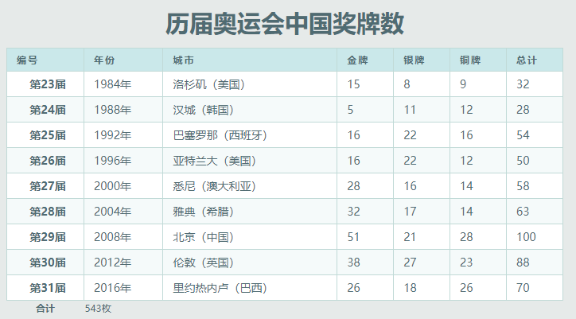

> 提示：为 `table` 添加 `border-collapse:collapse;` 声明，解决单元格边框分离问题。

**完整代码：**

```html
<!doctype html>
<html>
    <head>
        <meta charset="utf-8">
        <title></title>
        <style type="text/css">
        body {
            font-size: 12px;
            color: #4f6b72;
            background-color: #E6EAE9;
        }
        a {
            color: #c75f3e;
        }
        table {
            width: 700px;
            border-collapse: collapse;
        }
        caption {  /*设置表格标题 */
            padding: 0 0 12px 0;
            width: 700px;
            text-align: center;
            font-size: 30px;
            font-weight: bold;
        }
        thead th {
            color: #4f6b72;
            border: 1px solid #C1DAD7;
            letter-spacing: 2px;
            text-align: left;
            padding: 6px 6px 6px 12px;
            background: #CAE8EA;
        }
        tbody {
            background: #fff;
        }
        tbody th, tbody td {
            border: 1px solid #C1DAD7;
            font-size: 14px;
            padding: 6px 6px 6px 12px;
            color: #4f6b72;
        }
        tbody tr:nth-child(2n) {
            background: #F5FAFA;
            color: #797268;
        }
        </style>
    </head>

    <body>
        <table summary="历届奥运会中国奖牌数">
            <caption>
            历届奥运会中国奖牌数
            </caption>
            <thead>
                <tr>
                    <th>编号</th>
                    <th>年份</th>
                    <th>城市</th>
                    <th>金牌</th>
                    <th>银牌</th>
                    <th>铜牌</th>
                    <th>总计</th>
                </tr>
            </thead>
            <tbody>
                <tr>
                    <th>第23届</th>
                    <td>1984年</td>
                    <td>洛杉矶（美国）</td>
                    <td>15</td>
                    <td>8</td>
                    <td>9</td>
                    <td>32</td>
                </tr>
                <tr>
                    <th>第24届</th>
                    <td>1988年</td>
                    <td>汉城（韩国）</td>
                    <td> 5</td>
                    <td>11</td>
                    <td>12</td>
                    <td>28</td>
                </tr>
                <tr>
                    <th>第25届</th>
                    <td>1992年</td>
                    <td>巴塞罗那（西班牙）</td>
                    <td>16</td>
                    <td>22</td>
                    <td>16</td>
                    <td>54</td>
                </tr>
                <tr>
                    <th>第26届</th>
                    <td>1996年</td>
                    <td>亚特兰大（美国）</td>
                    <td>16</td>
                    <td>22</td>
                    <td>12</td>
                    <td>50</td>
                </tr>
                <tr>
                    <th>第27届</th>
                    <td>2000年</td>
                    <td>悉尼（澳大利亚）</td>
                    <td>28</td>
                    <td>16</td>
                    <td>14</td>
                    <td>58</td>
                </tr>
                <tr>
                    <th>第28届</th>
                    <td>2004年</td>
                    <td>雅典（希腊）</td>
                    <td>32</td>
                    <td>17</td>
                    <td>14</td>
                    <td>63</td>
                </tr>
                <tr>
                    <th>第29届</th>
                    <td>2008年</td>
                    <td>北京（中国）</td>
                    <td>51</td>
                    <td>21</td>
                    <td>28</td>
                    <td>100</td>
                </tr>
                <tr>
                    <th>第30届</th>
                    <td>2012年</td>
                    <td>伦敦（英国）</td>
                    <td>38</td>
                    <td>27</td>
                    <td>23</td>
                    <td>88</td>
                </tr>
                <tr>
                    <th>第31届</th>
                    <td>2016年</td>
                    <td>里约热内卢（巴西）</td>
                    <td>26</td>
                    <td>18</td>
                    <td>26</td>
                    <td>70</td>
                </tr>
            </tbody>
            <tfoot>
                <tr>
                    <th>合计</th>
                    <td colspan="6">543枚</td>
                </tr>
            </tfoot>
        </table>
    </body>
</html>
```

**运行效果如下：**



