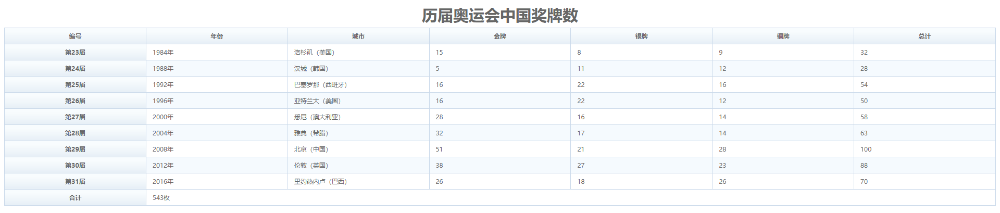

> 提示：`table-layout` 是 CSS 定义的一个标准属性，用来设置表格布局的算法，取值包括 `auto` 和 `fixed` 。当取值为 `auto` 时，则布局将基于单元格内包含的内容来进行，表格在每一单元格内所有内容读取计算之后才会显示出来。当取值为 `fixed` 时，表示固定布局算法，在这种算法中，表格和列的宽度取决于 `col` 对象的宽度总和，如果没有指定，则根据第一行每个单元格的宽度。如果表格没有指定宽度，则表格被呈递的默认宽度为 100%。设置 `auto` 布局算法，需要进行两次布局计算，影响客户端的解析速度，而 `fixed` 布局算法仅需要一次计算，所以速度非常快。

**完整代码：**

```html
<!doctype html>
<html>
    <head>
        <meta charset="utf-8">
        <title></title>
        <style type="text/css">
        table {
            font-size: 12px;
            table-layout: fixed;
            empty-cells: show;
            border-collapse: collapse;
            margin: 0 auto;
            border: 1px solid #cad9ea;
            color: #666;
            width:100%;
        }
        caption { /*设置表格标题 */
            padding: 0 0 5px 0;
            text-align: center; 		 /*水平居中*/
            font-size: 30px;		 /*字体大小*/
            font-weight: bold;		 /*字体加粗*/
        }
        th {
            background-image: url(images/th_bg1.gif);
            background-repeat: repeat-x;
            height: 30px;
        }
        td { height: 20px; }
        td, th {
            border: 1px solid #cad9ea;
            padding: 0 1em 0;
        }

        tbody tr:nth-child(2n) {
            background-color: #f5fafe;
        }
        </style>
    </head>
    <body>
        <table summary="历届奥运会中国奖牌数">
            <caption>
            历届奥运会中国奖牌数
            </caption>
            <thead>
                <tr>
                    <th>编号</th>
                    <th>年份</th>
                    <th>城市</th>
                    <th>金牌</th>
                    <th>银牌</th>
                    <th>铜牌</th>
                    <th>总计</th>
                </tr>
            </thead>
            <tbody>
                <tr>
                    <th>第23届</th>
                    <td>1984年</td>
                    <td>洛杉矶（美国）</td>
                    <td>15</td>
                    <td>8</td>
                    <td>9</td>
                    <td>32</td>
                </tr>
                <tr>
                    <th>第24届</th>
                    <td>1988年</td>
                    <td>汉城（韩国）</td>
                    <td> 5</td>
                    <td>11</td>
                    <td>12</td>
                    <td>28</td>
                </tr>
                <tr>
                    <th>第25届</th>
                    <td>1992年</td>
                    <td>巴塞罗那（西班牙）</td>
                    <td>16</td>
                    <td>22</td>
                    <td>16</td>
                    <td>54</td>
                </tr>
                <tr>
                    <th>第26届</th>
                    <td>1996年</td>
                    <td>亚特兰大（美国）</td>
                    <td>16</td>
                    <td>22</td>
                    <td>12</td>
                    <td>50</td>
                </tr>
                <tr>
                    <th>第27届</th>
                    <td>2000年</td>
                    <td>悉尼（澳大利亚）</td>
                    <td>28</td>
                    <td>16</td>
                    <td>14</td>
                    <td>58</td>
                </tr>
                <tr>
                    <th>第28届</th>
                    <td>2004年</td>
                    <td>雅典（希腊）</td>
                    <td>32</td>
                    <td>17</td>
                    <td>14</td>
                    <td>63</td>
                </tr>
                <tr>
                    <th>第29届</th>
                    <td>2008年</td>
                    <td>北京（中国）</td>
                    <td>51</td>
                    <td>21</td>
                    <td>28</td>
                    <td>100</td>
                </tr>
                <tr>
                    <th>第30届</th>
                    <td>2012年</td>
                    <td>伦敦（英国）</td>
                    <td>38</td>
                    <td>27</td>
                    <td>23</td>
                    <td>88</td>
                </tr>
                <tr>
                    <th>第31届</th>
                    <td>2016年</td>
                    <td>里约热内卢（巴西）</td>
                    <td>26</td>
                    <td>18</td>
                    <td>26</td>
                    <td>70</td>
                </tr>
            </tbody>
            <tfoot>
                <tr>
                    <th>合计</th>
                    <td colspan="6">543枚</td>
                </tr>
            </tfoot>
        </table>
    </body>
</html>
```

**运行效果如下：**
