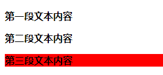
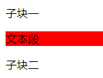

[toc]

伪类选择器是一种特殊的类选择器，它的用处就是可以对不同状态或行为下的元素定义样式，这些状态或行为是无法通过静态的选择器匹配的，具有动态选择性。

伪选择器包括伪类选择器和伪对象选择器，伪选择器能够根据元素或对象的特征、状态、行为进行匹配。

伪选择器以冒号作为前缀标识符。冒号前可以添加限定选择器，限定伪类应用的范围，冒号后为伪类和伪对象名，冒号前后没有空格。

### 1. 用法

CSS 伪类选择器有两种用法：

#### 1.1 单纯式

```css
E:pseudo-class {
    property: value;
}
```

其中 `E` 为元素，`pseudo-class` 为伪类名称，`property` 为 `CSS` 的属性，`value` 为 `CSS` 的属性值。例如：

```css
a:link {
    color: red;
}
```

#### 1.2 混用式

```css
E.class:pseudo-class {
    property: value;
}
```

其中 `.class` 表示类选择符。例如：

```css
a.selected:hover {
    color: blue;
}
```

### 2. 结构伪类

结构伪类是根据文档结构的相互关系来匹配特定的元素，从而减少文档元素的 `class` 属性和 `ID` 属性的无序设置，使得文档更加简洁。

结构体伪类主要包括下面几种：

+ `:first-child`：第一个子元素。
+ `:last-child`：最后一个子元素。
+ `:nth-child()`：按正序匹配特定子元素。
+ `:nth-last-child()`：按倒序匹配特定子元素。
+ `X:nth-of-type()`：在同类型中匹配特定子元素。
+ `X:nth-last-of-type()`：按倒序在同类型中匹配特定子元素。
+ `X:first-of-type`：第一个同类型子元素。
+ `X:last-of-type`：最后一个同类型子元素。
+ `:only-child`：唯一子元素。
+ `X:only-of-type`：同类型的唯一子元素。
+ `:empty`：空元素。

下面使用如下 `HTML` 代码进行测试，替换 `style` 代码即可：

```html
<!DOCTYPE html>
<html>
	<head> 
		<meta charset="utf-8"> 
		<title>伪类选择器</title> 
		<style type="text/css">
			#wrap {
				background: url(images/bg1.jpg) no-repeat;
				width: 260px;
				height: 276px;
				padding-top:26px;
				padding-left:12px;
			}
			#wrap ul {
				list-style-type: none;
				margin: 0;
				padding: 0;
				font-size: 12px;
				color: #777;
			}
			#wrap li {
				background: url(images/top10-bullet.png) no-repeat 2px 10px;
				padding: 1px 0px 0px 28px;
				line-height: 30px;
			}
			#wrap li a { 
				text-decoration: none;
				color: #777;
			}
			#wrap li a:hover { color: #F63; }
			
			#wrap li:last-child {
				background-position: 2px -277px;
			}
		</style>
	</head>
	<body>
		<div id="wrap">
			<ul id="container">
				<li><a href="#">送君千里，终须一别</a></li>
				<li><a href="#">旅行的意义</a></li>
				<li><a href="#">南师虽去，精神永存</a></li>
				<li><a href="#">榴莲糯米糕</a></li>
				<li><a href="#">阿尔及利亚，天命之年</a></li>
				<li><a href="#">白菜鸡肉粉丝包</a></li>
				<li><a href="#">《展望塔上的杀人》</a></li>
				<li><a href="#">我们，只会在路上相遇</a></li>
			</ul>
		</div>
	</body>
</html>
```

#### 2.1 :first-child

使用 `:first-child` 匹配，代码如下：

```css
#wrap li:first-child {
    background-position: 2px 10px;
    font-weight: bold;
}
```

#### 2.2 :last-child

使用 `:last-child` 来匹配，代码如下：

```css
#wrap li:last-child {
    background-position: 2px 277px;
}
```

#### 2.3 :nth-child()

`:nth-child()` 可以选择一个或多个特定的子元素。该函数有多种用法：

```cs
:nth-child(length)	/* 参数是具体数字 */
:nth-child(n)		/* 参数是 n, n 从 0 开始计算 */
:nth-child(n*length)	/* n 的倍数选择，n 从 0 开始计算 */
:nth-child(n+length)	/* 选择大于或等于 length 的元素 */
:nth-child(-n+length)	/* 选择小于或等于 length 的元素 */
：nth-child(n*length+1)	/* 表示隔几选一 */
```

在 `nth-child()` 函数中，参数 `length` 和 `n` 均为整数。

`:nth-child()` 可以定义值，值可以是整数，也可以是表达式，用来选择特定的子元素。

> 注意：`:nth-child()` 函数的参数不能引用负值，如 `li:nth-child(-3)` 是不正确的。

```css
#wrap li:nth-child(2) {
    background-position:2px -31px;
}
#wrap li:nth-child(3) {
    background-position:2px -72px;
}
#wrap li:nth-child(4) {
    background-position:2px -113px;
}
#wrap li:nth-child(5) {
    background-position:2px -154px;
}
#wrap li:nth-child(6) {
    background-position:2px -195px;
}
#wrap li:nth-child(7) {
    background-position:2px -236px;
}
```

##### 2.3.1 :nth-child(n)

在 `:nth-child(n)` 中，`n` 是一个简单的表达式，其取值从 0 开始计算，到什么时候结束是不确定的，需结合文档结构而定，如果在实际应用中直接这样使用，将会选中所有子元素。

```css
#wrap li:nth-child(n) {
    text-decoration: underline;
}
```

> 注意：`nth-child()` 是这样计算的：
>
> n=0 表示没有选择元素。
>
> n=1 表示选择第 1 个 li。
>
> n=2 表示选择第 2 个 li。
>
> 依次类推。

##### 2.3.2 :nth-child(2n)

`:nth-child(2n)` 是 `:nth-child(n)` 的一种变体，使用它可以选择 n 的倍数（其中 2 可以换成需要的数字，分别表示不同的倍数）。

```css
#wrap li:nth-child(2n) {
    font-weight:bold;
}
```

等价于：

```css
#wrap li:nth-child(even) {
    font-weight:bold;
}
```

##### 2.3.3 :nth-child(2n-1)

`:nth-child(2n-1)` 选择器是在 `:nth-child(2n)` 基础上演变来的，既然 `:nth-child(2n)` 表示选择偶数，那么在它的基础上减去 1 就变成选择奇数。

```css
#wrap li:nth-child(2n-1) {
    font-weight:bold;
}
```

等价于：

```css
#wrap li:nth-child(odd) {
    font-weight:bold;
}
```

##### 2.3.4 :nth-child(n+5)

`:nth-child(n+5)` 选择器是从第 5 个子元素开始选择。

```css
#wrap li:nth-child(n+5) {
    font-weight:bold;
}
```

##### 2.3.5 :nth-child(-n+5)

`:nth-child(-n+5)` 选择器刚好和 `:nth-child(n+5)` 选择器相反，它选择第 5 个元素前面的子元素。

```css
#wrap li:nth-child(-n+5) {
    font-weight:bold;
}
```

##### 2.3.6 :nth-child(5n+1)

`:nth-child(5n+1)` 选择器是实现隔几选一的效果。如果是隔三选一，则定义的样式如下：

```cs
li:nth-child(3n+1) {
    font-weight: bold;
}
```

#### 2.4 :nth-last-child()

`:nth-last-child()` 选择器与 `:nth-child()` 相似，但作用与 `:nth-child` 不一样，`:nth-last-child()` 是从最后一个元素开始计算，来选择特定元素。

```css
li:nth-last-child(4) {
    font-weight:bold;
}
```

#### 2.5 X:nth-of-type()

`:nth-of-type()` 类似于 `:nth-child()`，不同的是它只计算选择器中指定的那个元素。`:nth-of-type()` 选择器用来定位元素中包含好多不同类型的子元素时很有用处。`X` 表示指定的类型。

```css
div#wrap p:nth-of-type(even) {
    font-weight: bold;
}
```

#### 2.6 X:nth-last-of-type()

`X:nth-last-of-type()` 与 `:nth-last-child()` 用法相同，但它指定了子元素的类型。`X` 是指定的类型。

#### 2.7 X:first-of-type 和 X:last-of-type

`X:first-of-type` 和 `X:last-of-type` 选择器类似于 `:first-child` 和 `:last-child`，不同之处就是它们指定了元素的类型。`X` 就是它指定的元素的类型。

#### 2.8 :only-child 和 :only-of-type

`:only-child` 表示一个元素是它的父元素的唯一子元素。

```html
<!DOCTYPE html>
<html>
	<head> 
		<meta charset="utf-8"> 
		<title>伪类选择器</title> 
		<style type="text/css">
			.post p {
				font-weight: bold;
			}
			.post p:only-child {
				background: red;
			}
		</style>
	</head>
	<body>
		<div class="post">
			<p>第一段文本内容</p>
			<p>第二段文本内容</p>
		</div>
		<div class="post">
			<p>第三段文本内容</p>
		</div>
	</body>
</html>
```

效果如下：



`:only-of-type` 表示一个元素包含很多个子元素，而其中只有一个子元素是唯一的，那么使用这种方法就可以选中这个唯一的子元素。例如：

```html
<!DOCTYPE html>
<html>
	<head> 
		<meta charset="utf-8"> 
		<title>伪类选择器</title> 
		<style type="text/css">
			.post p:only-of-type {
				background-color: red;
			}
		</style>
	</head>
	<body>
		<div class="post">
			<div>子块一</div>
			<p>文本段</p>
			<div>子块二</div>
		</div>
	</body>
</html>
```

效果如下：



#### 2.9 :empty

`:empty` 用来选择没有任何内容的元素，这里没有内容指的是一点内容都没有，包括空格。例如：

```html
```

