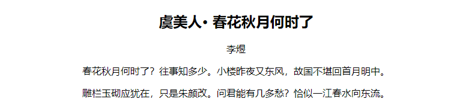

兄弟选择器使用波浪符号 `~` 连接两个简单的选择器，前面选择器指定同级的前置元素，后面选择器指定其后同级所有匹配的元素。

+ 优点：在结构中能够快速、准确地找到同级靠后的元素。
+ 缺点：使用前需要熟悉文档结构，匹配精度没有相邻选择器具体。

例如：

```html
<!DOCTYPE html>
<html>
	<head> 
		<meta charset="utf-8"> 
		<title>兄弟选择器</title> 
		<style type="text/css">
			h2, h2 ~ p { text-align: center; }
		</style>
	</head>
	<body>
		<h2>虞美人· 春花秋月何时了</h2>
		<p>李煜</p>
		<p>春花秋月何时了？往事知多少。小楼昨夜又东风，故国不堪回首月明中。</p>
		<p>雕栏玉砌应犹在，只是朱颜改。问君能有几多愁？恰似一江春水向东流。<p>
	</body>
</html>
```

效果如下：

