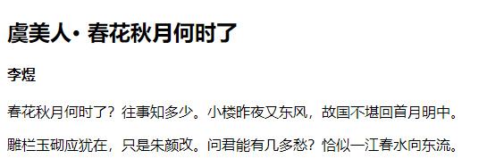

分组选择器使用逗号 `,` 连接两个简单的选择器，前面选择器匹配的元素与后面选择器匹配的元素混合在一起作为分组选择器的结果集。

+ 优点：可以合并相同样式，减少代码冗余。
+ 缺点：不方便个性管理和编辑。

例如：

```html
<!DOCTYPE html>
<html>
	<head> 
		<meta charset="utf-8"> 
		<title>兄弟选择器</title> 
		<style type="text/css">
			h1, h2, h3, h4, h5, h6, {
				margin: 0;	/* 清除标题默认外边距 */
				margin-bottom: 10px;	/* 使用下边距拉开标题距离 */
			}
		</style>
	</head>
	<body>
		<h2>虞美人· 春花秋月何时了</h2>
		<h4>李煜</h4>
		<p>春花秋月何时了？往事知多少。小楼昨夜又东风，故国不堪回首月明中。</p>
		<p>雕栏玉砌应犹在，只是朱颜改。问君能有几多愁？恰似一江春水向东流。<p>
	</body>
</html>
```

效果如下：

