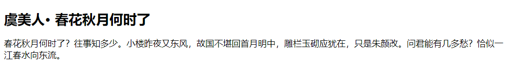

子选择器使用尖角号 `>` 连接两个简单的选择器，前面选择器表示包含的父对象，后面选择器表示被包含的子对象。

+ 优点：相对于包含选择器，匹配的范围更小，从层级结构上看，匹配目标更明确。
+ 缺点：相对于包含选择器，匹配范围有限，需要熟悉文档结构。

例如：

```html
<!DOCTYPE html>
<html>
	<head> 
		<meta charset="utf-8"> 
		<title>子选择器</title> 
		<style type="text/css">
			span { font-size: 18px; }
			h2 > span { font-size: 28px; }
		</style>
	</head>
	<body>
		<h2><span>虞美人· 春花秋月何时了</span></h2>
		<div><span>春花秋月何时了？往事知多少。小楼昨夜又东风，故国不堪回首月明中，雕栏玉砌应犹在，只是朱颜改。问君能有几多愁？恰似一江春水向东流。</span></div>
	</body>
</html>
```

效果如下：



