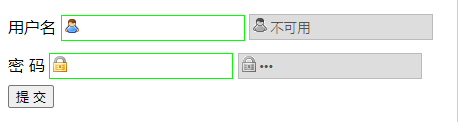

`CSS3` 包含 3 个 UI 状态伪类选择器，简单说明如下：

+ `:enabled`：匹配指定范围内所有可用 UI 元素。
+ `:disabled`：匹配指定范围内所有不可用 UI 元素。
+ `:checked`：匹配指定范围内所有可用 UI 元素。

例如：

```html
<!DOCTYPE html>
<html>
	<head> 
		<meta charset="utf-8"> 
		<title>否定伪类</title> 
		<style type="text/css">
			input[type="text"], input[type="password"] {
				border: 1px solid #0f0;
				width: 160px;
				height: 22px;
				padding-left: 20px;
				margin: 6px 0;
				line-height: 20px;
			}
			input[type="text"] {
				background: url(images/name.gif) no-repeat 2px 2px;
			}
			input[type="password"] {
				background: url(images/password.gif) no-repeat 2px 2px;
			}
			input[type="text"]:disabled {
				background: #ddd url(images/name1.gif) no-repeat 2px 2px;
				border: 1px solid #bbb;
			}
			input[type="password"]:disabled {
				background: #ddd url(images/password1.gif) no-repeat 2px 2px;
				border:1px solid #bbb;
			}
		</style>
	</head>
	<body>
		<form action="#">
			<label for="username">用户名</label>
			<input type="text" name="username" id="username"/>
			<input type="text" name="username1" disabled="disabled" value="不可用" />
			<label for="password">密 码</label>
			<input type="password" name="password" id="password" />
			<input type="password" name="password1" disabled="disabled" value="不可用" />
			<input type="submit" value="提 交" />
		</form>
	</body>
</html>
```

运行效果如下：

