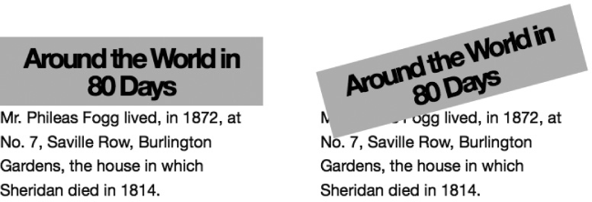

[toc]

## 12.2　旋转

在所有这些函数中，最简单的函数很可能就是rotate，它的名称就像它应该实现的功能一样，会让元素围绕一个固定的点进行旋转。以下是其语法：

这里的value是一个角度值，就像使用第11章介绍的CSS渐变一样。和那一章一样，我坚持在我的例子中使用能够被普遍理解的度数（deg）为单位。注意在这里我们也可以使用负值：例如，-90度就相当于270度。

为了展示rotate的实际应用，我打算将一个h2元素旋转-25度（或者335度），使用以下规则：

你可以在图12-1中看到它是如何显示的。

<b class="my_markdown">图12-1　旋转了10度的h2元素</b>

在图12-1中，我把另一个有浅灰色背景的h2元素放在和第一个元素相同的位置上，所以你可以把旋转过的元素和默认（无旋转）元素进行比较。对于本章的大多数例子，我都会使用这种方式进行演示。

### 12.2.1　文档流中的位置

元素一旦经过变换，看起来就像把positon:relative应用到它上面，也就是说，该元素几乎就像是两个元素一样。原始的、转换前的元素会保持它在文档流中的位置，所以后续的所有元素都会受到它以及它的边距（margin）和填充（padding）的影响。经过变换的元素并不影响页面的布局，但它会位于页面剩余部分之上的一个新层当中，意味着这个新的元素可以覆盖后续的元素。

在下一个例子中，我会再次旋转h2元素，但这一次会让它下面的一些文本流动起来，这样你就可以看到变换的效果。以下是旋转元素的代码：

图12-2展示了这一变换的结果。

<b class="my_markdown">图12-2　文档流上经过变换的元素效果</b>

上面这两个例子都是相同的，除了rotate变换以外。你可以清晰地看到旋转的元素覆盖了它下面的文本，这些文本在布局中是紧跟在无变换的元素之后的。相同的规则会被应用到所有应用了transform属性的元素上，所以以后对这一点要特别注意。

### 12.2.2　transform-origin

变换的原点（origin）是指一个元素变换发生时所围绕的点。这一概念在使用rotate的时候最容易说明清楚，尽管你可以把它应用到本章介绍的所有变换函数上。

至于rotate，你可以把原点形象化，想象你有一张纸（元素）和一个图钉（该元素的原点）。如果使用这个图钉把那张纸固定在一个平面上，你就可以让纸绕着图钉旋转。把图钉定在纸上的不同位置，就可以改变旋转的方式——如果图钉被固定在纸的中心，旋转将具有短的半径，图钉每一边的纸会相等地移动；如果图钉放在一个边缘上，纸的全部长度会围绕着它旋转。

在CSS的transform属性中默认的原点是绝对（即水平和垂直）中心，但你可以使用transform-origin属性去改变原点：

该属性的value可以是一个或两个长度值，或者是关键字值。长度可以是任何可接受的CSS单位（em、px，等等）或者是一个百分比值。关键字有left、right、top、bottom和center。如果提供了两个值，那么第一个设置了水平点，第二个则设置了垂直点；如果只提供了一个，那么设置的是水平点，垂直点会被假定为center（或者50%）。

如果要把原点修改为左上角，我们可以使用下面的其中一个语句：

如果要把原点设置在右下角，可以使用这些值（假设元素有50px的height和200px的width）：

我们演示一下修改变换原点的效果。这个例子展示了三个相同的元素，我们把相同的transform属性应用到每个元素上，但使用不同的transform-origin值：

可以在图12-3中看到这三个元素的效果。

<b class="my_markdown">图12-3　旋转元素上不同的transform-origin值</b>

第一个元素设置的是默认值center center，所以元素会围绕着绝对中心旋转。第二个元素设置的值是left center，所以元素会围绕左手边的垂直中心旋转。第三个元素设置的值是100% 50%，所以元素围绕着右手边的垂直中心旋转。

