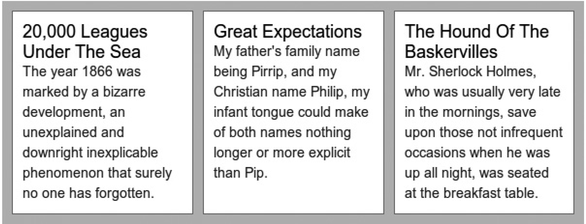
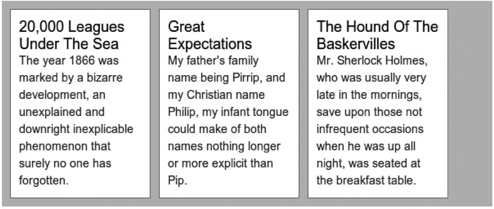
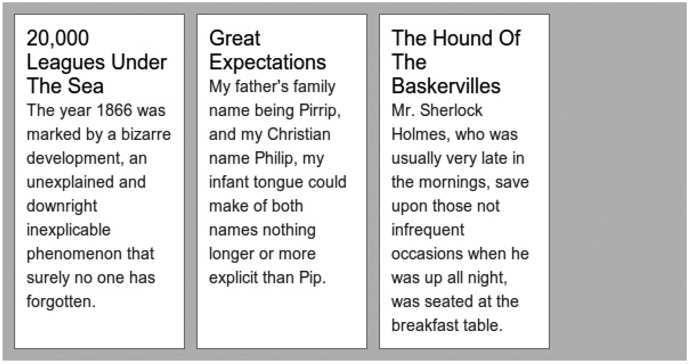

[toc]

## 15.2　让方框具有弹性

在图15-1中，子元素溢出了它们的父元素之外。现在我们来看看如何使用弹性方框和新的属性系列（我称之为box-*属性），让它们与其父元素相适应。系列中的第一个属性是box-flex，是弹性方框布局方法的关键属性。其语法如下：

根据规范，number值可以是一个整数或者是一个小数。不过，这一次Firefox只支持整数，所以我在下面的例子中会继续使用整数。这个值的作用就是一个比值，用在调整父元素中的子元素的大小的时候——随后我会更加详细地解释。它的默认值是0，生成的布局如图15-1所示。除了0以外的值都会被用于计算如何将子元素分配到其父元素的宽度中（或者说，正如你在后面会看到的，也可以是高度）。展示同样比解释更容易，我们来看一个例子，这个例子和图15-1所展示的情况有些类似，但我在子元素上添加了box-flex属性：

图15-4展示了在WebKit浏览器中看到的结果。

<b class="my_markdown">图15-4　子方框动态调整大小以适应父元素</b>

所有三个子方框都能够在父元素内部舒适地适应，它们的宽度被降低为165px，所以它们组合起来的值就相当于父元素的宽度。这是如何做到的呢？我讲过，box-flex的值实际上代表在父元素中分配方框的比值。在这个例子中，值是1其实无关紧要，重要的是所有的元素均有相同的值。

在这个例子中，父元素的宽度是600px，子元素的宽度是200px，还有20px的水平填充和2px的水平边框。而第一个和第三个元素也有20px的水平边距，通过将它们的box-flex值设置为任何非0的值，就可以触发它们具备弹性。尽管其边框、边距和填充值总是会保持不变，但它们的宽度值将会动态地修改，使它们能够在元素内部相适应。

在图15-4中，子元素要比父元素更宽，所以其宽度会依照每个子元素的box-flex值而降低。为了计算减少量，你要先从父元素的宽度（600px）中减去组合的边框、边距和填充值（分别是6px、40px和60px），只留下494px在各子元素之间分配。每个子元素的box-flex值都是1，表示494px将会在三个子元素中均等地分配，每个方框（向上舍入）可以得到165px。

box-flex还可以起相反的作用：box-flex不但可以降低宽度去适应父元素，如果子元素的组合值小于父元素的宽度，它还可以增加子元素的宽度。我们来看一个例子：

这里，子元素的组合宽度小于父元素的宽度，在图15-5中你可以看到空白的区域。

<b class="my_markdown">图15-5　子元素的组合宽度小于其父元素的宽度</b>

现在我们像以前一样应用box-flex值：

这里应用了和前面一样的计算：父元素的宽度是600px，而子元素组合的边框、边距和填充值是106px，剩下494px的差值，会被分为三份，得到165px的宽度值——所以这一次方框的宽度会增加而不是减少。要看到结果如何，可以再看看图15-4——这个例子的输出和上一个例子是相同的。

### 15.2.1　不相等的比例

1:1:1的比值和3:3:3或5.5:5.5:5.5或100:100:100的比值所产生的效果都是相同的，所以如果所有子元素都有相同的box-flex值，它实际上并不关心这个值究竟是什么。但如果这几个值不相等的话又会发生什么呢？

下一个代码示例类似于上一节的那个，但是子元素的宽度值减少了，并且带类名flex-two的元素增加了一个的box-flex值：

相同的计算发生在这些元素上，但这一次494px的差值会在子元素间以1:3:1的比例分配。因此，另外两个元素每增加1px宽度，box-flex值为3的元素宽度就会增加3px。你可以在图15-6中看到其结果。

<b class="my_markdown">图15-6　使用不同box-flex值的结果</b>

回顾图15-4和图15-5，其中每个元素的宽度都是165px（494px除以3）。在图15-6中，两个box-flex值为1的元素宽度是139px，而box-flex值为3的元素宽度是217px——这一切皆源于被改变的分配比例1:3:1。

### 15.2.2　零值与Firefox布局

将box-flex设置为0（或者不主动指定它的值），就意味着该元素是不能伸缩的——也就是说，它会保留原始的尺寸，或者，至少说它应该是这样。不幸的是，0在Firefox中多少有点奇怪的副作用，它会让一个元素看上去就像使用了怪异模式的方框模型（如果需要一点提示，参见<a class="my_markdown" href="['http://www.quirksmode.org/css/quirksmode.html']">http://www.quirksmode.org/css/quirksmode.html</a>）——元素指定的width值会应用到整个方框上，包括它的边框和填充。看看这段代码：

我在图15-5中使用了这段代码，所以它的结果应该和那里所展示的一样。但是Firefox中的输出就有点不同了，你可以在图15-7中看到其结果。

显而易见，更多的空间留在了父元素的右侧，因为每个子元素总的方框宽度都是150px，是由2px的边框、20px的填充和128px的宽度所组成的。现在，我没有发现规范中有什么地方说情况不应该是这样的，但是它的结果在我看来是完全不符合逻辑的。

不幸的是，我一直无法找到解决这个问题的方案，所以你在规划网站布局的时候也只能把它当作一个考虑的因素去对待，直到Firefox开发人员解决掉这个问题。

<b class="my_markdown">图15-7　box-flex值为0的子元素显示在Firefox中</b>

