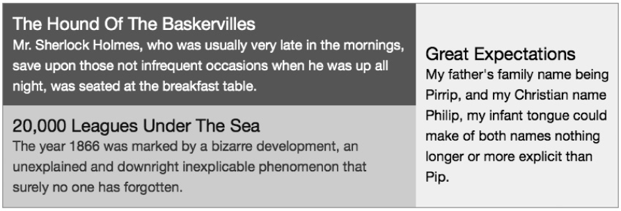
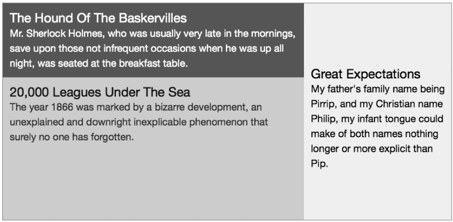

[toc]

## 16.6　设置行与列的高度和宽度

在此之前，我让布局算法平均地分配所有槽的高度和宽度，但是模板布局方法也能够对布局进行精细的控制，明确设置行高与列宽。二者的设置都非常简单，我会先介绍前者，因为行高的设置相比较而言更为容易。

默认情况下，行的高度是由其中的槽所设置的，而槽的高度则取决于内部包含元素的组合高度。但如果要让这一规则失效并设置固定的高度，只需要在要设置高度的行字符串后面指定一个长度值即可，可以使用一个斜杠（/）把二者隔开：

这里可以看到一个真实的例子，结果如图16-8所示：

<b class="my_markdown">图16-8　第一行的高度被手动设置</b>

该布局有两行和两列——位置b的元素跨越了两行。在设置第一行布局的字符串（“cb”）后面，我使用了一个斜杆和200px的值，将第一行设置为200px高。如果没有提供这个值，该行的高度就会和下面那一行（位置c中）的高度一样。

设置列的宽度只是稍微复杂一点，在display属性的结尾处，要为每一列指定一个长度值，不需要使用斜杠：

给出的长度值的数量必须和列数相等，但如果不想明确设置某一列的值，可以使用一个星号（*）来代替。这是实际中的样子：

结果如图16-9所示。

<b class="my_markdown">图16-9　手动设置第二列的宽度</b>

上图的标记和用于图16-8的标记一样，但是不同于指定行高，在这里我指定了列宽。在行字符串后面，你可以看到两个值：一个星号和33%。因为这里有两列，第一列使用一个自动化的值，而第二列的宽度就是其父元素的33%——如果我没有指定任何宽度，该列的宽度将会默认为50%。

### 16.6.1　宽度关键字值

和长度值以及百分比值一样，也有几个关键字可以用于设置列宽。第一个是max-content，指定该列最多只能和它所包含的最宽的内容一样宽；它的反面是min-content，表示该列最少要和其中最宽的内容一样宽，但是也可以更宽一些。

minmax函数接受两个值——minimum和maximun——分别提供了可以设置的列宽范围。你可以使用长度值或者是max-content/min-content关键字。以下是示例：

这段代码设置列应该至少和它的内容一样宽，最多不超过500px。

最后一个关键字值是fit-content，它是minmax（min-content,max-content）的缩写——即，让列宽和它包含的最宽内容一样。

### 16.6.2　同时设置行高与列宽

在一条声明中同时指定行高和列宽初看上去可能有点混淆。你需要记住的是，如果设置最后一行的宽度，那么斜杠之后的第一个值就是行高，而剩余的值则是列宽：

如果还混淆，记住你可以重新调整代码的格式，使其更便于查看：

这种布局会让代码读起来更为直观，但是如何安排代码还是取决于你。不管代码如何布局，结果都是一样的，如图16-10所示。

<b class="my_markdown">图16-10　第二行和第二列的尺寸为手动设置</b>

图16-10中的例子在两列中还分成两行：第二行的高度是200px，第二列的宽度是33%，而第一列会动态调整大小去适应父元素的剩余宽度。

