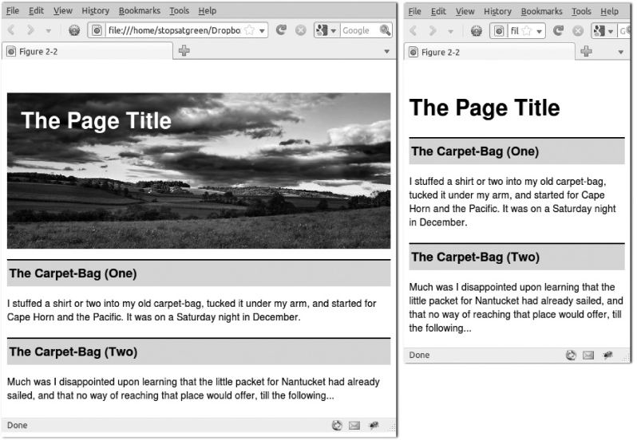
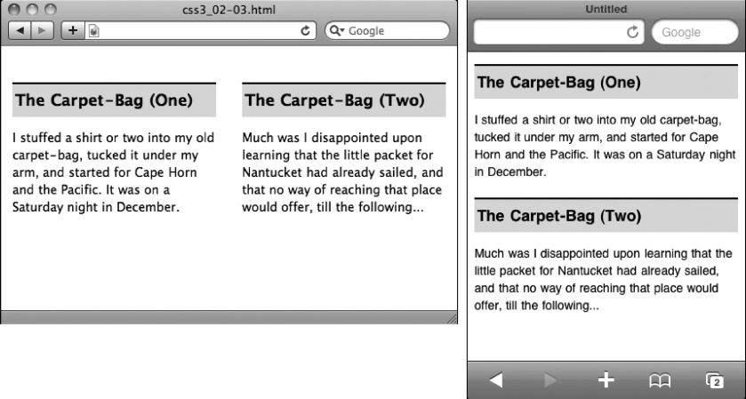

[toc]

## 2.3　媒体特征

媒体特征是与显示网页的设备有关的信息，它包括了设备的大小、分辨率等。这些信息被用于评估一条expression，评估的结果决定了哪些样式规则会被应用。例如，expression可以是“只在屏幕宽度超过480像素的设备上应用这些样式”或者“只在可以水平改变方向的设备上应用”。

在媒体查询中，需要为大多数的媒体特征表达式提供一个值：

在构造我刚刚提到的示例表达式的时候就需要这个值。不过在某些情况下，该值可以被忽略，只对媒体特征本身进行检测：

随着我进一步讨论媒体特征，解释这些值在什么时候是需要的、什么时候是可选的，这些表达式将会变得更加清晰。

了解完语法，我们来认识一些更加突出的媒体特征。接下来我要介绍的这些媒体特征最适合用于访问网页的彩色显示屏，也是最有可能在每天的工作中都要用到的。另外我们还可以使用其他的媒体特征，但它们更可能被用于电视或固定格栅终端这样的替代设备。

### 2.3.1　宽度与高度

width媒体特征描述了特定媒体类型的渲染视区（viewport）的宽度，实际上，对于桌面操作系统来说，通常就是浏览器的当前宽度（包括滚动条）。其基本语法需要一个长度值：

在这种情况下，这些规则只会应用到宽度被精确设置为600px的浏览器上，这样可能太过具体了。不过，width也可以接受两个前缀max-和min-中的一个，可以对最小或最大的宽度进行检测：

上面的第一个查询会在宽度不超过480px的浏览器上应用规则，而第二个查询会把规则应用到宽度至少在640px的浏览器上。

我们来看一个实际的例子。这里，我为较宽的浏览器窗口提供装饰性的标题，充分利用了浏览器窗口的尺寸：

该媒体查询会对宽度至少为400px的浏览器窗口进行检测，如果符合条件，就把背景图片应用到h1元素上。也就是说，如果我的浏览器窗口至少有400px宽，就可以看到这张图片；如果我重新对窗口进行调整，使窗口变得更窄，就只会显示文本的标题。该示例如图2-2所示。

<b class="my_markdown">图2-2　使用width媒体查询应用不同的样式规则</b>

height媒体特征所起的作用是相同的，只是它是以浏览器的高度而不是宽度为目标。其语法和width一致，也允许使用max-和min-前缀：

不过，由于垂直滚动这样的操作方式更为流行，height的使用频率远远不如width。

### 2.3.2　设备宽度与高度

device-width媒体特征的功能也是类似的，但它描述的是渲染页面的设备宽度。在处理网页的时候，设备宽度是指显示该页面的屏幕宽度，而不是浏览器窗口的宽度。就像width和height，device-width的基本语法需要一个长度值，同样也能够以相同的方式添加前缀：

在为移动设备（这样的设备具有更小的显示区域）进行设计的时候，device-width是最有用的。使用这种特征，可以让设计满足较小的设备，不必创建专门为移动网页而设计的全新版网站。

例如，为了让内容在两种不同的设备上显示, 我会对它们进行优化。默认情况下，我会使用两个内容框，让它们在水平紧靠着放在一起。相反，对于较小的设备（在这个例子中我使用的是iPhone），方框将不会浮动，它们会按顺序从上到下摆放，从而更好地利用较窄的设备。以下是代码：

默认情况下，我使用一个500px的容器元素，里面有两个浮动的div元素，宽度为235px，水平边距为15px。之后，我创建了一个媒体查询（使用only操作符对较老的浏览器进行隐藏），该查询只会应用到最大宽度为320px的设备上（iPhone的默认宽度）。这条查询设置了应用的规则，去掉width和margin属性的确切值，防止方框浮动起来。我们可以在图2-3中看到结果，网页的内容对目标设备进行了更加恰当的格式调整，在可读性上也不会有任何损失，不需要使用特别的“移动版本”。

<b class="my_markdown">图2-3　device-width媒体查询在桌面（左）和iPhone（右）上以不同的方式显示内容</b>

注意

> OS（iPhone、iPad，等等）和Android设备会通过四个屏幕侧边中较短的一对去测量device-width。也就是说，给定尺寸为320×480的设备，不管是以纵向还是横向模式去查看，device-width都会是320px。

device-width媒体特征同样具有对应的device-height，其操作如同height对应于width。同样地，device-height也使用了类似的语法，还有max-和min-前缀：

和height非常类似，对device-height的使用也比device-width少一些，因为垂直滚动比水平滚动也要容易一些。

### 2.3.3　媒体查询的实际使用

到现在为止，在这些例子中我倾向于先创建一个为较大的浏览器或设备而优化的站点，再使用媒体查询为较小（移动的）的设备提供不同的样式。这种方法用来演示还是很不错，但在自己的网站中，实现的方式可能恰好相反。

我们在现实中之所以要这么做，是由于某些浏览器加载页面资源（比如样式表中包含的图片）的方法所致。一些媒体查询的早期采用者，先使用大的背景图片，之后在移动设备设置display:none，将图片隐藏起来。不过，尽管这些背景图片不会显示，但仍然可能被下载并存放在缓存中。这种方式增加了页面的加载时间，也可能会消耗带宽流量——对于没有无线连接的移动设备用户来说一点儿好处都没有。

所以，创建页面的更好方法是先为移动受众制作一个基本的样式表，然后再为桌面或平板用户制作一个带较大资源的样式表，最后使用像device-width这样的媒体查询来加载：

如上，采用这种方式把样式表分开以后，对于屏幕宽度小于480px的设备，将不会加载desktop.css，那些大资源也不会在后台下载。

这种方式对过去这几年出现的大部分浏览器都有很好的效果。相反，那些真正比较老的浏览器只会得到基本的样式表，这样对它们来说更好一些，因为它们可能无法应付本书剩余部分将会讲授的那些高级特性。

这种方法会出现的最大的例外就是Internet Explorer（要习惯这句话，因为你还会听到许多次）。不过IE9倒是支持媒体查询，只是之前的版本都不支持。为了解决这个问题，我们需要使用只有Internet Explorer能够识别的条件注释去加载这个桌面文件：

上面代码的简单含义是：“如果你所使用的Internet Explorer的版本低于第9版，就加载desktop.css文件。”虽然这样有点重复，但可以有效解决这个问题，并且让你用一种渐进的方式构建自己的网站。

### 2.3.4　方向

如果对查看网页的设备的实际尺寸并不是太关心，但是要为水平方向（比如常见的网页浏览器）或垂直方向（比如电子书阅读器）两种网页浏览方式进行优化，需要使用的媒体特征是orientation。以下是它的语法：

它的value可以使用两个选项：landscape或者portrait。Landscape值会在浏览器宽度大于高度的时候被应用，而portrait值会在相反的情况下应用。尽管orientation肯定可以应用到桌面浏览器上，但其最大的用处还是处理用户可以轻易旋转的设备，就像新一代的智能手机和平板电脑。

例如，我们可以使用orientation，根据网页访问者的浏览器方向，水平或垂直地显示一个导航菜单。代码如下：

默认情况下，li元素的float值设置为left，这样可以让它们横跨页面叠放起来。如果以portrait方向查看同一个页面（要么重新调整浏览器，让它高于其宽度；要么在具有纵向模式的设备中查看页面）——浮动就会被去掉，相反，li元素会垂直地堆叠起来。可以在图2-4中看到其结果。

<b class="my_markdown">图2-4　在Android浏览器上的orientation媒体查询：landscape（左）和portrait（右）</b>

因为对orientation特征来说只可能有两个值，所以如果使用其中一个值应用有差别的规则，另外一个就自然是相反的。在这个例子中，我只使用了portrait值，所以在默认情况下，所有在作用范围之外的规则都会应用到landscape方向上。

### 2.3.5　高宽比

你也可以创建一些只有满足特定的宽度-高度比例才会应用的查询。要创建这样的查询，可以使用aspect-ratio特征检测浏览器的高宽比，或者使用device-aspect-ratio特征检测设备的高宽比。以下是这两种特征的语法：

其中，水平和垂直的值都是正整数，代表查看设备的屏幕宽度与高度（对应的）的比值，所以正方形的显示将会是1/1，而电影的宽屏显示则会是16/9。

我们通过高宽比进行选择的时候可能有许多地方需要注意。例如，某些设备制造商把宽屏定义为16:9，有一些是16:10，还有一些则是15:10。这样的变化意味着如果要应用针对“宽屏”的规则集，在选择的时候就必须把所有这些变化都作为参数包含进来。

### 2.3.6　像素比

一般而言，CSS像素单位（px）是指计算机屏幕上一个单独像素的大小——如果屏幕的分辨率是1024px×768px，我们把一个元素的宽度设置为1024px时，可以预期它在水平方向上将填满整个屏幕。不过，对于智能手机和移动设备来说情况并不总是这样。在它们的小屏幕上访问网站，通常需要放大显示，这样会导致屏幕像素大于CSS像素。例如，以100%的比例放大页面，意味着1个CSS像素会以4个设备像素（2×2）的大小在屏幕上显示。

对于可缩放的内容，比如文本和矢量图形，放大不会导致什么问题；但对于位图格式的图片，放大的时候可能会导致严重的失真。为了解决这个问题，许多设备目前使用了具有更高像素密度比的屏幕，能够以高分辨率显示而没有任何失真。例如iPhone 4，它的像素密度是2，意味着每个CSS像素会以4个设备像素显示在屏幕上（就像上一段的例子一样），能够以100%的比例放大而不会丢失任何细节。

媒体特征可以根据设备的像素密度去判断设备。该特征就是device-pixel-ratio，它在Mobile WebKit中的实现带有-webkit-前缀。

其中，number是一个小数，表示设备的像素密度。例如，三星Galaxy S的像素密度是1.5，如果要以类似的屏幕作为目标，可以使用：

和其他媒体特征一样，也可以检测最大和最小像素比：

这样的灵活性使我们为更高像素比的浏览器提供高分辨率的图片变得更加容易，正如这段代码：

第一条规则（）意味着“标准”（或低分辨率）像素比设备上的浏览器将使用标准图片（image-lores.png）；相反，像素比至少在1.5的设备则使用高分辨率的图片（image-hires.png）（）。注意这里background-size属性（）的使用，这个属性使用时应该用高分辨率的图片，以保证这些图片的显示不会大于要应用的元素（我会在第8章完整地介绍background-size）。

在Firefox Mobile浏览器（在写这本书时仍然是beta版）中应该也可以检测像素比，尽管其最大像素比和最小像素比的媒体特征在语法上有所不同：

### 2.3.7　多种媒体特征

可以用and操作符添加表达式，把多条查询链接在同一个媒体类型上：

这种语法在应用选定规则之前，先测试两个表达式是否匹配。例如，要测试16:9宽屏格式的小屏幕，可以创建如下查询：

也可以在多种媒体类型上设置不同的表达式：

这里每一条不同的表达式将会被用到每一种媒体类型上。例如，为所有横向设备和纵向投影设备设置一些规则：

当然，也可以创建上述语法的任何组合。

### 2.3.8　Mozilla特定的媒体特征

作为Firefox Mobile工作的一部分，Mozilla团队引入了许多专有的新媒体特征，其中有许多是Gecko（Firefox的渲染引擎）特有的，但也有一些被推荐给W3C作为正式的媒体特征。在以下地址可以看到所有这些内容：<a class="my_markdown" href="['https://developer.mozilla.org/En/CSS/Media_queries#Mozilla-specific_media_features']">https://developer.mozilla.org/En/CSS/Media_queries#Mozilla-specific_media_features</a>。

其中，也许最令人感兴趣的是-moz-touch-enabled，它可以专门把规则应用到触摸屏幕设备上的元素，比如说，让按钮变得更大以适合手指（而不是尖笔或者鼠标）的操作。以下是它的语法：

对于某个设备来说，要么是可触摸的，那样的话它的值就是1，要么就是不可触摸的，其值就为0。这种情况下，就不需要声明一个值参数，可以只使用特征关键字，如上。

