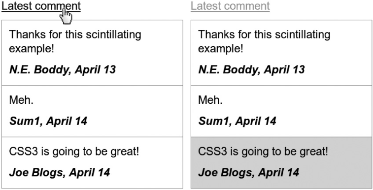

[toc]

## 4.2　其他伪类

除了本章到现在一直在讨论的结构伪类之外，CSS3还引入了许多伪类，允许根据其他条件去选择元素。这些条件包括链接的目的地、用户的界面元素，CSS3甚至还提供了反向选择器，可以根据一个元素不是什么进行选择！

### 4.2.1　target伪类

在网上，网站不仅仅只在页面之间进行链接，同样也提供了一些指向特定元素的内部链接。URI可以包含一个指向唯一ID或指定锚点的引用。例如，假设在页面中有如下标记：

可以使用下面的链接去引用它：

target伪类能够在涉及的URI被使用的时候，把样式应用到元素上。如果在示例的URI被单击时，要把样式应用到示例元素上，可以使用：

有一种流行的风格是形象化地突出显示内部链接，为用户提供清晰的提示。例如，考虑一下博客评论的标准模式，多少有点像下面这段简化的标记：

另一种相当常用的模式是将链接包含在个人评论中：

使用target伪类，可以轻松地突出显示用户要阅读的评论：

图4-9以两种状态展示了一系列评论：在左侧，显示的是引用的链接在点击之前的情况；在右侧，链接被点击之后，target选择器修改了链接涉及的元素的背景颜色。

<b class="my_markdown">图4-9　使用target伪类应用突出效果</b>

### 4.2.2　empty伪类

empty伪类选择没有子元素（包括文本节点）的元素。看看这段标记：

如果应用这条CSS规则：

该规则将只会应用到第一个td元素，因为其他两个td元素分别包含了一个文本节点和一个子元素。

### 4.2.3　root伪类

root伪类选择文档树中的第一个元素，它的唯一真正作用就是发生在为XML文档添加样式表的时候——在HTML中，root永远是html元素。在HTML中使用root也有一个小优点，就是可以用它为html元素赋予更高的特殊度，这在需要覆盖简单类型选择器的时候是很有用的：

假设我们正在创建一个基础样式表，想要设置html元素上的一个属性，而该属性不应该再被修改，在这种情况下，可以使用类似下面的方法：

较高的特殊度相对于其他应用到html元素的属性来说会占据优先，例如：

不过，在大多数情况下，这种方法不大可能会用得到。

### 4.2.3　not伪类

否定伪类（not）在选择元素时，选择的是除了作为参数值给出的元素之外的所有元素。

这条规则选择E元素的所有子元素，除了属于类型F的之外。例如，为了给一个div的所有直接子元素加上颜色（除p元素之外），我们可以使用：

想了解not伪类的用处究竟有多大，不妨考虑下面这段标记的情况：

现在假设要为除第一个p元素之外的所有p子元素应用斜体效果。

如果要使用CSS2现实的话，需要把样式应用到所有的p元素上，然后再应用样式将第一个元素重置回之前的状态：

有了not伪类，可以将其简化为单独的一条规则：

传入not伪类的参数必须是一个简单的选择器——所以连结符（比如+和>）以及伪元素（我会在本章后面讨论）都不是有效的值。

### 4.2.4　UI元素状态伪类

UI元素状态用于根据用户界面（UI）元素的状态对它们进行选择。尽管HTML5提出了一系列新的UI元素（例如command），但在HTML4中，只有form元素能够拥有状态：

textarea有一个disabled属性，而类型为checkbox的input元素则具有checked属性。不存在enabled属性，按照定义，没有被禁用的元素会被划分为启用的，所以也可以使用enabled伪类，因此我们可以给出三种用户状态伪类选择器：

要了解这几个选择器的效果，不妨假设有以下样式规则：

我打算把这些规则应用到一个有两个文本input元素的表单上，其中一个具有disabled属性（这个表单并不合理，因为我没有为输入框设置标签，不过在这个演示中这不是关键的问题）：

结果如图4-10所示。

<b class="my_markdown">图4-10　禁用与启用的元素状态</b>

如图所示，禁用的表单元素具有变成灰色的文本（自动由浏览器完成）和灰色的点线边框（这是我在样式表中设置的）。在启用的元素周围我设置了黑色实线边框。

这里我没有给出checked状态的演示，因为大部分浏览器在解释哪种样式规则可以应用到checkbox输入元素上有很大的差异。想要对表单元素的跨浏览器样式化有全面的了解，我强烈推荐456 Berea Street的博客文章“使用CSS样式化表单控件”（“Styling Form Controls with CSS”，<a class="my_markdown" href="['http://www.456bereastreet.com/lab/styling-form-controls-revisited']">http://www.456bereastreet.com/lab/styling-form-controls-revisited</a>）。

规范还提到W3C正在设想提出第四种UI元素状态——indeterminate（不确定状态），该状态可以用于某种偶然情况，在这种情况下一个元素可以是启用或禁用的，又或者还没有设置为其中的任何一种状态。在写这本书的时候，indeterminate还不是CSS3规范的正式内容。

