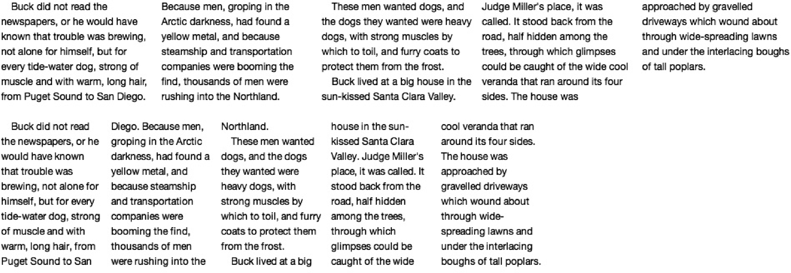

[toc]

## 7.1　分列布局方法

你可以使用两种方法把内容划分成多列：要么正式地设置分列的具体数量；要么动态指定分列的宽度，再由浏览器计算要分成多少列才能适应父元素的宽度。

### 7.1.1　指定分列：column-count

把内容划分为均等分布的几列的最简单的方法就是使用column-count属性：

元素E是要划分的内容的父元素，而columns值是一个整数，设置了分列的数量。为了把div元素中的内容分割成两列，可以使用：

当前，Firefox和WebKit各自实现了几个多列属性，只不过Firefox的实现稍微不是很兼容标准，并且二者在如何渲染多列上也有些许差别。因为和规范相比较，这些属性仍然有些不完整，所以两个浏览器都使用了它们专用的前缀：-moz-用于Firefox，而-webkit-则用于WebKit。

为了让分列在两种浏览器中都能起作用，我们需要在样式表中同时调用这两种属性。所以，当我们使用column-count（或者本章接下来所涉及的其他任何属性）的时候，都需要指定：

为了简洁起见，在本章的剩余部分，我会只使用无前缀的属性名称。不过，当你在产品的页面中使用多列的时候，一定要记住这一情况。

说完这些，我们来看一个现实中的例子。我会先后两次展示几小段材料。第一次会把材料分布在三列之中，而第二次会分成四列。以下就是我要使用的代码：

注意：

> 在这些例子中我使用了任意子串属性值选择器，这是我们在第3章介绍过的。

可以在图7-1中看到这段代码的结果。

<b class="my_markdown">图7-1　拆分成三列和四列的文本</b>

以下就是我用于图7-1所展示例子的标记（为了简洁进行过编辑）：

其语法是极其简单的，浏览器会负责对内容进行平均分配。

### 7.1.2　动态分列：column-width

将内容划分成多列的第二种方法对于弹性布局可能是更好的选择。和指定分列数目的方法不同，你可以使用column-width指定每一列的宽度，浏览器会根据宽度使用多个分列进行填充。它的语法就像下面这样简单：

和column-count一样，E是要进行分列显示的内容的父元素。但column-width的不同在于它需要一个length值：可以是长度单位（例如px或em）或者百分比。以下是示例：

这段代码会将div的子元素划分成100px宽的列，顺着div的宽重复分列。我们使用下面的样式规则，看看它是如何工作的:

这里有一个类名为columns的元素，宽950px，内容将会被分成100px宽的列，我们可以在图7-2中看到它是如何渲染的。

<b class="my_markdown">图7-2　文本被划分成动态创建的、等间距的多列</b>

把column-width设置为100px之后，浏览器就可以创建八个分列去填充父元素。但情况看上去似乎不是这样，请记住，父元素有950px宽，即便每一列中间有10px的间隔（我们很快就会谈论到），全部加起来的宽度也只有870px，额外的空间去哪里了呢？

创建分列的算法实际上是相当智能的，它会自动重新调整列的大小，使它们更好地适应父元素。该算法会使用100px作为最小值，让每一列稍微宽一些（在这个例子中，就是150px），而每一列之间生成的间隙也会更宽（在这个例子中，是一个超过15px的小数），所以总的宽度和它的父元素是相匹配的。

### 7.1.3　可读性提示

在使用多列布局模块时，要注意边距（margin）和填充（padding）仍然会应用到内容上，所以可能导致在分列的顶部或底部的段落和非固定文本行之间出现不必要的空行，二者都会影响到内容的可读性。

为了说明我的意思，我在图7-3上显示了网页上常见的格式化样式——左对齐，每个段落之间有边距——文本就像在多列之间流动。正如你所见到的，我们可以轻易地以素材的浮动行或者甚至是单个单词而结束，就像第三列顶部那样。

<b class="my_markdown">图7-3　多列中常见的排版风格</b>

当我们使用多列的时候，按照大多数的报纸和杂志所提供的例子去排版是一种不错的方法，即：在每个段落开始的时候缩进，段落之间不要留下边距。我们可以使用现有的CSS属性轻松地实现这样的布局：

我把这些属性应用到前面的例子中，如图7-4所示。它展示的是相同的文本，但是我把margin-bottom从段落中去掉，并对每个段落的首个句子进行缩进。

<b class="my_markdown">图7-4　多列中的文本——缩进并去掉边距</b>

这个例子现在稍微好读一些，但文本在右侧边缘仍有些参差不齐，看起来不是太好。为了解决这个问题，我们可以使用text-align属性对文本进行两端对齐：

如果你能够对内容进行绝对的控制，就可以把两端对齐当作只是建议而已，因为它会把无规律的空白放在单词之间，实际上会降低文本的可读性，除非你用连字符正确地连接（可以使用HTML代码&shy;添加软连字符）。图7-5再一次显示了那段示例文本，这里我设置文本为两端对齐，把软连字符插入到较长的单词中，使它们可以漂亮地断行，单词之间不会出现太多无规律的空白。

<b class="my_markdown">图7-5　多列文本——两端对齐并用连字符连接</b>

依我看来，尽管使用这些值需要内容作者付出更多的努力，但却可以藉此展现出最具有可读性的文本。只是，添加软连接符需要我们手动去完成，会花费一些时间，并且一旦要添加新的内容，就需要重新检查格式，确保不会带来错误。

### 7.1.4　Firefox和WebKit中不同的分配方式

使用多列时有一个需要注意的地方，就是Firefox和WebKit在计算分列的时候所使用的算法稍微有些差别。因此，文本在每个浏览器中被划分到各列之中会有所不同。Firefox的方法是让大多数的列有相同数量的行，最后一列比其他部分稍长或稍短一些。与此相反，WebKit会让所有的列尽可能均等。

比起把这种差别解释清楚，将其展现出来要容易许多。图7-6展示了划分为四列的文本在Firefox中呈现的效果。

<b class="my_markdown">图7-6　Firefox中划分为四列的文本</b>

前三列的行数是一样的，但第四列要短得多，在这个例子中，大部分的列有相同数量的行。现在我们将这个例子和图7-7所展示的呈现在WebKit中的相同文本进行比较。

<b class="my_markdown">图7-7　WebKit中划分为四列的文本</b>

在这里，你可以看到第一列和第三列比起其他两列多了一行文本，不像Firefox那样有一列比其他列要短得多，WebKit在渲染多列的时候总体上会更加均匀一些。因此，文本的盈余部分在各列之间的分配会更加均匀一些。

之所以会出现这种情况，是因为以前的规范版本（从2001年到2005年）从来没有明确过排印材料应该如何在各分列之间进行平衡，所以浏览器厂商就会提出自己的方案。W3C在后来的规范版本中通过使用column-fill属性解决了这个问题：

如果该属性的关键字值是auto，就表示会按顺序对分列进行填充，就像Firefox那样；而balance值则会向WebKit那样以相同的方式进行分配。默认值是balance，所以我们可以假设WebKit的方法在这种情况下是正确的。不过，实际上没有一个浏览器实现了这个属性，所以在浏览器实现之前，我们在处理分列的时候，只能够自己去分清楚这两种不同的方法。

### 7.1.5　column-count和column-width的结合

我们可以在一个元素上同时设置column-count和column-width属性，尽管一开始可能觉得这么做会产生冲突，不过这种可能性毕竟也已经被考虑到了：如果两个属性应用到同一个元素上，column-count值的作用就像是设置了最大值。为了解释清楚，我们参考一下图7-2，我们只要修改一下CSS代码，让它也包含column-count属性：

这段代码背后的逻辑是：把文本划分为100px的列，如果会产生5个或5个以上的列，就生成有5个最小的宽度是100px的列。

如果回顾一下我们的例子，你就会记得，对于宽度为950px的父元素，使用column-width属性会渲染为8列。然而，当你在同一个元素上应用两个属性的时候，column-count属性就会先起作用，所以只会划分为5列，而它们的宽度会被动态修改，以最好地适应父元素。

然而，WebKit错误地实现了这一规则，相反，它创建了5个100px的列，留下无意义的白色空间，如图7-8所示。

<b class="my_markdown">图7-8　Firefox（上）和WebKit（下）解析组合的分列属性</b>

第一个例子展示了Firefox对规范的正确解析，第二个例子展示了WebKit的错误解析。然而，所有这些属性都使用专用的前缀，所以这种不一致性在无前缀的属性最后被实现之前，还有机会得到更正。

如果要同时使用这两个属性，我们可以使用简写属性：

这个属性当前只在WebKit浏览器中被实现（同样，也要使用专用前缀），所以如果使用图7-8中的值，就需要使用以下代码：

