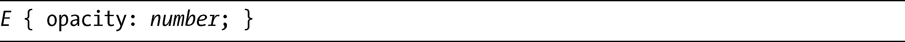
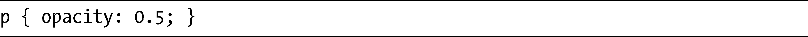
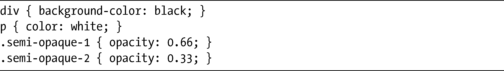
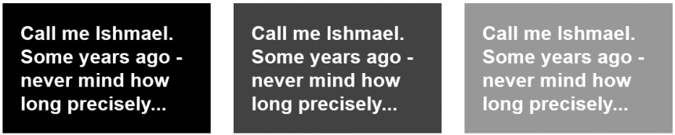
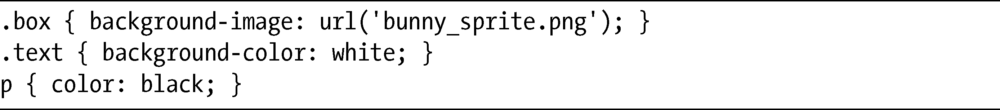
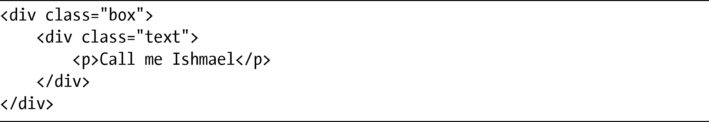
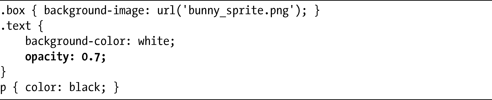
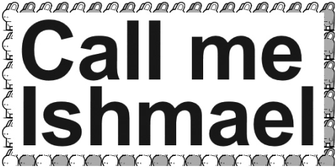
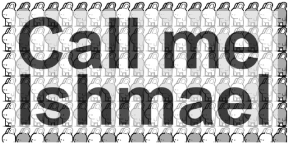

### 10.1　使用opacity属性设置透明度

不透明度与透明度位于天平的两端。严格来讲，它们是估量一个对象对光线的阻力——某种东西更加不透明，表示它允许通过的光线就更少；某种东西的透明度更高，它允许通过的光线就更多。一个没有透明度的对象是完全不透光的，而一个没有不透明度的对象则是完全透明的。在CSS中，二者都使用opacity属性来度量。本质上，对于opacity，你设置的是背景在多大程度上可以透过指定的元素被看到。

opacity属性有以下语法：

number值是一个小数——例如，一个在0.0到1.0之间的数字——其中0.0是完全透明的，而1.0则是完全不透明的，任何介于这两者之间的值都是不透明与透明之间的混合。例如，要把一个p元素设置为50%的不透明度（或者50%的透明度，取决于你的玻璃杯是半空的还是半满的），应该使用下面的代码：

为了更进一步演示，我会展示三个div元素（每个元素都带有一个单独的p子元素），除了opacity值有所改变之外，以相同的方式去显示每一个元素。以下是这个例子的相关代码：

我们可以在图10-1中看到输出的结果。

<b class="my_markdown">图10-1　在三个相同元素上不同的不透明度值的效果</b>

第一个方框（左）对opacity的值没有进行明确的设置，所以它的默认值是1.0，或者说是全不透明的。下一个方框（中）设置的值是0.66，所以它的不透明度降低了三分之一，导致黑色显示为深灰色（方框黑色背景颜色和body元素白色背景颜色的混合，隐约显示出来）。最后，是最后一个方框（右），它设置的opacity值是0.33，所以可以当作是67%的透明度，令方框变成较浅的灰色。

现在，要记住这个属性一个非常重要的要点：opacity属性的值会被它的所有子元素继承。所以如果我设置一个元素的opacity值是0.5，它的子元素就永远不可能比这个值更加不透明。这种设置不能够被其他任何的属性推翻——更确切地说，你永远不可能让一个元素比它的父元素更加不透明，但你可以让它变得更透明一些。

图10-1中的这个例子并没有让这一点显得非常明显，因为p元素的color值是white，在它背后的元素的白色背景并没有任何显著的差异。但在下一个例子中，你会更加清晰地看到这种差异。考虑这些CSS规则：

我会把它们应用到一个使用了下述标记的方框上：

你可以在图10-2中看到其结果。

现在我会把opacity属性添加到内部的div上，如下：

你可以在图10-3中看到其结果。原始版本中完全不透明的文本（图10-2）是正黑色的。但在第二个版本中（图10-3），我应用了opacity属性，文本框变成了半透明的，而其中包含的文本也是一样。

<b class="my_markdown">图10-2　应用了一些样式的嵌套div元素</b>

<b class="my_markdown">图10-3　内部的div的opacity值是0.7</b>

opacity属性看起来也许多少有点限制，因为你无法把它应用到具有子元素的元素上，但又不应用到它的那些子元素上，就像我刚刚演示的。不过，CSS3有一种新的方法可以处理这种问题，它被称之为Alpha通道，我会在下一节进行解释。

opacity属性当前得到Firefox、WebKit和Opera的支持，并且计划包含在IE9之中。

