### 10.2　新的和扩展的颜色值

CSS2.1允许使用三种方法指定颜色值：关键字（比如black）、十六进制表示法（比如#000）和RGB（比如0，0，0）。在CSS3中，加入了一种全新的指定颜色的方法，同时通过Alpha通道引入了不透明度。

### 10.2.1　Alpha通道

和opacity属性（它是对一个元素的透明度的度量）相对——Alpha通道（简称Alpha）是对一种颜色透明度的度量。所以，尽管使用Alpha的颜色值可以像其他任何颜色值一样被子元素所继承，但元素的整体不透明度并不受影响。

CSS3引入Alpha作为RGBA颜色模型中的一个值。RGBA代表Red（红）、Green（绿）、Blue（蓝）和Alpha，而该语法和CSS2所使用的RGB值是相同的，但多了Alpha值，即在结尾处用一个额外的逗号隔开的参数去指定：

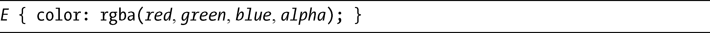
alpha参数的值和为opacity所提供的值是一样的：是一个在0.0到1.0之间的小数，同样也是在全透明（0.0）和全不透明（1.0）之间的度量。如果要设置一个p元素为黑色，并且为50%的不透明度，就要使用下面的代码：

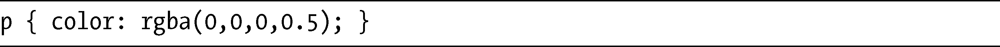
我提到过的，rgba和opacity在两个地方有所不同：第一，rgba是一个颜色值，所以你无法，比方说，用它去改变一张图片（或者一个具有背景图片的元素）的不透明度；第二，rgba值只能应用到它指定的元素上，所以子元素可以否决所有的继承。

为了更精确地演示两者之间的差异，我会展示图10-2和图10-3所示例子的修改版。我会使用相同的标记，但这一次我会为其中一个设置opacity，而为另一个的background-color属性设置rgba值，二者均使用相同的值：

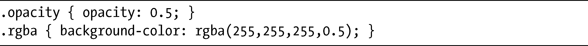
可以在图10-4中看到其结果。

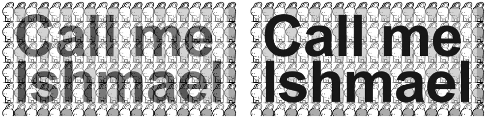

<b class="my_markdown">图10-4　对比不透明度（左）和RGBA（右）</b>

上面这种差别是相当明显的。两个方框都具有相同的透明等级，但在第一个方框中（左），opacity值被它的p子元素所继承，使得文本也成为半透明的。在第二个方框中（右），color属性的rgba值并没有被继承，所以p元素仍然是全不透明的黑色。

确定了rgba和opacity并不相同，我们就来看看它究竟是如何工作的。对于一个颜色值，很明显你可以把它用在背景、边框、阴影等地方。下面的代码展示了rgba应用到不同的属性上的一些例子：

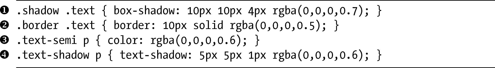
图10-5展示了这些属性的实际应用。

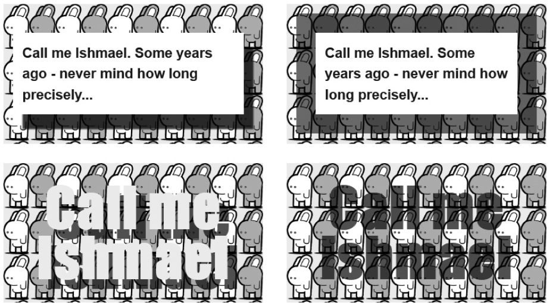

<b class="my_markdown">图10-5　应用到不同属性上的RGBA</b>

我们按顺时针方向，先从左上方看起，在第一个方框中，rgba降低了box-shadow的不透明度，把alpha的值设置为0.7，使得背景的一部分显露出来，也让阴影更加的“逼真”。下一个例子展示了50%不透明度的黑色border（我在第8章“背景裁剪和原点”一节中的图8-4所展示的例子使用过，在本章“WebKit中的边框重叠问题”一节中我会解释在使用这项技术的时候一个需要记住的问题）。在下一个例子中，color属性的alpha值被设置为0.6，这会让文本显示为半透明的。而最后的例子则展示了另一种阴影效果，这次是在text-shadow属性上。alpha值被设置为0.6，同样也产生了更加逼真的阴影。

像opacity一样，RGBA颜色值目前在Firefox、WebKit和Opera中得到支持，并计划包含在IE9之中。

**RGBA和优雅降级**

其他不支持RGBA值的较老浏览器会忽略任何使用这些值的规则，并默认使用之前的指定值或者继承值。为了弥补这个缺点，你应该两次指定该颜色，使用层叠以确保实现了正确的颜色。

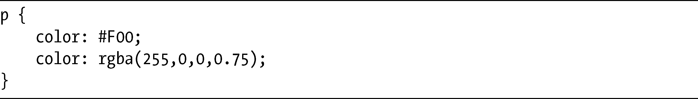
在这个例子中，不支持RGBA值的浏览器会忽略第二个color属性并应用第一个color属性。当然，这种结果意味着完全不透明的颜色将会被使用，而非使用半透明的，所以要彻底检查一下你的设计，确保它不受负面影响。

对于本章接下来要介绍的所有新的颜色值，也是相同的道理。

**WebKit中的边框重叠问题**

正如我所提到的，所有WebKit浏览器目前在border-color属性上实现RGBA都存在问题。在那些浏览器中，具有RGBA颜色值的边框会在边角上显示重叠的颜色。

为了理解我所讲的意思，不妨考虑下面这条CSS规则：

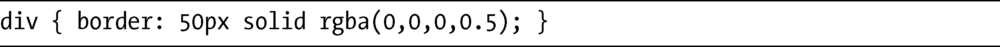
当我们在WebKit浏览器中查看这条规则时，这句代码会给出如图10-6所示的结果。

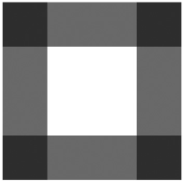

<b class="my_markdown">图10-6　WebKit中在边框上使用RGBA颜色时出现的问题</b>

可以看到，边角由于两个半透明边缘的重叠而变得更深。WebKit团队已经发现了这个bug，但现在还没有进行修复。而Firefox和Opera都没有这个问题存在。

### 10.2.2　色度、饱和度和明度

要总结HSL究竟是什么东西，如果不提供一门颜色理论课程的话是很难讲清楚的，但我还是会尽我所能：HSL——代表Hue（色度）、Saturation（饱和度）和Lightness（明度，有时也被称为亮度，luminance）——是RGB的柱坐标表示法。还不是很明白？好吧，看看这种解释如何：HSL就像是所有可能的RGB颜色被映射到三维之中。还不明白？好吧，先看看图10-7。

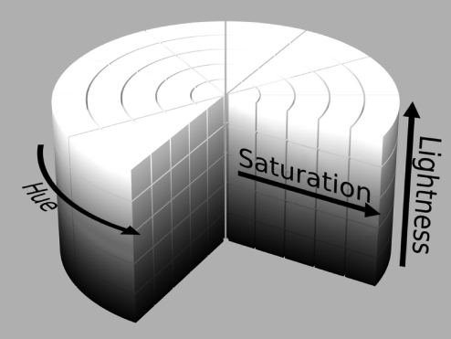

<b class="my_markdown">图10-7　图解HSL颜色方法<a class="my_markdown" href="['../Text/Chapter10.html#jzyy1']">[1]</a></b>

所有可能的颜色被安排在一个带有中心轴的圆柱体当中，围绕该轴的角度就是色度，与该轴的距离就是饱和度，而沿着轴线的距离就是明度。这三个值的组合就产生了一种独特的颜色。

色度代表主要颜色，从红色开始和结束（0或者360），并包括了这中间所有的主要颜色。考虑你在学校里面学到的可见光谱的颜色（或者彩虹的颜色）——红、橙、黄、绿、青、蓝、紫——围绕圆周分布，色度就是指向某个特定颜色的圆周的角度。

饱和度就是该颜色的强度或力度：0%就是没有强度，会让颜色变得稍微有些灰色，而100%就是全部强度，是该颜色的最强版。

明度就是颜色的亮度或者暗度：50%是真实色度，0%是黑色，而100%则是白色。

如果你以前从来没有遇到过HSL，并且我的解释仍令你感到迷惑，请别担心——对于我们的目标，只需要明白hsl是一个使用三个参数的颜色值，类似于RGB的语法就行了：

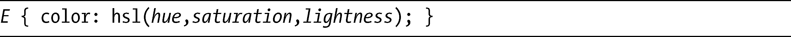
色度接受的值从0到360，而饱和度和明度接受的值则是从0%到100%。表10-1显示了一些简单的颜色示例，包括十六进制和RGB的等效值。

<b class="my_markdown">表10-1　四种颜色值常见的颜色等效值</b>

| HSL | RGB | 十六进制数 | 关键字 |
| :-----  | :-----  | :-----  | :-----  | :-----  | :-----  |
| 0,0%,0% | 0,0,0 | #000000 | 黑 |
| 360,0%,100% | 255,255,255 | #FFFFFF | 白 |
| 0,100%,50% | 255,0,0 | #FF0000 | 红 |
| 120,100%,25% | 0,128,0 | #008000 | 绿 |
| 240,100%,50% | 0,0,255 | #0000FF | 蓝 |

> 注意：
> 即便你把值0（零）用于饱和度和明度，仍然必须把这个值指定为一个百分数。

这一表格实际上没有讲述出全部的详情——例如，许多不同值的组合也可以创建出纯白色。实际上，要更加了解HSL的最好方法是使用一个支持HSL的颜色选取工具，然后摆弄上一阵子。HSL插件可以从Photoshop和大多数其他的图形软件包得到，你应该也可以找到在线的颜色转换工具。不过要注意，不要把HSL和Hue（色度）、Saturation（饱和度）和Value（纯度）相混淆（即HSV）。尽管它们使用的是相同的语法，但颜色值的映射是不同的，所以不会获得相同的结果。

HSL相比RGB（或十六进制数）的优点是能够让你更快地尝试一种颜色的不同变化，对于设计网站的人来说更为有用。如果你是一名把其他人的设计进行编码的开发人员，也许还要继续使用RGB，把HSL仅仅作为一种可考虑采用的选择。

HSL颜色值目前得到Firefox、WebKit和Opera的支持，同样，也被计划包含在IE9之中。

### 10.2.3　HSLA

如果你觉得HSL就是适合自己使用的颜色方法，那么你也可以使用hsla颜色值，利用Alpha通道实现透明效果。就像对应的RGBA值一样，hsla只不过在语法中使用一个附加的参数去扩展配色方案：

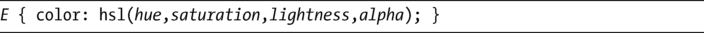
举例来说，如果想得到一个color值为红色、50%透明度的元素，可以使用下面的代码：

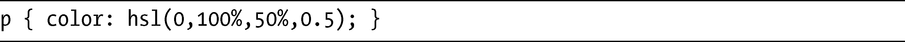
注意，RGBA边框重叠的问题，如图10-6所示，它也会发生在HSLA中。

### 10.2.4　颜色变量：currentColor

除了我刚刚描述的新的颜色方法，CSS3也引入了一个新的颜色值关键字：currentColor。这个关键字的作用就像是一个变量，也就是说它的值是继承的，所以根据它应用在文档树中的不同位置，可以有不同的值。

一个元素的currentColor值是它自己的color属性的值，并且像color一样，currentColor可以被继承。假设一个元素有一个color值为red，那么currentColor的值就是red。然后你就可以使用它为不同的属性设置颜色值，不需要再次指定red值。

下面的例子应该能够阐明currentColor的有用性。首先，我使用如下标记：

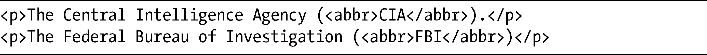
然后为它应用这段CSS：

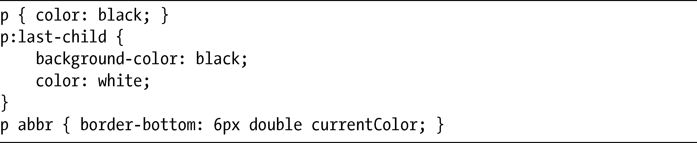
其中，有一个段落将会在默认（white）背景上显示黑色（black）文本，而另一个段落则在黑色（black）背景上显示白色（white）文本。接下来，我使用了currentColor关键字作为abbr元素上的border-bottom属性的值。我们可以在图10-8中看到其结果。

<b class="my_markdown">图10-8　currentColor颜色值关键字的演示</b>

因为第一个段落的color值是black，所以abbr元素的border-bottom属性的颜色值也是black。而第二个段落的color值是white，所以abbr元素的border-bottom属性也有相同的颜色值。这些值继承了它们的父元素的color属性。

currentColor关键字表示我不需要指定abbr元素的每一个实例的边框颜色。在这个例子中，我不需要使用一条额外的规则，但如果没有currentColor关键字，我就不得不使用像下面这样的语句：

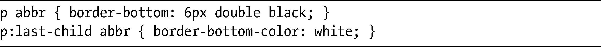
尽管这看起来也许节省不了多少代码，但其意义在于我可以更新父元素的颜色而不需要担心如何把该颜色也设置到相关的子元素上。对于有许多不同颜色组合的大型站点，你会发现currentColor是极其方便的。

currentColor值目前在Firefox、WebKit和Opera中均得到实现，也被计划包含在IE9当中。

