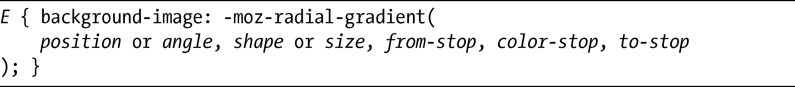
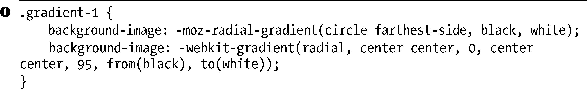
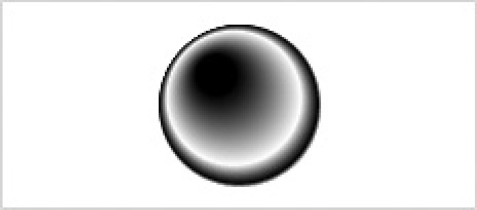

### 11.2　放射渐变

放射渐变<a class="my_markdown" href="['../Text/Chapter11.html#jzyy1']">[1]</a>（radial gradient）是从一个中心点向所有方向放射状地在各种颜色间逐步进行过渡。最简单的放射渐变是两种颜色在一个圆形或椭圆形中逐渐变化。

### 11.2.1　Firefox中的放射渐变

以下是在Firefox中实现放射渐变的语法：

前两个值：position和angle，作用就像-moz-linear-gradient中对应的值一样，而from-stop和to-stop也是一样。两个新的参数是shape和size，shape使用一个关键字常量值，可以是circle或ellipse（默认是ellipse），而size可以接受6个不同的关键字常量中的其中之一，我会在适当的时候进行介绍。

使用Firefox语法创建放射渐变的最简单方式是：

上述代码的结果是出现了一个椭圆形的简单黑白渐变，向其父元素的最远角扩散，如图11-4所示。

<b class="my_markdown">图11-4　Firefox中简单的两种颜色的放射渐变</b>

### 11.2.2　WebKit中的放射渐变

WebKit的语法有非常大的差异。其语法如下：

和线性渐变一样，你要有一个type参数，但在这里，我使用的值是radial。接下来，你会看到两对参数：inner-center和inner-radius，还有outer-center和outer-radius。这些参数设置了渐变的开始点和结束点，以及它们的半径距离。

inner-center和outer-center均接受相同的值，而inner-radius和outer-radius也是一样的。inner-center和outer-center允许的值和线性渐变的start-point和end-point所使用的值是一样的——也就是说，必须是一对关键字值（center center）或者是一对百分比值（50% 50%）——而inner-radius和outer-radius只接受一个整数值，即用像素表示的长度。

from()、color-stop()和to()函数和用在线性渐变上的函数是一样的，就像本章前面所描述的。

### 11.2.3　使用放射渐变

由于WebKit需要设置外半径的界限，所以它的放射渐变语法并不允许创建椭圆形状的渐变——必须全部使用圆形的。所以，我无法重复图11-4所示的例子，相反，我会使用下面的语法，展示简单的反射渐变：

内部的渐变从元素的中心开始，半径值为0，而外部渐变从相同的地方开始，但是半径值为50。这些值产生了一个单独的渐变，从白到黑，从元素的中心到它的上下边缘。该容器高100px，所以50px的半径恰好是它的一半。

我们可以在图11-5看到其结果。

<b class="my_markdown">图11-5　圆形放射渐变</b>

你可以使用这段代码在Firefox中精确地重复这一效果：

注意，这里有两个新的关键字。第一个是circle，它是shape参数的值，仅仅用于将渐变设置为圆形而非椭圆。接下来是contain，它是我早先提到过的size参数的值。contain值表示渐变会在方框上最接近中心的一端停止下来。如果喜欢的话，也可以使用关键字closest-side，因为这两个关键字是同义的。

size参数的另外一个关键字常数值是：cover，表示渐变会在距中心最远的元素角落停止下来（也可以使用farthest-corner关键字，它和cover是同义的）；closest-conner则表示渐变会在最接近其中心的角落停下来；而farthest-side，表示渐变会在距其中心最远的边停止下来。请原谅我讲述这些赘述的定义，不过这些关键字的作用也都是很明显的！

你应该能够从这个例子中推断出这两种语法的关键差别：WebKit需要明确地设置界限，反之在Firefox中，其界限是由渐变所应用的元素尺寸所定义的。

为了列举说明应用放射渐变的一些方法，我会使用下面的代码来展示四个例子：

你可以在图11-6中看到其输出。

<b class="my_markdown">图11-6　放射渐变使用不同的值的例子</b>

第一个例子（）展示了一个黑白渐变，从方框的中心开始，辐射到方框的最远端（水平）。在Firefox中，我使用了farthest-side关键字，而在WebKit中，我设置它的值为95px（方框的一半宽度）。

在下一个例子中（），我再次把辐射的界限设置为方框的最远端，但这一次，我把中心点设置为左边缘的中心点。在WebKit中，我把第二个半径值定义为190px，即方框的宽度。

第三个例子（）是WebKit的语法真正开始造成恶果的地方。我把渐变设置为从方框的右上角开始，辐射到最远的角落（左下角）。在Firefox中，我通过farthest-corner常量实现，但为了在WebKit中达到相同的效果，我需要使用公式sqrt(x2 + y2)计算方框的对角线——即，高度的平方加宽度的平方之和再开平方根，在这个例子中就是214.7。我想你真的不会愿意在每次使用这种类型的渐变时都需要这么做！

在第4个例子中（），我把渐变的中心放在方框宽度的80%和高度的50%的位置，然后设置其辐射界限为最近的边（右端）。同样，这在Firefox中是简单易行的——我只需要使用closest-side关键字就可以了。但在WebKit中，则需要更多复杂的数学计算。方框有190px宽，所以渐变的中心点是距方框左侧152px的位置，而半径限制必须是38px（190px – 152px）。

### 11.2.4　多个color-stop值

和线性渐变相对应的是，放射渐变接受多个color-stop值。和之前一样，我们在Firefox中只需要在from-stop和to-stop之间添加颜色值就可以了，而在WebKit中，要使用color-stop()函数去声明每个color-stop。最终的代码可能像下面这样：

我会使用下面的代码，举例说明多个color-stop值的使用：

所有的结果如图11-7所示。

<b class="my_markdown">图11-7　为放射渐变使用不同的color-stop值</b>

在第一个例子中（），我使用3个color-stops（黑-白-黑）创建了一个从方框中心到其最远端的渐变。记住Firefox会自动地计算它们的比例，反之在WebKit中，我需要指定color-stop必须出现的半径长度。第二个例子（）是相似的，只是我要把color-stop指定为在半径长的25%。在第三个例子（）中，我设置渐变从方框的左端开始并在右端结束，color-stop位于方框长的25%和75%的位置。

我在最后一个例子（）使用了五种颜色，但指定from-stop和第一个color-stop使用相同的颜色，而在中心我创建了实心的白色圆形。注意这里渐变的界限是方框长的水平端，所以在WebKit中，我设置outer-radius的值为50px，是方框垂直高度的一半。

### 11.2.5　WebKit的优势

WebKit语法相对于Firefox语法的一个优势就是inner-和outer-参数，它们能够在同一个渐变上设置两个不同的中心和半径。这两个参数实现了Firefox语法所无法复制的渐变模式。例如，看看下面的代码：

我设置内部渐变的中心在元素的45%和35%的位置，还设置了10px的半径；而外部渐变的中心则设置在元素的50%和50%的位置，半径为40px。因此，两个渐变的位置是相互偏移的，而渐变的总半径是30px，所以得到了如图11-8所示的效果。

<b class="my_markdown">图11-8　只可能用WebKit语法实现的放射渐变</b>

尽管这是WebKit语法所独有的，但这种特殊的渐变需要付出两个额外参数的代价，而这两个参数许多时候都是没有必要使用的。

