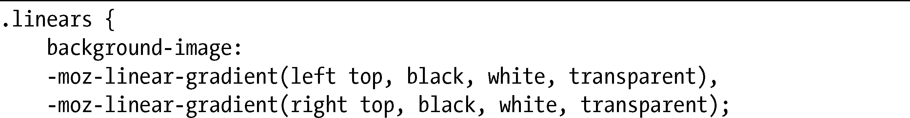
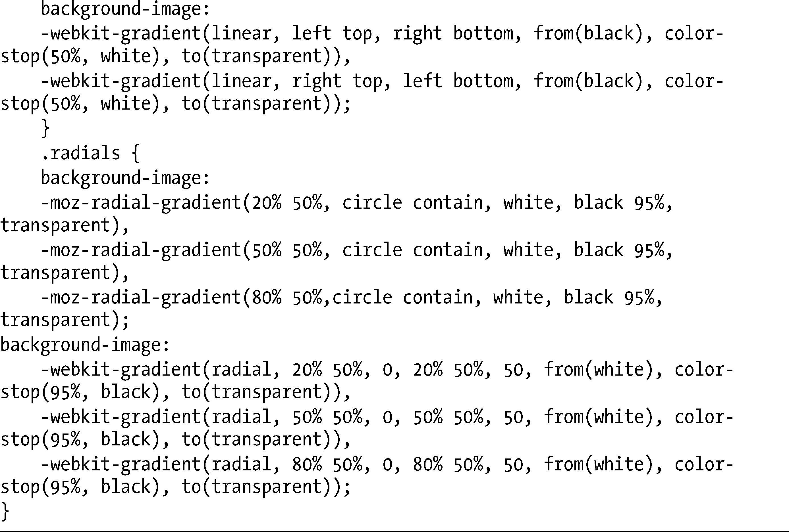
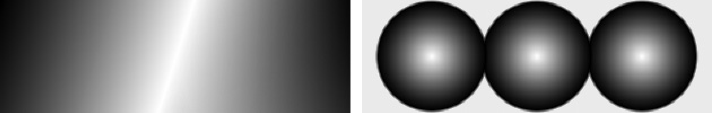

### 11.3　多重渐变

由于渐变能够应用到background-image属性上，所以我们可以使用CSS3引入的多背景值语法（参见第8章），利用逗号隔开的值在一个元素上应用多重渐变。

这里是两个例子，第一个使用线性渐变，第二个则使用放射渐变：

这两个例子都显示在图11-9中。

<b class="my_markdown">图11-9　多重渐变背景值</b>

第一个例子展示了两个线性渐变，一个是从左上到右下，另一个是从右上到左下。to-stop设置的值是transparent，允许第二个渐变从后面显现出来——记住，如果不设置透明度，该渐变就会填充方框的剩余部分，在它后面的层就会被隐藏起来。

第二个例子展示了三个放射渐变，每个渐变的半径均为50px。同样，to-stop的transparent值允许后面的层显现出来。

