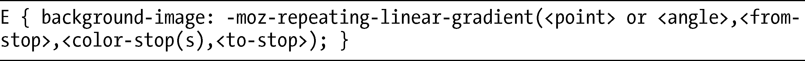
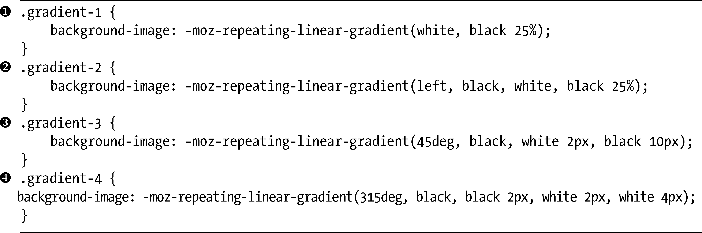
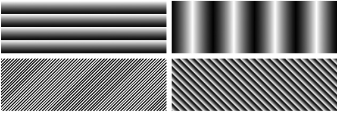
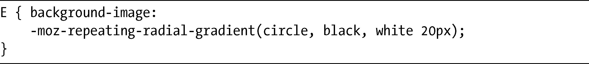
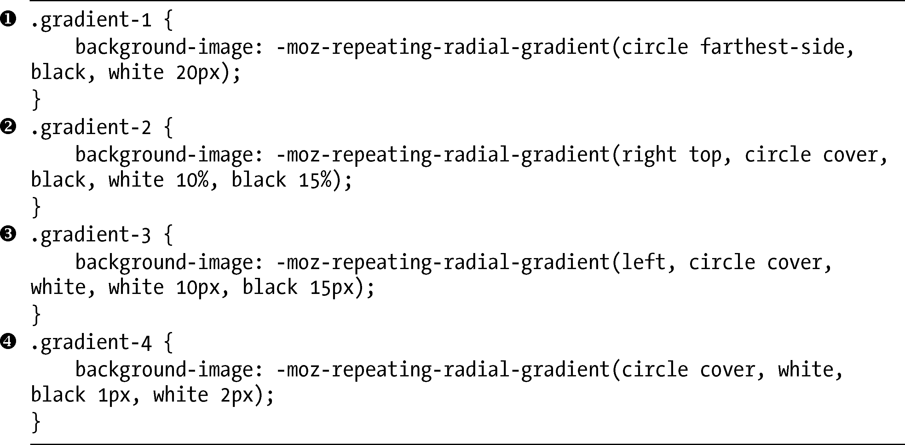
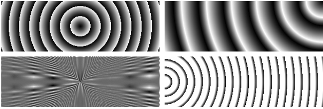

### 11.4　Firefox中的重复渐变

目前的渐变语法有一个限制，那就是在指定额外的color-stop的时候，它们会变得越来越难以处理，这意味着我们如果要实现简单渐变以外的效果，就需要大量的重复代码。Firefox开发人员提议使用一组函数，通过对渐变进行重复去填充方框，可以在一定程度上解决这一问题。目前这些函数都属于专用函数，并没有被图像取值模块所接受，所以必须要使用-moz-前缀。

### 11.4.1　重复线性渐变

线性渐变的重复可以通过-moz-repeating-linear-gradient来实现，它接受和-moz-linear- gradient一样的基本的值集：

二者之间的差别是对于-moz-repeating-linear-gradient来说，to-stop需要一个长度值或百分比值。例如：

该值设置了渐变应该结束以及重复开始的点。这个例子创建了一个上下渐变（记住，这是默认值），该渐变是在覆盖了方框高度的25%的黑色和白色之间，意味着它将会重复四次。

用一些使用不同值的例子可以进行最好的解释说明，后面我再详细解释。这里是我用在这些例子中的代码：

你可以在图11-10中看到其输出。

<b class="my_markdown">图11-10　在Firefox中重复线性渐变</b>

按顺时针方向从左上角开始看起，第一个例子（）使用我在这一节介绍的代码：上下、双色、重复四次。接下来，我引入了一个额外的color-stop并改变了起点，所以渐变称为左右方向（）。这里渐变覆盖了元素的25%，但这一次该渐变成为黑-白-黑，并且均匀地分布。

对于第三个例子（），我使用了一个角度值：45deg，所以渐变是沿着对角线的，我还使用了px作为color-stop的单位。同样，渐变也是黑-白-黑的，但这一次并不是均匀地分布，所以黑-白覆盖了2px，而白-黑覆盖了8px。

在最后一个例子（）中，我使用了四个color-stops：2px的黑-黑，之后是2px的白-白。较低的长度值不会在两种颜色之间产生任何渐变，所以此处产生了生硬的对角线。

### 11.4.2　重复反射渐变

在Firefox中，与-moz-radial-gradient函数对应的就是-moz-repeating-radial-gradient，该函数会重复所提供的值，直到达到指定的界限。它的工作方式和-moz-repeating- linear-gradient一样，需要为to-stop指定一个长度值，例如：

这个例子创建了一个黑白渐变，每隔20px重复一次。在下面的代码中，你可以看到其实际应用和更进一步的演示：

其结果显示在图11-11中。

我们再次按顺时针方向从左上角开始看起，第一个例子（）是我在本节的介绍部分所使用的，一个黑-白的圆形渐变，每隔20px重复一次。第二个例子（）从右上角开始辐射，经过三个color-stops，跨越方框宽度的15%——该界限是通过cover关键字常量设置的，意味着它会延伸到最远（左下）角落。在第三个例子中（），我设置渐变的中心为方框的左端，界限为最远的角落，使用10px的白-白（一致的）渐变，之后是5px的白-黑渐变。在最后一个例子（）中，我似乎创建了一件艺术作品！我设置了重复的白-黑-白渐变，跨越了2px这一非常低的半径，创建出你在这里看到的干涉图形。我并不是故意要这样实现的，但其结果确实很有趣！

<b class="my_markdown">图11-11　在Firefox中重复放射渐变</b>

