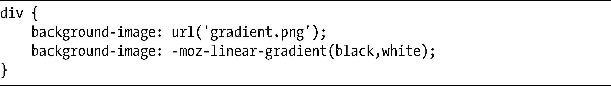

### 11.5　小结

WebKit语法能够对渐变进行精密的控制，但这种控制所付出的代价就是：复杂性。尽管Firefox语法无法实现所有可以用WebKit实现的东西，但你会发现在把渐变应用到元素上时，使用Firefox语法要简单得多。

当前，使用CSS把添加渐变到页面上看起来也许是一个相当痛苦的过程，但实际上这只是因为W3C采纳这种方法的时间还很短，而实际的浏览器实现仍然处于过渡阶段，所以我们为了实现需要的效果，就不得不使用两种差异很大的语法。

除非有特殊情况，当前的WebKit语法并不打算使其成为规范的最终草案，所以你也许觉得最好还是不用为好。只要你提供了回退的图片（或者即便只是单纯的颜色）——不管怎样，这是你对其他的浏览器也应该提供的，那么你马上就可以随意地使用Firefox的实现。

现在，我们学习了装饰页面元素的方法，我打算继续前行，学习一个全新的专业领域：变换页面元素并添加动画效果。

