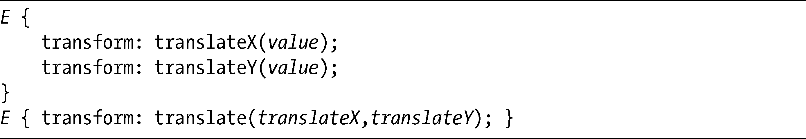
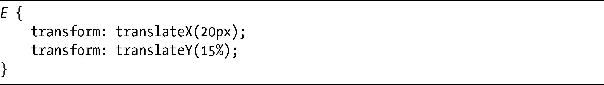
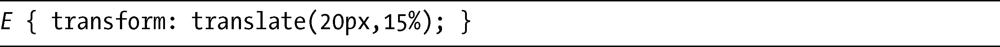
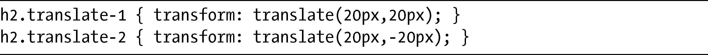
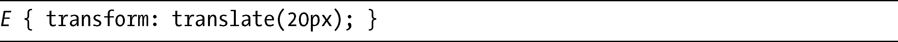
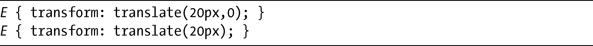

### 12.3　平移

我们要了解的下一个函数是translate，该函数可将元素从它的默认位置进行移动。实际上它包含了三个函数：translateX、translateY和translate：

前两个函数，translateX和translateY，可以把元素按照指定的长度沿着一条轴线移动——如果你需要补习一下，看看第6章中关于轴线的解释。这里你可以使用任何长度单位或百分比值，例如，可以这么用：

这段代码会将元素向右移动20px（沿着x 轴），并向下移动其自身高度的15%（沿着y 轴）。你也可以使用负值，将把元素沿着轴线向相反方向移动——也就是说，向上或者向左移动。

下一个函数，translate，是translateX和translateY的简写。你可以用前面例子中的值来使用它，像这样：

这里是使用translate的两个例子：

你可以在图12-4中看到这段代码的结果，和前面一样，浅灰色的元素会显示在原来的位置上。

<b class="my_markdown">图12-4　展示translate函数中不同值的效果的元素</b>

第一个例子使用一对20px的值，所以元素距原点水平并垂直偏移了20px。第二个例子的第二个值是负的（-20px），所以该元素沿着y 轴被移到相反的方向，在原点上方发生位移。

translate简写可以允许只使用一个值，如下：

如果这样的话，所提供的值就会被假设为translateX值，而0（零）值将被用于translateY。既然如此，下面的两条声明就都是相同的：

你也许认为translate非常类似于使用相对定位以及left和top属性，但请记住，经过变换的元素会保留它的位置，只是从显示上看起来像被移动过，被变换的是元素的图像，而不是元素本身。

