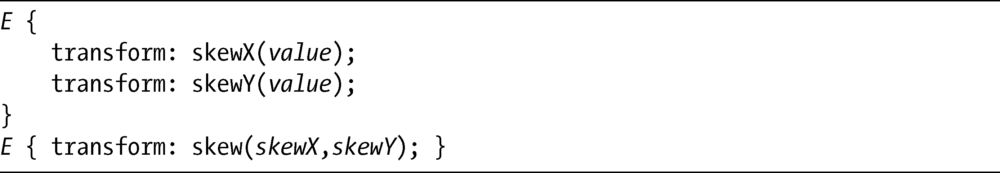
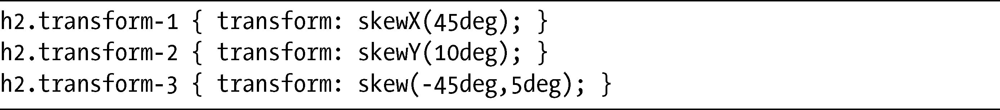
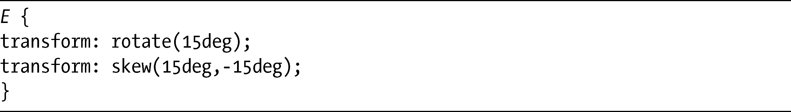

### 12.4　倾斜

skew函数允许修改元素的水平轴或垂直轴的角度。就像translate一样，每一条轴都有一个单独的函数，二者都可以使用简写函数：

skew函数使用的值是角度值（我会在示例中使用度数），也可以使用负值，而skew简写可以使用一个或两个值——和以前一样，如果只指定了唯一一个值，该值会被假设为skewX，而skewY会默认为0。

我来展示一下skew是如何工作的，用下面的代码提供三个演示：

这些演示如图12-5所示。

<b class="my_markdown">图12-5　在skew函数中使用不同的值变换元素</b>

在第一个例子中，元素沿着它的x轴倾斜45度，导致垂直边缘沿对角线倾斜。在第二个例子中，在y 轴上出现了10度的倾斜，所以水平边缘会向对角倾斜，而垂直边缘保持不变。最后一个例子展示了使用简写函数应用两个值的效果。这两个值分别是x 轴45度，y 轴5度，所以元素在两个轴线上都会发生倾斜。

看看最后一个例子，你可以看到使用skew去替代rotate函数也是可行的。要实现这种效果，就要把旋转元素的角度作为给scaleX的值，而相反的值则给sacleY。也就是说，如果scaleX是10度，那么scaleY应该是-10度，反之亦然。因此，下面代码示例中的这两个函数执行的是相同的任务：

当我在本章后面介绍matrix函数的时候，你会发现这种方法是很有用的。

