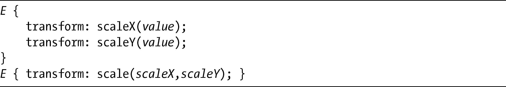
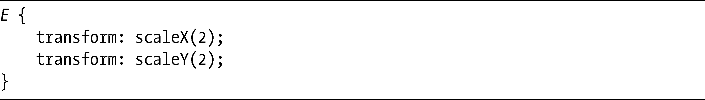
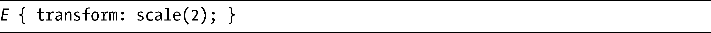
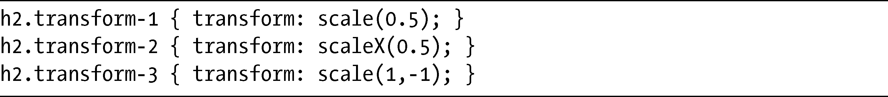
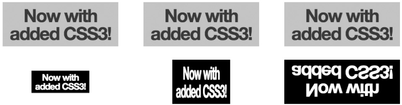

### 12.5　缩放

你可以使用scale函数，让一个元素与原来相比变得更大或更小。同样，对于水平的值和垂直的值也有对应的函数和简写函数：

scaleX和scaleY的值是无单位的数字，给出的是一个尺寸比例。默认尺寸是1，所以2就是两倍默认值，0.5就是一半的默认值，等等。你也可以使用负数——我马上会解释负数的效果。

为了让元素在两个轴线上变成原始尺寸的两倍，要使用：

当然，我们也可以使用简写属性，scale。不过要注意，scale函数和你在本章到目前所见到的其他简写属性是不同的，因为如果只为它提供了一个值，另外一个值就被假定为是相同的值。对于前面的例子，你可以使用简写属性取而代之：

我会使用几个例子演示scale的实际应用。以下是我所用的代码：

结果如图12-6所示。

<b class="my_markdown">图12-6　scale函数中不同的值的效果</b>

第一个例子的scale值是0.5，所以经过变换的元素是原来的一半大——记住，在简写属性中我只指定了一个值，所以另一个值被假定为等同于我所指定的值。在第二个例子中，我使用的值是0.5，但这一次是用于scaleX函数，意味着经过变换的元素具有和原来一样的高度，但只有一半宽。

在最后一个例子中，我为scale简写提供了两个值：第一个是1，设置水平尺寸和原来保持一致，但第二个值是-1，使用负值的效果就是垂直地翻转元素，以相同大小创建原元素的“映射”。

> 注意：
> WebKit浏览器也有另外一种方法，就是使用box-reflect属性，我会在“使用WebKit映射”中进行介绍。

