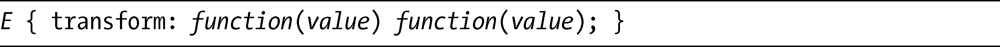
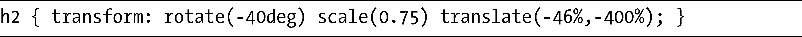
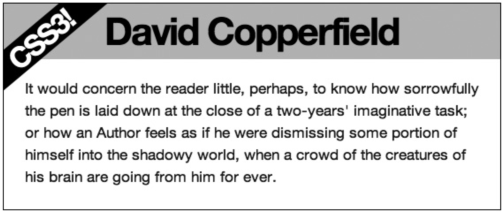

### 12.6　多重变换

你可以在一个单独的元素上应用多重变换，只需要在transform属性中用空格隔开列出多个函数即可：

例如，我们可以使用下面的代码旋转、缩放并平移一个元素，如下：

可以在图12-7中看到这段代码的实际演示效果如何。

<b class="my_markdown">图12-7　多个函数应用到h2元素上，创建“绶带”效果</b>

h2 元素经过了多个函数的变换后位于父元素的左上角，那是一种网页上相当流行的绶带效果，但是，在此之前这种效果还只能通过图片去实现。

