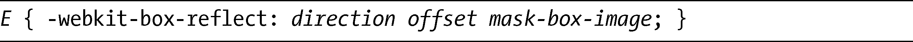
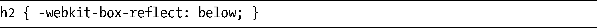
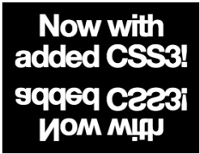
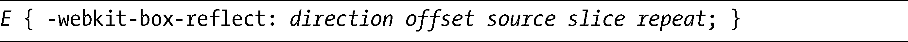
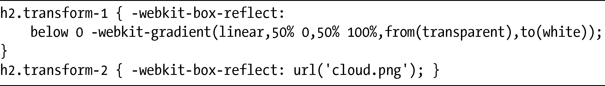

### 12.8　使用WebKit反射

“Web 2.0”的一种常见的设计手法就是反射的图片——即，让一张图片看上去似乎在光滑的表面上出现了反射。在本章前面，我演示了如何使用scale去翻转并反射一个元素，但这需要两个独立的页面元素：原始元素和反射元素。

为了解决这一问题，WebKit引入了一个新的属性，可以不需要使用额外的元素，那就是：-webkit-box-reflect。其语法如下：

第一个值，direction，是一个关键字，设置反射相对元素应该出现的位置，分别有：above、below、left或者right。接下来是offset，这是一个长度值，设置元素和反射之间的距离（默认为0）。最后的值是mask-box-image，这是一个可选的值，允许你把一张图片设置为遮罩。

我们先暂时把mask-box-image放到一边，相反，我会先展示一个可能是最简单的反射例子：

这里，我设置反射出现在元素下面。记住，offset默认值是0，而mask-box-image是可选的，所以direction是唯一需要的值。你可以在图12-9中看到它如何显示。

<b class="my_markdown">图12-9　在元素下方简单的反射</b>

这段代码创建了图片的精确镜像，但为了获得有光泽的Web 2.0反射，需要生成反射渐渐变弱的幻觉，就像它离原始的元素越来越远。你可以使用mask-box-image值实现——或者，使用一系列的值。mask-box-image使用的语法和第8章遮罩一节所用的语法是一样的，也和第9章的border-image是相同的：

就像border-image，source是图片文件的URL（这里也可以使用第11章的渐变语法），slice是可选的一系列长度值，用于定义图片要使用的区域，而repeat是一个关键字值，设置了图片要如何重复填充反射元素。这个值也是可选的，如果repeat不存在的话，就会使用默认值stretch。

我来展示两个非常简单的例子，仅仅使用了source值：

输出结果如图12-10所示。

<b class="my_markdown">图12-10　使用渐变（左）和作为遮罩的图片（右）</b>

在第一个例子中，我使用从透明到白色的渐变垂直地填充，产生了一种光滑的反射效果。在第二个例子中，我使用图片cloud.png在反射上产生遮罩的作用。

注意反射和本章其他变换效果的行为是一样的：它并没有占据页面布局流的位置，而是位于主体内容之上的层，因此将会覆盖在后面的元素上。

