### 13.1　过渡

CSS2没有中间状态：当一个属性的值发生变化的时候，这种改变是突然发生的。考虑一个元素的宽度是100px，当鼠标悬停在上面的时候，宽度要改变为200px。你会注意到元素在两种状态之间并没有平滑地变化，而是在这两种状态之间发生跳跃。CSS3引入了过渡模块（Transitions Module，<a class="my_markdown" href="['http://www.w3.org/TR/css3-transitions/']">http://www.w3.org/TR/css3-transitions/</a>），提供了改变这种变换方式的选项。在CSS中，过渡就是让一个属性在两种状态之间移动的动画。

正如本章开头部分所介绍的，过渡是隐式的动画，意味着它们只有在CSS属性设置了新值的时候才会被触发。为了让过渡发生，必须满足4个条件：一个初始条件、一个终止条件、过渡本身和触发器。

这是一个非常简单的过渡的四个条件的例子：

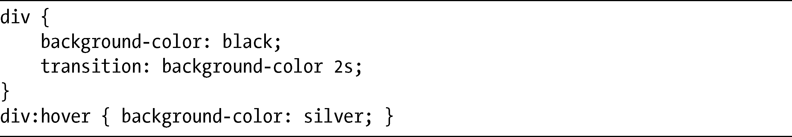
div元素提供了初始值（background-color:black）和过渡（background-color 2s）。现在先别担心语法，我会在适当的时候再进行解释。它的触发器是:hover伪类，并且为background-color属性提供了结束值（silver）。

所以这里我们得到一个带黑色背景的div元素，当鼠标移过的时候，会平滑地过渡为银色的。当触发器不再激活时，所有过渡会有相反的表现，所以当鼠标移开div，背景会平滑地过渡回黑色状态。

现在你对过渡如何工作应该大体有所了解，我会依次讨论每一个过渡属性。过渡在WebKit浏览器、Opera（从10.6版开始）和提前发布的Firefox测试版（目前计划在第4版中实现）中得到实现。下面所有的这些属性在网页中都要使用-moz-、-o-和-webkit-前缀。一如既往，我会在例子中使用无前缀的属性。

### 13.1.2　属性

第一个新属性，transition-property，指定了元素的哪一个属性（或者多个属性）会有动画效果。这是它的语法：

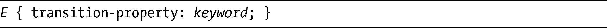
keyword可接受的值可以是关键字all或者none，又或者是一个有效的CSS属性。它的默认值是all，表示每个有效属性都会有动画。这里我强调的是有效的CSS属性，因为不是每个属性都可以有过渡效果。规范中有一个完整的列表列出了我们可以应用动画效果的属性，位于<a class="my_markdown" href="['http://www.w3.org/TR/css3-transitions/#properties-from-css-']">http://www.w3.org/TR/css3-transitions/#properties-from-css-</a>。

这是transition-property的一个例子：

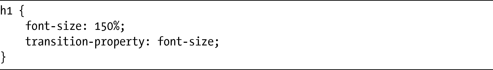
这段代码在font-size属性上设置了150%的初始值，然后声明这就是在触发器（还未指定）激活的时候，将会应用过渡效果的属性。注意，我会添加一些属性到这个例子上并一直使用这个例子，直到在本节结尾的时候我才会完整地展示这个例子的实际应用。

### 13.1.2　持续时间

下一个属性是transition-duration，它定义了过渡从开始到完成的时间长度。其语法是：

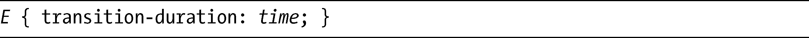
time值是一个单位为ms（毫秒）或者s（秒）的数字。因为1 000毫秒等于1秒，值1.25s和1 250ms是相同的。默认值是0（零），意味着该属性是创建过渡唯一一个必要的属性。如果声明了一个transition-duration而没有transition-property，过渡也可以发生（因为默认值为all，所以所有有效属性都会应用动画），但反过来就不行了（即transition-duration是必需的）。

为了让第一节的例子的过渡持续两秒钟，需要添加以下代码：

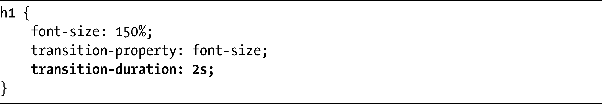
注意，尽管我们在这里可以提供负值，但它们也会被解释为0。

### 13.1.3　计时函数

要控制元素在两种状态之间过渡的方式，我们要使用transition-timing-function属性。该属性能够让动画在过渡持续期间在速度上有各种变化，对动画的节奏进行控制。该属性有两种不同的值类型：关键字或者是cubic-bezier函数。稍后我会在本节详细地讨论cubic-bezier，因为它有点儿复杂，一开始，我会先把注意力放到关键字上。

#### 计时函数关键字

在使用关键字的时候，transition-timing-function属性的语法是非常简单的：

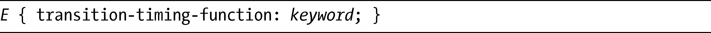
keyword的可能值是ease、linear、ease-in、ease-out和ease-in-out。默认值是ease，其动画效果就是慢慢开始，快速加速，然后在结尾处再降低速度。linear值使动画从过渡的开始到结束都是稳定地发展，在速度上没有变化。对于ease-in值，动画会慢慢地开始，然后不断加速直到结尾，而ease-out值则是相反的。最后，ease-in-out会使动画慢慢地开始，在中间的时候加速，之后在结尾处又再次降低速度，类似于ease值，但没有那么引人注目。

解释清楚之后，我们为示例中的过渡添加一个简单的计时函数：

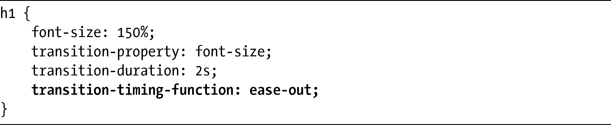
#### 立方贝塞尔曲线

transition-timing-function其中一个可能的值是cubic-bezier函数。如果你对立方贝塞尔曲线（cubic Bézier curves）不熟悉——的确，为什么要熟悉呢？——请允许我解释一下。首先，这是其语法：

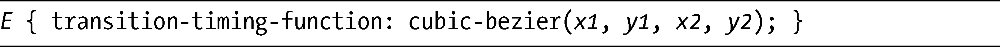
一条立方贝塞尔曲线是利用网格上的四个点上绘制出来的，在每条轴线上都是从0变化到1。这四个点已知为P0、P1、P2和P3，它们定义了曲率并使用（x，y）坐标对进行绘制，其中第一个点（P0）总是在（0，0），而最后一个点（P3）总是（1，1）。另外两个点定义在函数中，分别是：（x1，y1）和（x2，y2）。图13-1所示的例子是最好的说明。

图13-1展示了映射到网格上的四个点，创建出一条贝塞尔曲线。每个点的坐标显示在表13-1中。

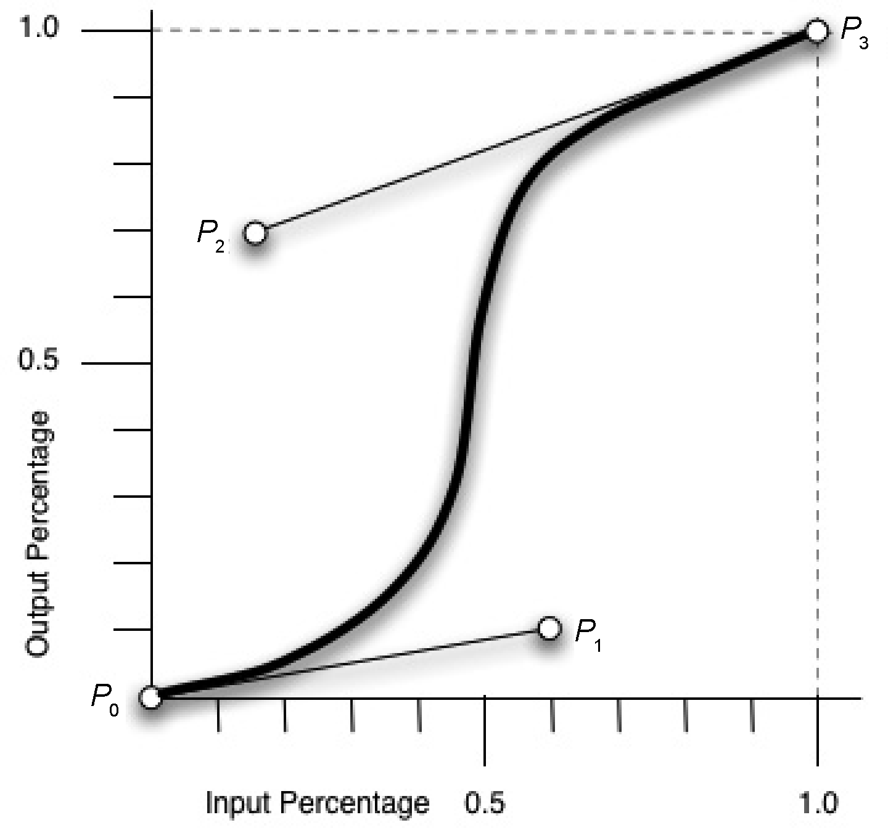

<b class="my_markdown">图13-1　立方贝塞尔曲线示例</b>

<b class="my_markdown">表13-1　用于绘制贝塞尔曲线的坐标点</b>

| 点 | 坐标(x, y ) |
| :-----  | :-----  | :-----  | :-----  |
| P0 | (0, 0) |
| P1 | (0.6, 0.1) |
| P2 | (0.15, 0.8) |
| P3 | (1, 1) |

你可以使用下面的CSS来表示曲线（记住，不需要定义P0和P3，因为它们总是有相同的值）：

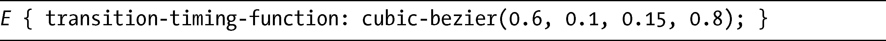
线性动画的变化趋势是沿着一条从（0，0）到（1，1）的直线发展的，但是我们这个示例动画会在设置的持续时间内，跟随曲线的发展变化向终点发展。假设持续的时间是1秒，我们可以看到动画在开始的时候（大概在0和0.5秒之间）速度会逐渐增加，之后，会在大约0.7秒的时候急剧地加快，然后又会以较慢的速度变化，直到动画结束。

前面描述的所有transition-timing-function关键字都是使用立方贝塞尔曲线产生的。表13-2显示了每个关键字以及它们对应的cubic-bezier函数的值。

<b class="my_markdown">表13-2　对比transition-timing-function关键字和等效的立方贝塞尔值</b>

| 关键字值 | 立方贝塞尔值 |
| :-----  | :-----  | :-----  | :-----  |
| ease | 0.25, 0.1, 0.25, 1 |
| linear | 0, 0, 1, 1 |
| ease-in | 0.42, 0, 1, 1 |
| ease-out | 0, 0, 0.58, 1 |
| ease-in-out | 0.42, 0, 0.58, 1 |

就像上一章介绍的变换矩阵一样，对于不常使用数学的人，cubic-bezier函数可能也会非常让人觉得生畏。但是请别担心——我们总是可以使用关键字值，在大多数情况下这些值已经远远够用了。

如果要对立方贝塞尔曲线进行试验，这里有一个在线工具，可以图形化地显示出不同坐标组合的结果，位于<a class="my_markdown" href="['http://www.netzgesta.de/dev/cubic-bezier-timing-function.html']">http://www.netzgesta.de/dev/cubic-bezier-timing-function.html</a>。

### 13.1.4　延迟

transition-*系列的最后一个属性是transition-delay，该属性设置了过渡开始的时间。以下是其语法：

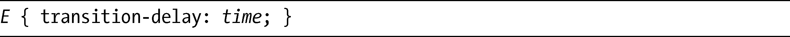
和transition-duration一样，time值是一个单位为ms或s的数字。其默认值是0（零），意味着过渡会在触发器被触发的时候发生。任何正值都会让过渡在指定的时间长度过去之后才开始。

例如，如果我们要在示例过渡开始的时候设置四分之一秒的延迟，可以使用以下代码：

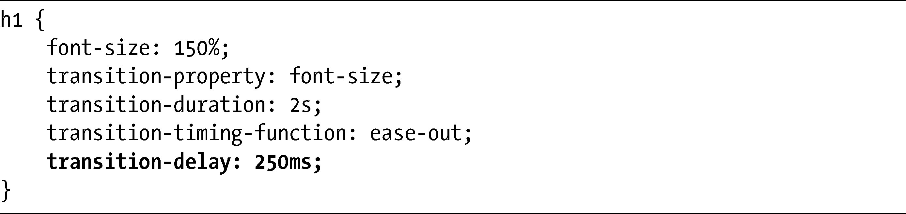
你也可以在transition-delay上使用负值，会出现有趣的效果：过渡会立即开始，但是会提前跳过负值对应的时间量。为了说明我的意思，考虑一个4秒钟的过渡，但延迟了-2秒：

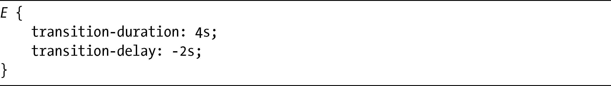
当该过渡被触发的时候，过渡会立即开始，但看上去就像是已经过去了2秒钟一样（2秒是持续时间减去延迟时间）。这种情况下，动画会在整个过渡的中途开始。

### 13.1.5　简写

在这一整节中，我通过一个一个的属性构建出一个过渡的例子，现在，代码看起来应该像下面这样：

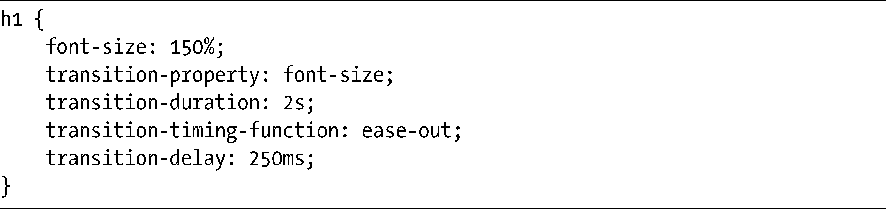
这段代码对于每个过渡来说看上去要写的东西还有很多。但是，和所有其他成“系列”的CSS属性一样（background-*、border-*，等等），transition-*系列也有一个简写。下面就是它的语法：

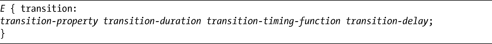
这里需要知道的一件重要事情是，有两个值：transition-duration和transition-delay，必须按照这一顺序进行声明。如果只声明了一个，语法会推测它是transition-duration，而transition-delay会被设置为默认（或者继承）值。

如果要把示例过渡中的值和简写属性一起使用，其结果会是：

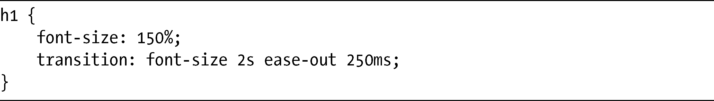
很明显，这种方式使得我们需要编写的代码大大减少。

### 13.1.6　完整的过渡示例

现在我已经解释了所有构成过渡的属性，我们来看看示例过渡的实际应用。完整的代码如下所示：

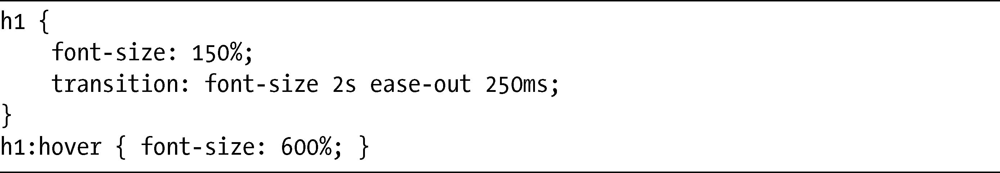
图13-2显示了当我把鼠标放在h1元素上面的时候会发生什么。

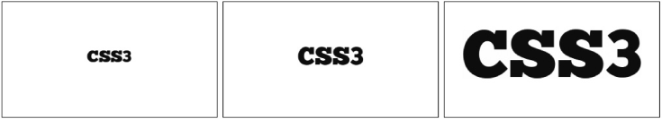

<b class="my_markdown">图13-2　font-size属性动画过渡的三个阶段</b>

很明显，我不能在印刷的页面上显示完整的动画，但是上面的演示展示了过渡的三个阶段：初始的、过渡前的阶段（左），font-size是150%；中间的、过渡中的阶段（中），处于font-size增大并进入动画的两秒钟内；最终的、过渡后的阶段（右），该阶段font-size是600%。

如前所述，当作为触发器的条件不再符合时，过渡会有相反的表现，所以当你把鼠标从h1元素上移走时，从右到左看看这个例子，就知道会发生什么了。

### 13.1.7　多重过渡

你可以为独立或简写的属性提供一列用逗号隔开的值，轻松地把多种过渡添加到一个元素上。这种情况下，下面的这两个代码示例都是有效的：

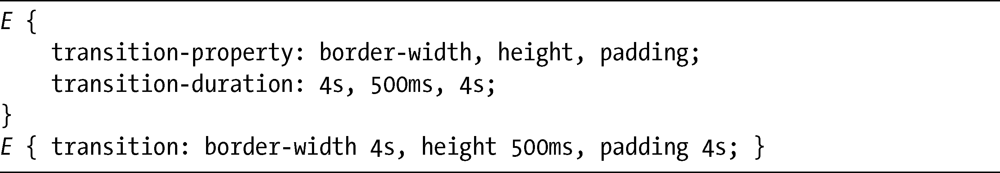
注意，如果一个属性的值比另一个属性更少一些，那么值列表就会被循环。记住这一点之后，可以稍微重写一下这个代码示例：

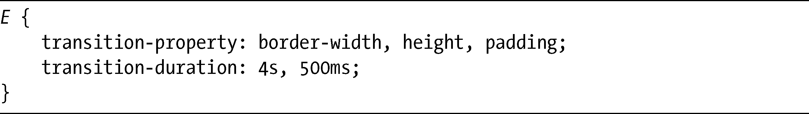
这里，transition-property属性有三个值，反之transition-duration属性只有两个。这意味着前者的第三个值（padding）会匹配后者的第一个值（4s），和第一个例子中所提供的属性值是相吻合的。

这是一个实际中的例子：

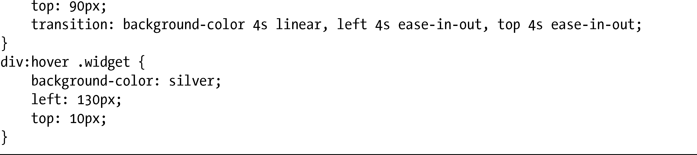

这里，我使用了transition简写去应用三个过渡。第一个过渡在linear计时函数中将background-color从black修改为silver，而接下来的两个过渡则使用ease-in-out计时函数改变了left和top属性。所有过渡的发生持续了4秒,你可以在图13-3中看到图解说明。

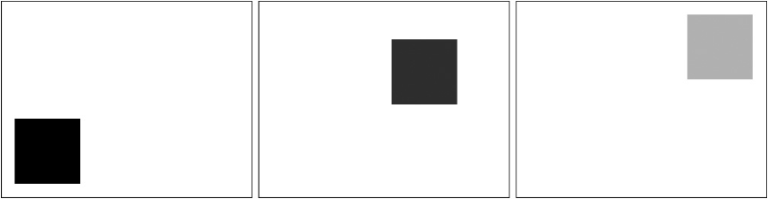

<b class="my_markdown">图13-3　动画过渡在background-color、left和top属性上的三个阶段</b>

图13-3展示了这个过渡的三个阶段：第一个阶段（左）显示了该元素的过渡前阶段，元素具有黑色的背景，并且位于其父元素的左下角；下一个阶段（中）是过渡中阶段，因为元素正在改变颜色并且移动到父元素的右上角；最后一个阶段（右）展示了元素的过渡后阶段，它具有银色的背景，并且在最终的位置上。

### 13.1.8　触发器

在我的例子中，我使用了:hover伪类作为触发器，但也可以使用其他选项。和所有其他的元素状态伪类一样（:active、:target），你也可以把JavaScript和过渡组合在一起。例如，可以把CSS设置成下面这样：

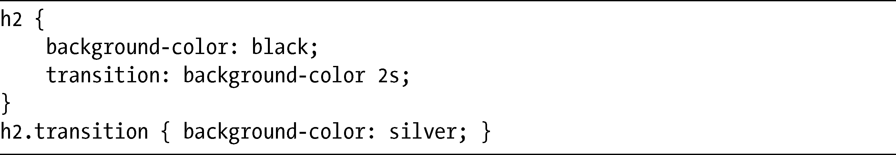
然后使用脚本去添加类并触发这个过渡：

当函数运行的时候，h2元素有一个类添加到上面，而元素的背景颜色会平滑地从黑色变化为银色。

