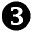
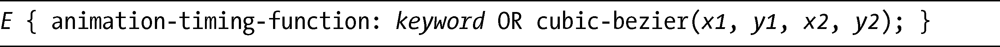
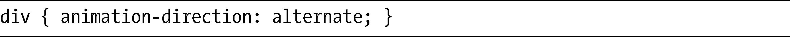
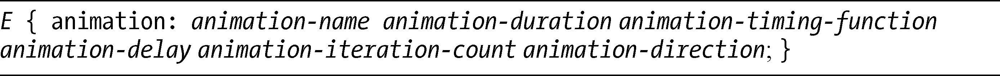
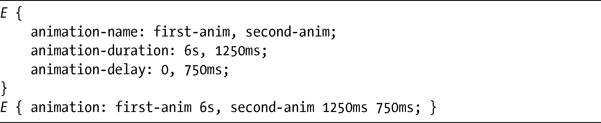

### 13.2　更复杂的动画

动画虽好，但也有本质上的局限，它们只能够在属性值发生改变的时候才能应用。CSS3动画模块（CSS3 Animations Module，<a class="my_markdown" href="['http://www.w3.org/TR/css3-animations/']">http://www.w3.org/TR/css3-animations/</a>）超越了过渡模块所带来的可能，能够使用一种更加灵活的语法，让动画直接应用到元素上，并能够进行更加精细的控制，但是创建动画的过程是截然不同的：首先，你要定义属性和计时，之后要把动画控制添加到要应用动画效果的元素上。

动画模块目前只在WebKit浏览器中实现，尽管Firefox开发人员已经说过它们考虑“在将来”实现该模块。

### 13.2.1　关键帧

创建动画的第一个步骤是定义关键帧。关键帧定义了一个过渡的开始点和结束点。最简单的动画有两个关键帧——一个在开头，另一个在结尾——而更为复杂的动画在开头和结尾之间具有多个关键帧。CSS过渡本质上是一个只有两个关键帧的动画。

在CSS中，我们在@keyframes规则中声明关键帧，它具有以下语法：

> 注意：
> 我提到过，当前只有WebKit浏览器实现了CSS动画。记住要为这条规则使用WebKit前缀，就是@-webkit-keyframes。

@keyframes规则的第一个值是name，这个独特的标识将会用于动画的调用，稍后我再讨论这个话题。在这里你其实可以使用几乎任何的值，不过我还是建议使用一个与描述的动画相关的单词或术语——如果这么做的话，能够更容易地对样式表进行跟踪。

下一个值，keyframes，设置了在动画持续期间关键字将要出现的位置，可以使用的值是百分比或者是from或to的其中一个关键字（分别类似于0%和100%）。你必须至少指定两个关键帧（from/0%和to/100%），只要是两个以上，愿意设置几个都可以，保证每个关键帧在动画中有一个唯一的位置就行了。

在每个关键帧中，是一个或一系列的CSS声明，这些声明会应用到动画的特定阶段的指定元素上。我用一个例子来解释清楚，下面的代码描述了具有三个关键帧的简单动画：

在动画的开始阶段（），选中的元素有一个10px宽的边框；在动画的中途（），边框减少为1px宽；在动画的结尾（），边框是1px宽，而高度和宽度分别有120px和150px。在每个关键帧之间，元素会逐渐地动起来，所以在起始和50%标记之间，边框会产生动画，宽度平滑地从10px变化为1px。

要注意单个关键帧上的继承所发挥的作用，如果要让一个变化在两帧之间持续，就需要在每一帧中指定它。如果我没有在to关键帧中再次指定border-width（），它就会默认回到动画所应用到的元素的继承值，意味着动画可能会有相当大的差别。

### 13.2.2　动画属性

一旦定义了关键帧，下一个步骤就是添加对动画元素的控制。我在本节的介绍部分提到过，许多动画属性和transition-*系列中的对应属性共享语法，所以你对它们应该已经相当熟悉了。

> 注意：
> 和@keyframes规则一样，animation-*属性目前只在WebKit中实现，所以当你在页面中使用这些属性的时候，应该使用-webkit-前缀。

#### 名称

animation-name属性常用于指向使用@keyframes规则定义的动画，其语法同样是非常简单的：

你可以看到它只需要一个单独的值，就是已经定义的动画名称。要调用在上一节创建的动画，可以使用：

唯一允许使用的其他的值是none，它将阻止该元素发生任何动画。

#### 持续时间

动画的持续时间通过animation-duration属性进行设置，它在功能上和这一章前面介绍的transition-duration属性是完全相同的：

和transition-duration一样，time值是一个单位为ms或者s的数字，也可以是0（零），0会阻止动画运行（负值的作用和0是一样的）。要延长示例动画的时间，让它持续6秒钟，可以加上这一行：

#### 计时函数

另一个你应该被熟悉的属性是animation-timing-function，功能上和它的搭档transition-timing-function也是相同的：

该属性可以使用的值是ease、linear、ease-in、ease-out和ease-in-out，也可以使用cubic-bezie。我在“过渡”一节中的“计时函数”中已经解释了这些值。

因此，如果要让动画在开始的时候有“淡入”的效果，可以添加这句代码：

#### 延迟

还有另一个（稍微）介绍过的属性是animation-delay，在功能上和它的搭档transition-delay属性是相同的：

和animation-duration（以及两个相应的transition-*属性）一样，它的时间值是一个单位为ms或s的数字，设置了动画开始之前的延迟时间。0（零）意味着没有延迟。和transition-duration一样，负值会让动画“跳过”指定的时间段。

为了让示例动画推迟两秒钟，我们要包含以下代码：

#### 迭代次数

和只发生一次的过渡不同（或者说两次，如果把相反的过程也算上的话），动画可以被重复任意次数。这个重复次数可以由animation-iteration-count属性设置，使用以下语法：

语法中的count值要么是一个整数，要么就是关键字infinite，其中的数字值设置了动画要重复的次数，它的默认值是1，表示动画会从头到尾播放一次，然后停止下来；infinite值表示动画会无尽地循环，或者至少循环到与另一个条件相匹配，改变了该值。0（零）值或任何负数都会阻止动画播放。

继续使用我在这一节构建的这个例子，如果要让动画重复10次，需要添加下面的声明：

#### 方向

动画的播放是从开始到结束，但它们也可以以相反的方向播放（像过渡那样）。你可以设置动画是否一直以同一个方向播放，或者交替地向前或向后播放。为了实现这一效果，我们可以使用animation-direction属性：

keyword关键字有两个选项：normal或者alternate。默认值是normal，表示总是向前播放动画：即动画会从开始播放到结束，之后，如果被设置重复播放的话，又会从头开始再次播放。如果使用了alternate值，动画会从头开始播放到完成，之后在再次开始播放之前会先反向播放。如果你认为动画的每次迭代是一个“圈”，那么奇数的圈会向前转，而偶数的圈则向后转。

为了完成示例动画，我们把动画设置为交替地前后播放：

#### 简写

在这一整节中，我依次为示例动画装配上一个属性。以下是所有属性组合起来的样子：

对于每一个动画，我们都有许多不同的属性需要声明。不过，也可以利用一个名为animation的简写属性，这是它的语法：

和transition简写一样，animation-duration和animation-delay必须按照顺序指定。如果忽视了二者中的任何一个，语法会假定它是animation-delay，并设置为默认值0。

为了让例子看起来紧凑一点，我们可以使用以下简写代码：

#### 播放状态

还有一个动画属性并没有包含在这个简写属性中，那就是animation-play-state属性，该属性指出一个动画是否是活跃的。以下是它的语法：

keyword值有两个选项：running表示动画正在播放，而paused表示动画未在播放。我们可以使用这个属性执行动画的播放、暂停的动作，像这样：

在这个例子中，动画会一直循环播放，直到鼠标越过动画才会停止；当鼠标移开元素，动画又会继续下去。

> 警告：
> 规范中的一个注解说明了animation-play-state属性可能会在将来被去掉，但现在它还是语言中的一部分。

### 13.2.3　完整的动画示例

我们来看一看完整示例动画的实际应用。这是它的CSS代码：

结果如图13-4所示。

<b class="my_markdown">图13-4　影响到border-width、height和width属性的动画的三个阶段</b>

遗憾的是，我无法在书中展示动画，所以我只能勉强去描述它。图13-4展示了元素在动画的三个关键帧中的状态：0%的关键帧（）显示了元素有4px的border-width以及继承的height和width（都是100px）；在50%的关键帧（），border-width增加为12px；而在最后100%关键帧（），border-width恢复为4px，尺寸变为150px乘130px。

### 13.2.4　多重动画

你可以使用一个逗号隔开的列表，为元素添加多个动画。该方法可用于每一个子属性和简写属性，所以以下这两个例子都是有效的：

这里，值列表会循环以确保所有属性应用了相同数量的值，和“过渡”一节中“多重过渡”所描述的方法是完全相同的。

