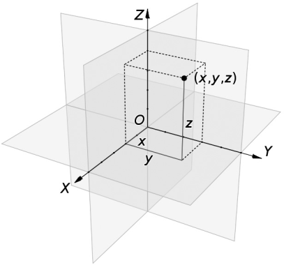
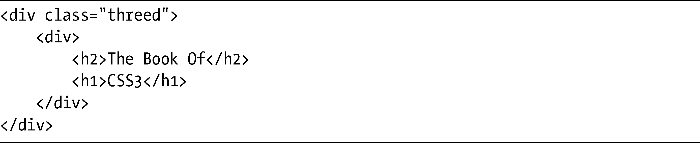
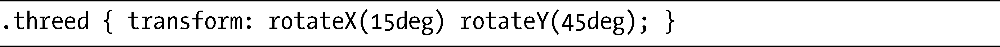
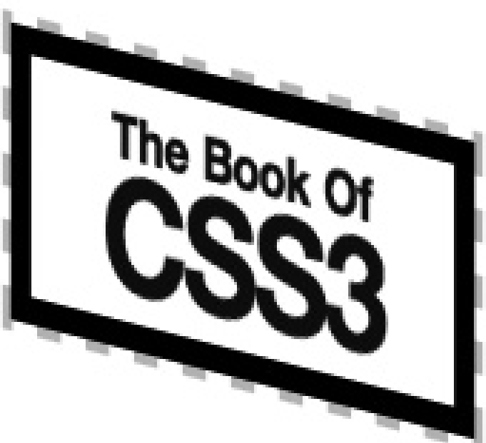

### 14.1　CSS中的3D元素

CSS中的三维对象是基于笛卡尔坐标系统的，图14-1进行了说明。我们可以在Wikipedia中了解有关内容（<a class="my_markdown" href="['http://en.wikipedia.org/wiki/Cartesian_coordinate_system']">http://en.wikipedia.org/wiki/Cartesian_coordinate_system</a>），在第6章也已经讨论过该系统的的二维版本。

> 注意：
> 如果你有使用三维计算机图形程序的经历，对本章所用的计算和术语应该会比较熟悉。如果没有这种经历，也不用担心，在学习的时候我会尽力解释清楚。

<b class="my_markdown">图14-1　具有x 轴、y 轴和z 轴的笛卡尔坐标系统<a class="my_markdown" href="['../Text/Chapter14.html#jzyy1']">[1]</a></b>

在CSS中，z 轴是以观看者为参照的：如果你认为x 轴是从左到右，而y 轴是从上到下，那么就可以认为z 轴是由近及远。当你沿着z 轴以正值移动一个元素时，就是把元素向自己的方向移动；同样，以负值移动的话就是让元素以远离你的方向移动。你也可以对此稍作改变，使用不同的视角，，我会在适当的时候进行解释。

在纸面上用图形解释三维变换的概念是非常困难的，所以我强烈建议你看看本书配套网站上的一些例子（<a class="my_markdown" href="['http://www.thebookofcss3.com/']">http://www.thebookofcss3.com/</a>），我给这些例子添加了一些过渡规则，这样当你与之交互的时候就会出现动画，而在二维的书中是很难清晰地展示这些三维效果的。这些例子应该真正有助于你理解本章所使用的一些技术，我也推荐你看看Westciv的团队的测试页面（<a href="http://www.westciv.com/tools/3Dtransforms/">http://www.westciv.com/tools/3Dtransforms/</a>），该页面允许你尝试变换各种值的不同组合，从而了解它们应用在元素上的效果。

在我开始介绍新的、扩展的变换属性之前，对于本章所使用的例子要作一个简短的提示：尽管每个例子在应用独特的样式规则时可能使用了不同的类，但所有例子使用的都是相同的基本标记：

除非另有说明，本章的变换函数都是应用到div（.thread的子元素）上。为了更加清晰地展示一些3D效果，我使用了第12章所介绍的transform属性，把父元素围绕x 轴和y 轴进行了旋转。以下是我使用的代码（先别担心代码的含义，我会在这一整章进行解释）：

你可以在图14-2中看到这段代码的结果。在这些例子中，如果我提到“默认”或“未变换”的元素，指的就是这个只应用了上述变换的元素。

<b class="my_markdown">图14-2　在本章的许多例子中使用的参照元素</b>

此外，我建议你访问本书的配套网站（<a class="my_markdown" href="['http://www.thebookofcss3.com/']">http://www.thebookofcss3.com/</a>），看看本章示例的文件。

