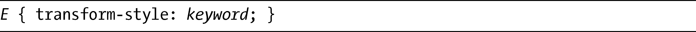
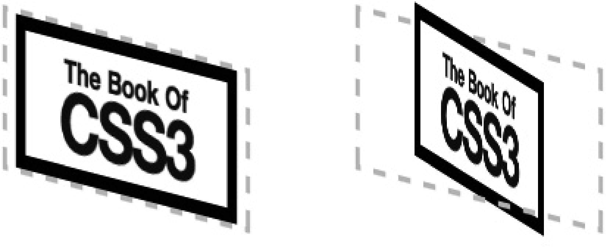

### 14.2　transform-style属性

第一个新的属性非常简单却又非常重要，如果不改变它的默认值，就无法在本章的三维变换中观察到你的变换。该属性称为transform-style，这就是它的语法：

keyword值可以是flat（默认）或者是preserve-3d。如果我们从一个例子入手，解释这两个值的差异就会变得简单许多。首先，我创建了两个相同的元素，除了赋给transform-style的值不同以外：

我会对这个例子应用一些3D变换，具体是什么对这个示例来说不是太重要，在本章后面我会再作解释。先看图14-3所示的结果。

<b class="my_markdown">图14-3　对比transform-style属性不同值的效果</b>

它们的差异是非常明显的。第一个例子使用的值是flat，所以三维变换只会应用到二维平面上，虽然扭曲了元素，但并没有产生深度的真实感觉。作为对比，第二个例子的transform-style值是preserve-3d，它在三维中变换元素，并产生了真正的深度感。本章接下来的所有例子都会使用这个值，你也需要使用这个值去制作自己的三维页面元素。

为transform-style指定的值会影响元素的子元素，而不是元素本身。本质上，它的作用就是设置子元素究竟是在分离的平面中显示还是全部被收缩到一起。不过，有一个需要注意的地方：如果一个元素的overflow值是hidden，它的子元素就无法以3D显示，所以元素看上去就像是transform-style值被设置为flat一样。

