### 14.3　变换函数

在第12章，我介绍了transform属性以及与它相关联的函数。三维变换使用的是相同的transform属性以及许多相同的函数，但也扩展了其中的一些函数，并添加了一些全新的函数。我会依次解释每一个变换函数，也会提到它们是否是全新的，又或者是扩展自我们已经讨论过的现有2D变换属性。

### 14.3.1　绕轴旋转

我会像2D函数那样开始解释3D变换函数——使用旋转。在二维空间中只有一条旋转所围绕的轴，所以rotate函数只需要一个单独的值。但是当你在三维中处理旋转的时候，有三条轴可以围绕着旋转。因此，也就有三个属性可以进行控制。如下：

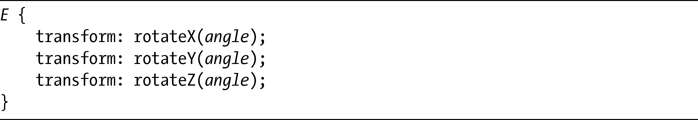
和rotate函数一样，每个函数都接受一个单独的角度值。在我的例子中，我会使用deg（度数）为单位，所以负值也是允许使用的。我会用下面的代码，通过展示围绕每一条轴所发生的旋转，演示它们是如何工作的：

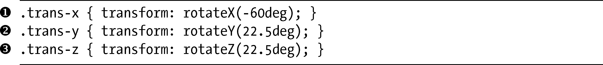
结果如图14-4所示。

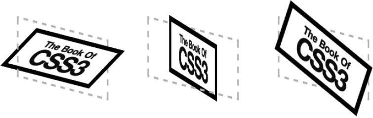

<b class="my_markdown">图14-4　围绕三条轴线中的每一条轴进行旋转</b>

第一个例子（）展示了一个元素围绕x 轴旋转60度。为了了解这个例子在这里发生了什么，不妨想象有一条线水平地穿过元素的中心，位于线上方的一半元素向你倾斜了60度，而线下方的另一半元素则向远离你的方向倾斜了60度。下一个例子（）应用了22.5度的旋转，但这一次是在y 轴上。想象一条垂直的线向下穿过方框的中心，线左侧的一半元素向你倾斜了22.5度，而右侧的一半则向远离你的方向倾斜了22.5度。最后的例子（）展示了相同的旋转，22.5度，但是这次是围绕着z 轴发生的，这和二维的rotate函数有相同的效果。

如果你要围绕超过一条轴旋转元素，可以把多个函数应用到一个元素上：

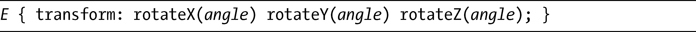
不过，另一个新的函数——rotate3d——也允许你围绕多条轴线旋转元素。这是它的语法：

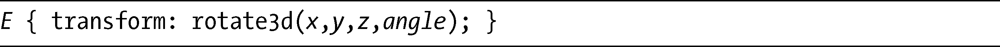
angle值非常明了，但x 、y 和z 值就不是这么简单了。每个值都采用一个数字值，用于计算方向向量（完整的解释已经超出了本书的范围，请访问<a class="my_markdown" href="['http://www.tutorvista.com/math/3d-cartesian-coordinates/']">http://www.tutorvista.com/math/3d-cartesian-coordinates/</a>了解这个主题的大概内容）。向量的原点是所有轴线相遇的点，用值0，0，0来表示。方向向量在3D空间中设置了一个点，而提供给rotate3d函数的x 、y 、z 值会绘制出一个点，该点与每一条轴线的距离就是对应的x 、y 、z 的值。想象在原点和这一点之间有一条线——那就是旋转按指定角度发生时所围绕的线。

这个主题非常的复杂，所以我会用几个简单的例子来解释，使用的是下面的代码：

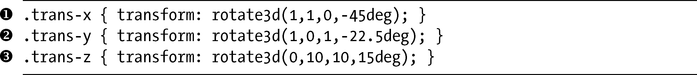
你可以在图14-5中看到输出的结果。

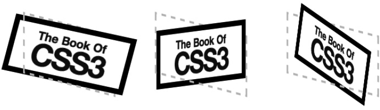

<b class="my_markdown">图14-5　利用rotate3d函数使用方向向量进行旋转</b>

第一个（左）例子（）的值是1，1，0，表示假想的线通过沿x 轴和y 轴1px的点上（事实上，该“线”会在相同方向上继续通过这一点，无论值10，10，0或者是1000，1000，0都会产生相同的结果）。元素围绕该线旋转了45度，就像图14-5左边的例子所展示的一样。第二个（中）例子（）的值是1，0，1，沿着x 轴和y 轴1px的位置创建了一个点，然后围绕那条线将元素旋转了22.5度。最后一个例子（）的值是0，10，10，所以元素围绕原点与沿着y 轴和z 轴10px的一个点之间的线旋转了15度，如图14-5右图所示。记住，任何两个相等的值有相同的效果。

在编写纯CSS变换的时候，可能不会经常使用这个函数，因为它所包含的计算是相当复杂的。但是与JavaScript结合使用的时候，这种方法的灵活性就真的很重要了。

### 14.3.2　沿轴平移

translateX和translateY函数（以及它们的简写，translate）在二维中用于将元素沿着它的轴按指定的长度移动，但是在三维之中移动元素需要一个新的函数：translateZ。其语法和它的兄弟属性是一样的：

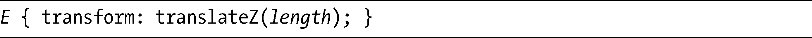
length值是带有长度单位的任何数字。例如，要沿着z 轴将div元素移动30px（对着观察者），可以使用

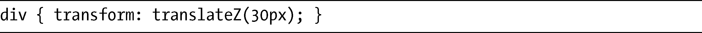
不过在我演示之前，允许我先介绍一个新的简写函数，translate3d。这个简写函数能够设置全部的三个值。其语法是translate函数的一种逻辑扩展：

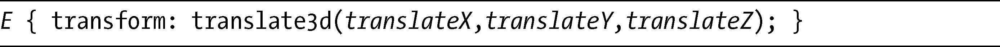
每个值都等同于指定的函数，所以每个值都接受一个数字值，可以是正值或者负值，带有CSS长度单位。

现在你和新的函数已经碰过面了，我们来看看它们是如何工作的。在下一个例子中，我会使用这段代码展示不同的translate函数的组合：

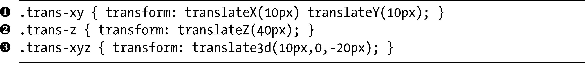
你可以在图14-6中看到其结果。

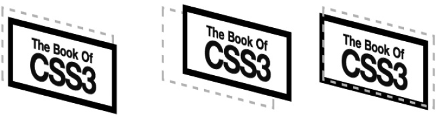

<b class="my_markdown">图14-6　展示沿着不同轴线所发生的平移</b>

第一个（左）例子（）为translateX和translateY函数设置了10px的值，表示它会沿着x 轴和y 轴移动这一距离，所以会放置在原始位置的右下方。下一个例子（）在translateZ函数上的值是40px，会沿着z 轴移动这一距离，让元素出现在原始位置的“前面”，就像中间的示例所展示的。在最后一个例子（）中，translate3d函数将元素沿着x 轴移动10px，沿着z 轴移动20px，在y 轴上保留在相同的位置，所以会放置在原始位置的下面和后面，就像图14-6中右边的示例一样。

### 14.3.3　缩放

在12章中，我也介绍了scale函数，同样还有子函数scaleX和scaleY。在三维中则添加了一个新的子函数，sacleZ，它的语法是：

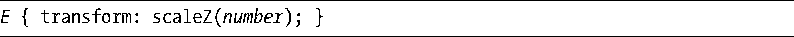
和它的兄弟一样，number值提供了元素的缩放因数，所以值为2表示将沿着y 轴双倍放大元素。然而，其产生的行为可能并不是你所期待的——元素本身并没有深度，它只有高度和宽度，所以在scaleZ中增加数值看上去对元素并没有改变。所增加的数值实际上起的作用就像提供给translateZ值的乘数。例如，考虑这句代码：

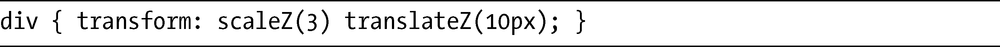
scaleZ函数的值3将会乘以translateZ函数的值10px，所以该元素将会显示在z 轴上30px（3 × 10px）的位置。

除了scaleZ之外，一个新的简写函数scale3d也被添加进来。这是它的语法：

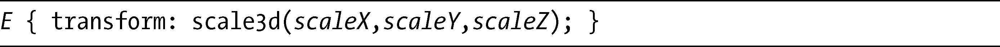
你应该非常清楚，这个简写函数简单地接受一个数字用于它的每一个值，作用就像相关轴线上的一个缩放因数。这里有几个例子，展示了3D缩放的实际应用：

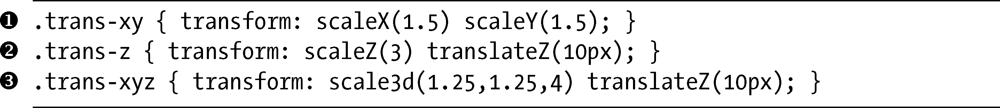
结果如图14-7所示。

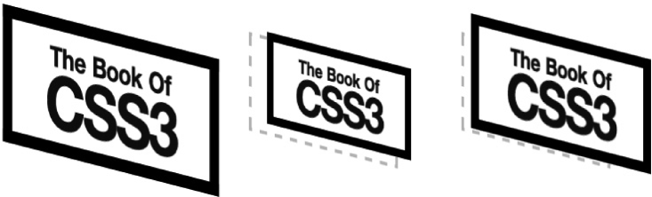

<b class="my_markdown">图14-7　在不同的轴线和多条轴线上缩放</b>

在第一个（左）例子中（），我将scaleX和scaleY的值都设置为1.5，所以元素在二维轴上是原始尺寸的一半。第二个（中）例子（）展示了一个元素，它的translateZ值是10px，而scaleZ的值是2.5；我说过，scaleZ的作用是translateZ的一个乘数，所以这个元素会出现在z 轴25px的位置，你可以在图14-7中间的示例看到它的结果。在最后一个例子中（），我用scale3d函数在x 轴和y 轴上设置了值1.25，在z 轴上设置为4。最终的元素，显示在图14-7的右侧，在二维轴上放大了25%，而scaleZ值乘以translate的10px的值，使得元素沿着z 轴移动了40px。

### 14.3.4　变换矩阵

2D变换中较为难懂的内容就是matrix函数，这是我在第12章中介绍过的。这个函数允许使用六个值（基于网格状排列）和一些三角几何计算去应用复杂的变换。你也可以使用matrix3d函数的矩阵应用三维变换，但如果你觉得2D矩阵已经很难理解，也可以跳过这个有天大的16个值的matrix3d！以下是它的语法：

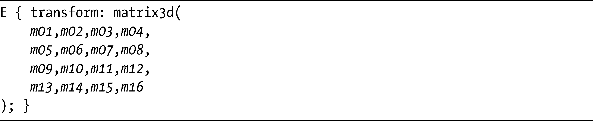

> 注意：
> 这里进行分行只是为了让代码更加清晰，实际中不需要这样。

其中每个m值都是一个数字，但我甚至无法解释每个值都是干嘛的！我建议你阅读有关这个主题的一个介绍（<a class="my_markdown" href="['http://gpwiki.org/index.php/3D:Matrix_Math']">http://gpwiki.org/index.php/3D:Matrix_Math</a>）。记住，所有的matrix3d效果都可以使用不同的函数实现，这个函数出现在这里是为了让你能够精细地对变换进行控制，或者想要与JavaScript更轻松地进行交互。

我会提供几个简单的例子，使用这段代码来演示它的功能：

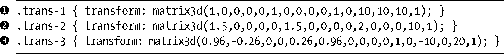
结果如图14-8所示。

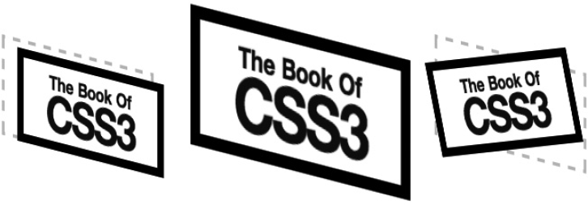

<b class="my_markdown">图14-8　使用matrix3d函数应用变换</b>

第一个（左）例子（）展示了元素沿着每一条轴移动10px，和translate3d函数是相同的——矩阵中的m13、m14和m15的作用分别相当于translateX、translateY和translateZ。在第二个例子（）中，我按照1.5的因子在x 轴和y 轴上（m1和m6）对图片进行缩放，以2为因子在z 轴上缩放（m11），它将乘以translateZ（m15），将元素沿着z 轴移动20px，如同图14-8中间的示例所展示的。最后一个例子（）需要为一些三角函数进行科学计算，因为我在z 轴上将元素旋转15度。为了产生这样的旋转，你需要给出cos(15)的值——即0.96——给m1和m6，之后是sin(15)——即0.26——给m6，以及负的sin(15)给m2。我还把元素沿着x 轴平移了10px，使用的是m13的值。结果如图14-8中所示。

我肯定你已经看见了，这个函数是非常强大的——也是非常复杂的。你是否要学习matrix3d的全部潜能，主要取决于你和你的项目，但我觉得这已经超出了本书的范围。别忘了你可以使用单独的函数去执行所有这些变换，这样的话你会需要更多的代码，但也更易于理解——不仅对你自己而言，对所有在你之后要去维护网站的人也是一样的。

### 14.3.5　透视

最后一个函数是perspective，这是一个全新的函数，可以在你查看3D对象时生成一个人工观察点，提供了深度的错觉。以下是其语法：

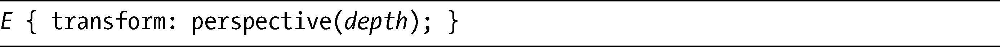
depth值是一个整数，代表长度（以像素表示）或者是默认的none。这个长度设置了一个“观察点”，该观察点在z 轴上元素原点（z =0）的距离就是这个长度的值。如果元素沿着z 轴平移，视角与元素的距离就决定了元素所显示的大小。

考虑一个translateX为10px的元素。如果perspective是50，元素的显示会异常的大；如果perspective是1 000，元素就会显示出它的原始尺寸，只有将元素沿着z 轴负向移动，并且从较低的视角去查看，元素才会比原始尺寸小。

对perspective进行演示可能比起描述它要更简单一些。我提供了几个例子，对perspective函数使用了不同的值，为你展示观察点的变化情况。以下是我要使用的代码：

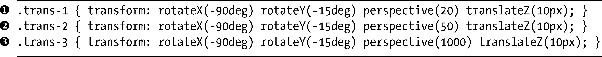
在我展示结果之前，要先说一点题外话。你也许想知道为什么上面的代码中包含了如此多的重复，为什么不能像下面这样去代替它呢？

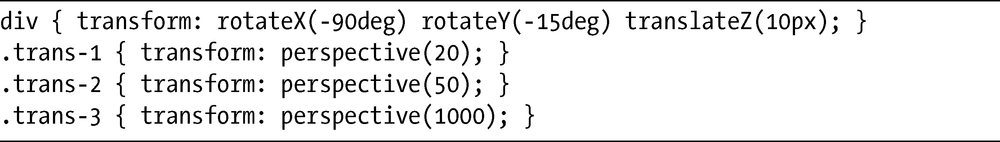
原因是如果你不指定一个函数的话，它的值会被假设为默认的，所以我在函数中设置在h1元素上的值会被后续样式中（不存在）的函数实际覆盖掉。例如，在后续的声明中没有重申rotateX（-90deg）的话，它就会被假设为默认地回到rotateX(0)。

不管怎样，我们回到例子中。你可以在图14-9中看到它的结果。

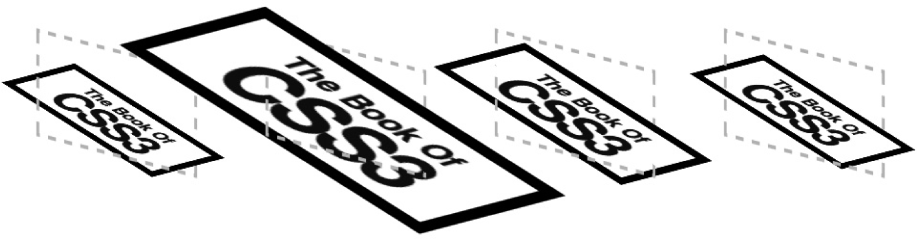

<b class="my_markdown">图14-9　不同perspective函数值的效果</b>

图14-9中的第一个例子作为没有变换的参照，和我们一直在用的那个参照有所不同。在第二个例子中（），你从perspective值为20的观察点去查看相同的元素，意味着你实际上在z 轴上20px的位置去查看它，并且由于元素本身已经沿着z 轴平移了10px，所以它处于观察点与原点之间一半的距离，显示的效果是原来的两倍大小。在第三个例子中（），perspective的值增加为50，观察点稍微远离元素一些。所以尽管它比上一个例子更小一点，但正如你在图中所见，元素看上去仍然比参照元素更大一些。最后（最右边）的例子（）是从 perspective 为 1 000 的距离去显示元素，而该元素显示的尺寸和图14-9中的参照示例差不多。从较高的值，比如1 000的观察点去查看元素，通常没有什么显著的效果。

