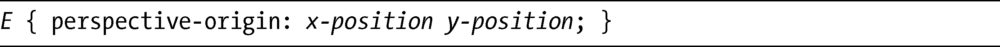

### 14.4　perspective和perspective-origin属性

我已经讨论了perspective变换函数，但是也可以使用perspective属性。它的语法也是非常简单：

这个属性所起的作用和perspective函数是一样的：depth值是一个数字，用于设置到元素原点（z =0）的距离。事实上，这个函数和属性之间唯一的区别是提供给属性的值只会应用的它的子元素上，而不是元素本身。

与perspective搭配的属性是perspective-origin。该属性从观察点查看元素的地方去设置元素的原点，用于改变元素被查看的角度。这是它的语法：

x-position可以是left、right或center这几个关键字中的其中一个；而y-position可以是top、bottom或者center。也可以使用百分比值或者长度值。你在学习其他属性（比如background-position或者transform-origin）的时候应该熟悉这些值了。

该属性的默认值是center center（或者50% 50%），这样你正在查看的视线好像就在元素的绝对中心的。改变perspective-origin的值也会改变视线的起点。

这听起来是有点混乱，同样地，展示会比解释更容易。在下一个例子中，我会从不同的视角起点展示同一个变换元素。以下是代码：

这几个例子如图14-10所示。

<b class="my_markdown">图14-10　为perspective-origin设置不同的值</b>

最先展示的是参照的例子；这个参照是从默认点center center查看的变换元素。第二个例子（）是同一个元素，但是perspective-origin是在元素左手边的中心。你可以在图14-1中的第二个例子清晰地看到，你所查看的元素角度已经发生了变化，观察点出现在稍微偏左的位置。图中的第三个例子（），我使用了长度值128px 56px，将起点改为右手边的底部。这一次观察点出现在稍微偏右并向上仰望的位置。最后（最右端）一个例子（）是从x 轴上75%和y 轴上25%的点去查看，有点类似于参照的例子，但是其观察点已经稍微移到元素的右边向上一点的位置。

