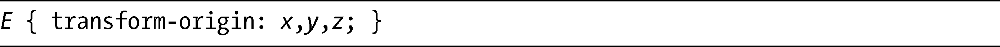
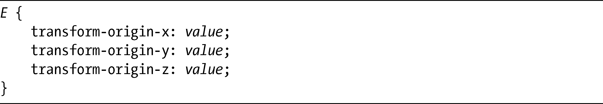
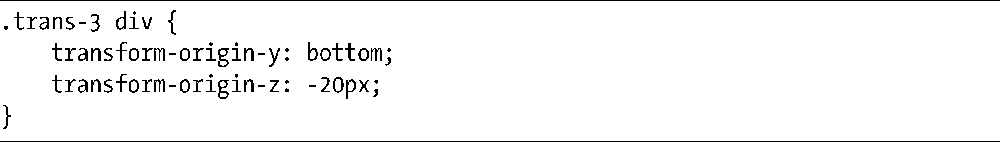

### 14.5　变换原点

一个元素的原点是x 轴、y 轴和z 轴相遇的交点。默认情况下，该点就是元素的精确中心，但是你可以使用我在第12章介绍过的transform-origin属性去修改这个点。很明显，该属性是为二维变换而编写的，但你也可以通过扩展其语法，把它用在三维变换上：

前两个值，x 和y ，就像在transform-origin属性中为2D元素所起的作用一样，也就是说，它们接受的值可以是一个关键字（left、right、center用于x ，而top、bottom、center用于y ）、长度单位或者是百分比。默认的值是center center，或者50% 50%。第三个值，z ，是一个长度值，设置了将发生的变换相距z 轴的距离。它看上去可能非常不符合我们的直觉，因为它好像应该起相反的作用。如果设置了一个负值，变换的原点会在元素后面，这样会使元素出现在其父元素的前面；同样的，正值就是把原点放在元素的前面，会让元素看上去就像在它的父元素的后面。

我会用一个演示来举例说明，展示三个元素，它们除了transform-origin之外所有的值都是一样。下面是这几个例子的相关代码：

其输出如图14-11所示。

<b class="my_markdown">图14-11　为变换的元素设置不同的transform-origin值</b>

同样的，第一个例子也是一个参照元素。下一个例子（）展示了transform-origin值设置为0 28px，也可以说是在左手边的中心（元素有56px高）并且在z 轴的原始（未改变）位置的同一个元素。第三个例子（）的值是100% 100% 10px，所以变换原点被设置为元素的右下角，看上去就是沿着z 轴向远离观察者的方向移动了10px——我解释过，这是因为原点现在在元素的前面。在最后（最右方）一个例子中（），变换的原点被设置为元素的center bottom，它将沿着z 轴移动20px——即（似乎是）朝着观察者的方向。

最初的WebKit提案也包含了三个独立的子属性：

这几个属性接受和刚刚讨论的transform-origin属性的子值相同的值：可以是位置关键字（left、right、center、top、bottom）、百分比或者是长度值。我可以像下面这样去声明前面展示的第三个例子（）：

尽管这些子属性当前可以在Safari中工作，但它们并没有出现在W3C模块中，所以很可能会被去掉并且不会出现在将来的各种浏览器实现中。

