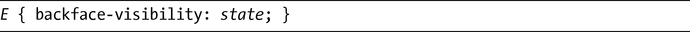
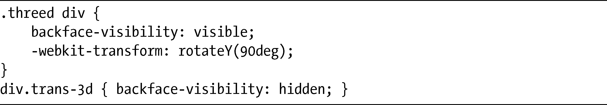
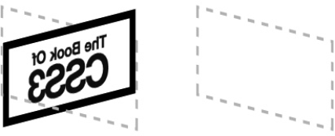

### 14.6　显示或隐藏背面

你经常会遇到这么一种情况，在元素旋转的时候，一旦它的正面远离你，你就会看到它的“背部”（称为背面）。默认情况下，元素似乎就像透明的一样，所以实际上你会看到正面所显示内容的反转图像。你也可以使用backface-visibility属性去改变这一情况，使用下面的语法：

state值有两个可选的关键字：hidden或者visible。默认是visible，其作用就像我刚刚描述的，可选的值是hidden，就是什么都不会显示。这和visibility属性的工作方式是一样的，你应该在CSS2的时候就比较熟悉了。

我提供了一个快速的示例，演示了这两种状态之间的差异，展示了两个只有backface-visibility值不同而其他全部一样的元素。以下是它的代码：

结果如图14-12所示。

<b class="my_markdown">图14-12　演示backface-visibility属性</b>

两个示例元素都围绕 y 轴进行旋转，所以它们都是背对着你的。左边的例子展示了backface-visibility属性为visible的元素，所以你可以清晰地看到元素的背面。在右边的例子中，你可以看到……是的……什么都没有。它的backface-visibility属性的值是hidden，所以什么都没有显示——没有border、没有background-color，什么都没有。为了确认元素实际上确实存在，可以访问本书的配套网站，然后看看动画代码的示例，就能够更好地了解它们是如何工作的。

