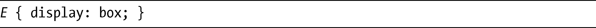
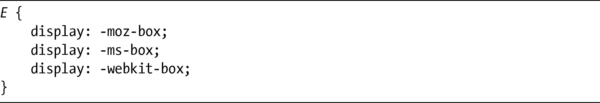
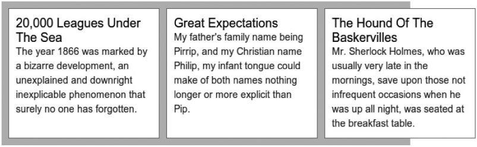
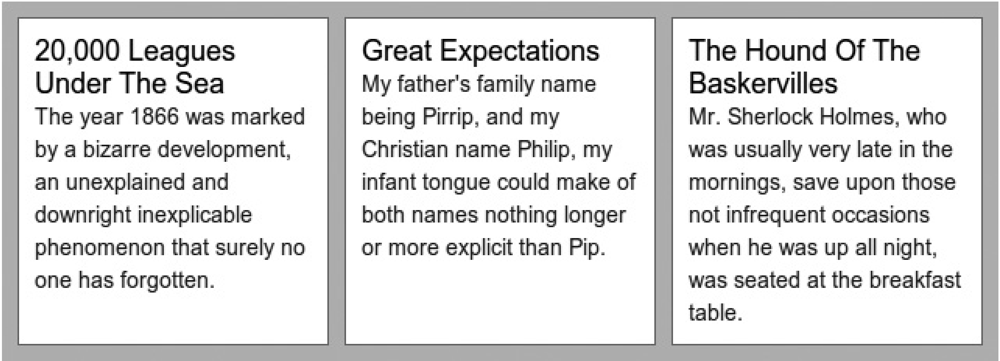
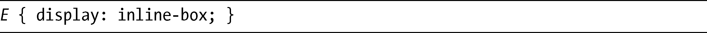
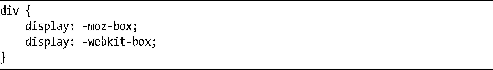

### 15.1　启动弹性方框布局

为了开始进行弹性方框布局模式，你必须指定一个包含元素，不管是文档的body元素还是其中的子元素。你可以使用现有的display属性以及一个新的值去实现：

当这个声明设置在元素上的时候，它的所有直接子元素都会受弹性方框布局规则的支配。要弄清楚的是，这种情况你在本章其他地方所看到的示例声明是不同的，那些声明都需要使用带浏览器专用前缀的属性，而这里你必须在属性值上设置这些前缀。实际上，你必须声明如下：

给出这不同寻常的告诫之后，我们来看看这个属性的效果。在第一个例子中，我会展示一个带三个子元素的父元素，把box值应用到父元素上。代码如下：

结果如图15-1所示。

要注意的第一件事是，在此我并没有指定任何的float或者position值，子元素就水平地出现在父元素中。在本章后面的“改变方向”一节中，我会解释这是为什么。

另外要注意的事情是子元素溢出了父元素之外，因为它的父元素的宽度是600px，并且每个子元素都是200px宽，还要加上边距、填充和边框，所以组合起来的方框宽度已经超过了父元素的宽度，因此溢出了容器。这种情况是在意料之中的，但是，一般来说这不会是你真正想要实现的效果。为了修复这个问题，需要使用box-*系列中的新属性，我会在本章的剩余部分进行介绍——我先离开正题，谈谈浏览器之间的差异。

<b class="my_markdown">图15-1　在display属性上使用box值的效果</b>

### 15.1.1　Firebox中的方框值

在介绍中，我提到Firefox的实现多少存在着一些问题。第一个例子清楚地突显了这些问题。图15-1中显示的例子演示了代码在WebKit浏览器中是如何显示的，再看一看图15-2中相同的代码在Firefox中渲染的效果。

<b class="my_markdown">图15-2　与图15-1一样的代码，但在Firefox中进行查看</b>

这里，你可以看到父元素扩展为640px。在Firefox的实现中，如果父元素的width值是auto，或者少于子元素的宽度组合，该值就会被忽略，而父元素也会重新调整大小，以容纳它的所有子元素。可这不是我们想要的效果，如果我为父元素设置了一个宽度值，我们希望该宽度能够切实得到应用。

我不相信WebKit或者Firefox会像现在这般产生了错误的实现。实际上，该模块并没有清晰地指明哪种方法才是正确的。但我要说的是，WebKit的实现尊重了我们赋给元素的值，所以这种方法对我们来说能够更好地预见结果，因此也更容易进行处理。在本章接下来的内容中，我会展示一些例子在WebKit中显示的效果，并关注它们在Firefox的实现有些什么差异，并且如果可能的话，要如何去解决。

### 15.1.2　行内方框

除了子元素上的效果，display值为box的元素作用和带block值的元素是一样的，都会在元素前后产生换行。但就像block有一个对应的值inline-block一样，box也有一个对应的inline-box:

你可能会推断，这个值会启用弹性方框布局，但是会让元素在文档流的行内，不会产生换行。Firefox的-moz-box实现实际上是错误的，看上去就像是-moz-inline-box一样，所以我可以使用这段代码来演示它们的差异：

结果如图15-3所示。左边的两个块展示了它们在Firefox中显示的效果——它们相互位于一行之中，所以是水平显示的。右边的两个块演示的是它们在WebKit中显示的效果——它们正确地显示为块元素，所以是垂直显示的。

<b class="my_markdown">图15-3　两个display值为box的元素，在Firefox（左）中错误地显示
 （类似inline-block），在WebKit（右）中正确地显示（类似block）。</b>

不幸的是，我没有找到一种可以在Firefox中去改变这种行为的方法，所以如果想让元素在该浏览器中以块流（a block flow）的形式显示，可以考虑使用清除元素的方法：

在本章接下来的内容中，我不会在任何例子中使用inline-box，现在你知道能够这样实现就可以了。

