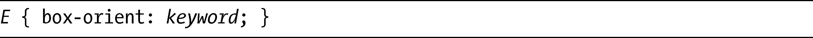
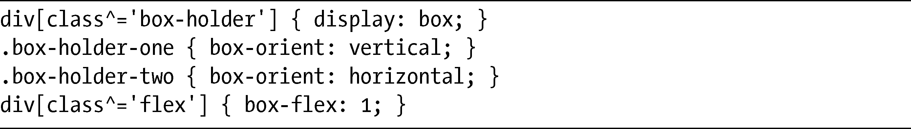
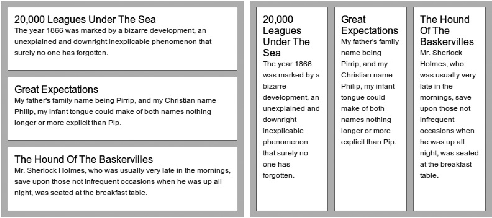

### 15.4　改变方向

当你开始使用这种布局方式的时候，设置了box-flex值的方框会自动填充水平长度——即它们的父元素的宽度，就像你在本章使用的所有例子中所见到的。但是，你可以使用接下来的这个新属性box-orient去改变这种行为。其语法如下：

keyword有四个可能的值：block-axis、inline-axis（默认值）、horizontal或者是vertical。前两个值，block-axis和inline-axis，取决于网页的编写模式；因为本书使用的是英语<a class="my_markdown" href="['../Text/Chapter15.html#jzyy1']">[1]</a>，是一种从左到右的语言，所以block-axis、inline-axis和vertical、horizontal分别是可互换的。我会在这一节自始至终使用这些值。以下是对二者之间差异的快速演示：

我把它应用到图15-8所使用的相同标记上，结果如图15-9所示。

右边的这三个元素的box-orient值是vertical，所以会调整大小以填充父元素的高度，而右边的三个元素使用的值是horizontal，所以它们会填充父元素的宽度。

<b class="my_markdown">图15-9　比较box-orient属性的值：vertical（左）和horizontal（右）</b>

