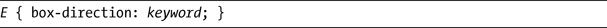
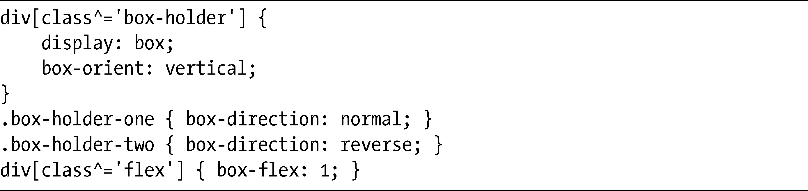
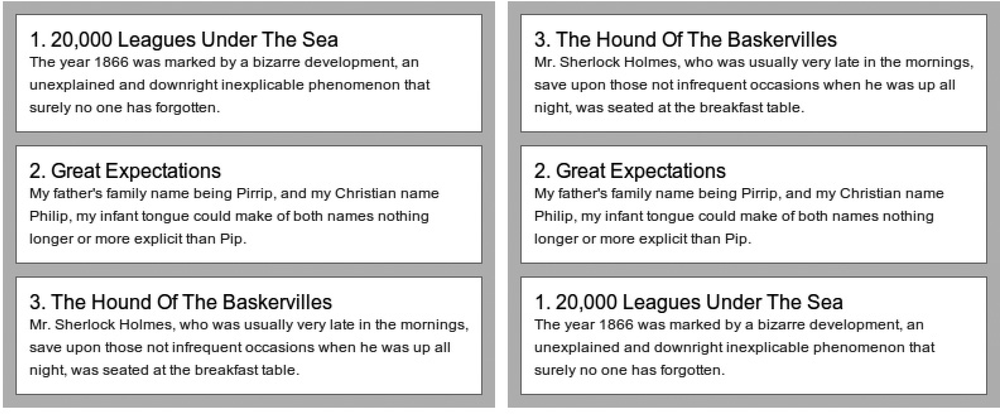
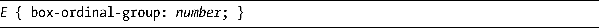
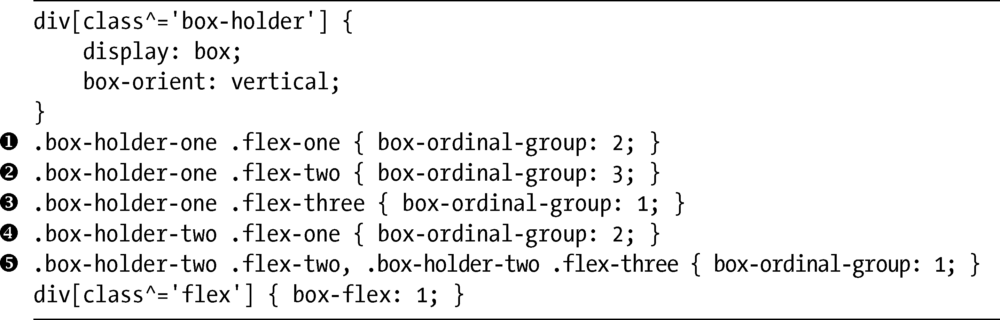
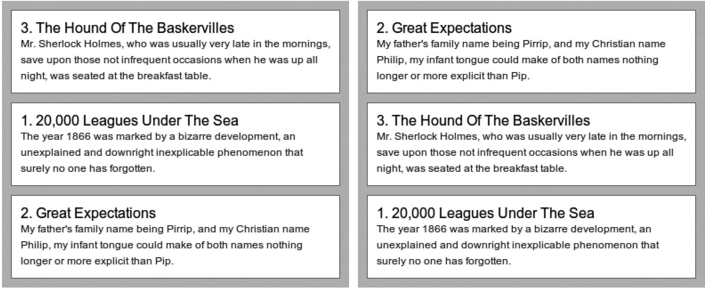

### 15.5　改变弹性方框顺序

弹性方框另外还有一个大优点：不管方框在DOM中的顺序如何，你都可以轻易地改变它们在页面上显示的顺序，并且不需要使用JavaScript或者定位技术。你可以使用两种方式去调整这一顺序：颠倒顺序或者将元素放入有序的分组中。

### 15.5.1　颠倒顺序

默认情况下，弹性方框元素会以它们在文档中编码的顺序显示——但你可以使用box-direction属性拒绝这一行为。box-direction是在父元素上应用的，其语法如下：

Keyword可以是normal（初始值或者默认值），也可以是reverse。对于reverse，所有的弹性方框元素会按照它们在文档中出现位置的相反顺序显示：即最后一个元素会显示为第一个，反之亦然。为了了解其实际应用，我们复制图15-8中展示的其中一个例子的标记，但是为box-direction使用不同的值。

以下是CSS代码：

结果如图15-10所示。

<b class="my_markdown">图15-10　对比box-direction属性的值：normal（左）和reverse（右）</b>

我把数字添加到标题上，能够更加清晰地展示它们在顺序上的差异。左列三个方框的box-direction值是normal，所以会按照它们在标记中出现的顺序显示。但是右列的方框使用的值是reverse，所以会以相反的顺序显示：第三个方框最先显示，第二个方框保留在原来的位置，而第一个方框则最后显示。

### 15.5.2　进一步控制顺序

如果你要对方框元素进行更精细的控制，可以使用box-ordinal-group属性，该属性应用在子元素上，其语法如下：

number值是一个正整数，其默认值为1。该数字作为一个值提供给属性，设置方框元素显示的顺序，从低到高，而不管它们在标记中的顺序如何。例如，一个box-ordinal-group值为2的元素，显示在值为3的元素之前。如果把同一个值赋给多个元素，它们就会形成一个分组。分组中的元素会按照它们在标记中出现的顺序进行显示，但仍然会位于具有不同编号的元素前面或者后面。

为了展示该属性在实际中如何工作，我们回到图15-8所示例子的标记中，但这一次要展示的是box-ordinal-group使用不同值的效果。以下是CSS代码：

你可以在图15-11中看到其结果。

<b class="my_markdown">图15-11　为box-ordinal-group属性使用不同值的例子</b>

在左列的例子中，我在每个元素（，，）上为box-ordinal-group设置了独特的值。在右列，我给第一个元素（）的值是2，而第二个和第三个元素（）的值是1。因此，第一个元素显示在第二个和第三个元素之后。第二个和第三个元素会按照它们出现在文档中的顺序显示。结果就是元素会按照2，3，1的顺序显示。

