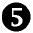

### 15.6　对齐

由于方框元素性质的不同，你可能经常会碰到方框无法延伸、未能填充父元素的整个宽度或高度并因此产生空白的区域的情况。而空白区域究竟是水平显示还是垂直显示是取决于父元素的box-orient值，但是空白区域相对子元素所出现的位置可以在父元素上使用box-align属性来设置。其语法如下：

keyword有几个可能的值。默认值是stretch，其表现你已经在本章见到过了，即增加元素的高度或宽度去填充它的父元素。start关键字会把元素放在其父元素的左侧（如果box-orient设置为horizontal）或上方（如果box-orient被设置为vertical）；类似的，end关键字会把元素放在其父元素的右侧（如果设置为horizontal）或下方（如果设置为vertical）。如果该值是center，空间会平均地分布在元素的两侧，而究竟是水平还是垂直分布同样取决于box-orient的值。

> 注意：
> box-align属性是在相反方向的轴线上发生作用的。如果box-orient设置为horizontal，box-align就会把空间分配在垂直轴上，反之亦然。

在接下来的例子中我会演示该属性的几种可能性，使用的是下面的代码：

结果如图15-12所示。

<b class="my_markdown">图15-12　box-align属性不同的值</b>

因为我们没有为第一个（最左边）例子（）指定box-orient的值，它使用默认值horizontal，而box-align设置为center会让元素在上下分布相等空间，使得元素处在其父元素的垂直中心。第二个（左）例子（）也是水平方向的，但是它的box-align值是start，会将它置于父元素的上边缘。对于接下来的两个例子，box-orient属性都被设置为vertical（）。第三个（右）例子（）的box-align被设置为end，会将元素移动到其父元素的右端，而最后（最右边）一个例子（），box-orient的值也是vertical，但是box-align的值是center，所以会水平地处在其父元素的内部。

规范中提到的另一个值是baseline。baseline会将所有子元素按照它们的基线对齐，之后再将最高的元素和父元素的顶端对齐。然而，我也许无法让它按预期的方式显示——baseline的作用和start关键字一模一样。要么是这个值没有被正确地实现，要么就是我完全理解错误了。

