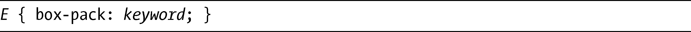
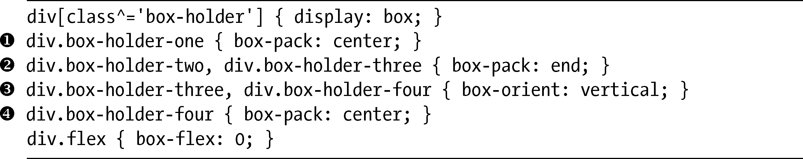
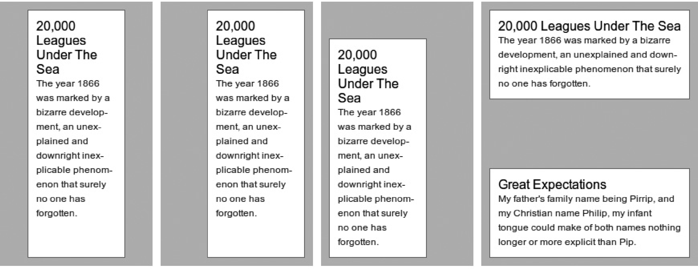
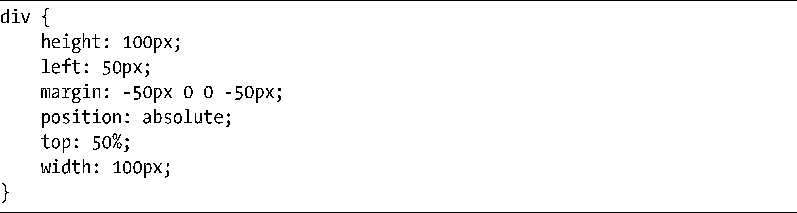
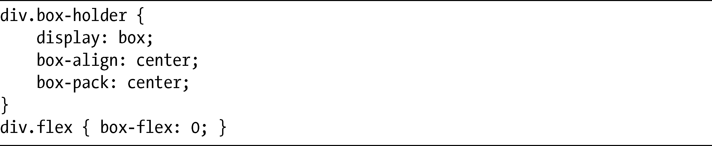
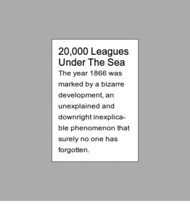

### 15.7　同轴对齐

我在上一节提到过，box-align属性在其方向相反的轴线上起作用，但是如果你想要在相同的轴线上分配空间，需要怎么做呢？为此，我们可以使用box-pack属性。同样，你也要把它应用到父元素上。其语法如下：

keyword所使用的值和box-align使用的那些值非常类似：center会将空间分配在子元素的两侧（水平还是垂直要取决于box-orient值），而start和end会（分别在）在元素之前或之后添加空间。一个新的关键字值是justify，只用于呈现两个或更多子方框元素的情况。justify会将第一个元素和父元素的开始处对齐，将最后一个元素和父元素的结尾处对齐，然后在它们之间添加额外的空间。

我会使用这段代码演示一些可能的组合：

结果如图15-13所示。

<b class="my_markdown">图15-13　box-pack属性不同的值</b>

第一个和第二个例子默认的box-orient值是horizontal，而第三个和第四个例子使用的值是vertical。在第一个例子中（），box-pack属性的值是center，所以水平方向的元素在水平轴线上两边都分布有额外的空间。第二个（）和第三个（）例子的box-pack值都是end，但分别在不同的轴线上：对于第二个例子（），空间分布在子元素的左侧；而在第三个例子中（），空间位于子元素的上方。最后一个例子（）有两个子元素，而父元素的box-pack值是justify，所以第一个子元素在父元素的上方，而第二个则在底部。

这个属性也可以用来实现一个功能，这一功能一直以来都很难实现，即：让元素在一个父元素内部的两条轴线上均居中对齐。在此之前，你还需要使用各种各样的技巧去实现这一功能，比如把定位和负边距结合起来：

使用弹性方框布局的话，你就可以更轻松地实现这一效果，不需要指定高度或者计算边距：

该元素的box-align和box-pack的值都是center，意味着所有在子元素周围的额外空间都会均等地分布在两条轴线上，使得它可以水平和垂直地居中。你可以在图15-14中看到其实际效果。

<b class="my_markdown">图15-14　使用box-align和box-pack在两条轴线上让元素居中</b>

