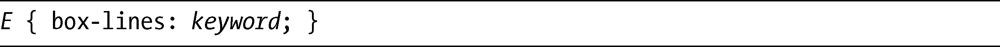

### 15.8　多行或多列

最后一个新的属性目前在Firefox中还没有实现，尽管这个属性在WebKit中已经被列为要实现的属性，但严格的测试似乎表明该属性在这一浏览器中根本还无法工作。因为这个属性可能在你读这本书的时候会被修复或实现，所以无论如何我还是要讨论它。

这个属性就是box-lines，它会处理一行（在水平方向中）或一列（在垂直方向中）的可伸缩子元素超过父元素尺寸而带来的潜在问题。其语法如下：

keyword值可以使用single或者multiple。默认值是single，声明了只有一行或一列可以延长到父元素的边界之外——受overflow属性值的控制。另一个可选的值是multiple，如果只有一个元素超过其父元素的尺寸，该值会被忽略，而所有的元素会调整大小去适应。不过，如果多个元素超过了父元素的尺寸，如果尺寸上允许的话，它们将会被移动到后续的行（或列）中。

我讲过，box-lines当前仍然没有被实现。实际中会如何起作用仍然有待观察。

