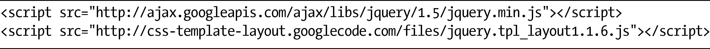
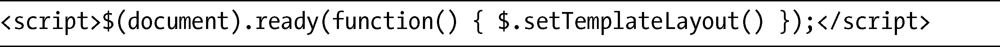
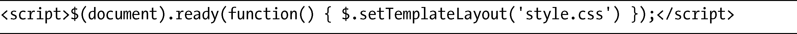

### 16.1　设置JavaScript

我在介绍中讲过，为了模仿模板布局模块，我们需要使用Alexis Deveria的JavaScript工具。这个工具使用的是jQuery库（<a class="my_markdown" href="['http://www.jquery.com/']">http://www.jquery.com/</a>），我相信大多数人都非常熟悉了。在页面的头部，要使用script标签先链接到jQuery，然后再链接到Alexis的CSS模板脚本：

> 注意：
> 代码中的版本号——jQuery是1.x，而Template Layout是1.1.6——是我写作的时候（2011年2月）的最高版本。当你读到这段代码的时候，可能需要更新一下版本号。

链接脚本之后，我们就可以在页面准备好的时候运行JavaScript函数，其中需要使用的是jQuery的ready()事件，它会调用setTemplateLayout函数：

我在这个例子中只要使用这段代码就可以了，因为我所有的CSS都嵌入在页面当中。不过，如果要使用外部的样式表，就必须把路径作为函数的选项提供给文档。

更进一步还有许多选项可供我们使用，所以我建议你读读这份文档：[http://code.google.com/ p/css-template-layout/](http://code.google.com/ p/css-template-layout/)，看看使用这个出色的脚本还有什么其他的可能。现在我们完成了这一设置过程，我们接着往下走，看看这个新模块的实际使用。

