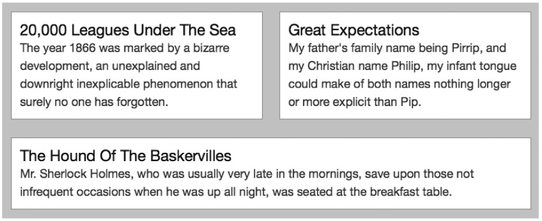
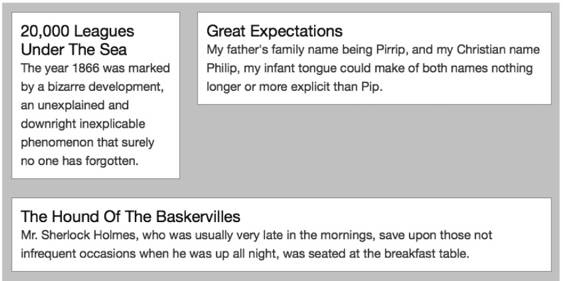

### 16.3　多行

目前我所展示的技术可以很好地用于在单独的一行中水平对元素进行布局，但如果不止一行又会怎么样呢？实际上这是非常简单的。你可以在display属性上设置想要的行字符串值的数量，只需要用空格隔开每个字符串然后列出来就可以了。为了让大家了解我的意思，可以看看这个例子：

这段代码设置了两行，第一行是position值为a和b的元素，每个元素会占据一半的宽度；在第二行中，我让c重复出现两次，匹配上面一行中的两个元素，意味着它会占据全部的宽度。你将在图16-3中看到它是如何显示的。

<b class="my_markdown">图16-3　元素在两行中布局</b>

位置a和b的元素在第一行中，它们的宽度是父元素的一半，而位置c中的元素会占据第二行的全部宽度。

关于行字符串有两条重要的规则需要我们记住：每个字符串中的元素默认会按比例分布，而每个字符串必须包括同等数量的字符。这两条规则意味着你可以通过重复字符串中的字母，改变元素分布的比例，如下：

看看图16-4中这段代码的输出。

现在每一行都有三个字母，因此，三个元素将会在每一行中平均地分布。但是第一行有一个a和两个b值，所以位置b的元素会扩展填充宽度的三分之二。在第二行，位置c中的元素会占据全部的宽度——该行也有三个字符，和上一行中的字符数相匹配。

<b class="my_markdown">图16-4　通过重复display属性中的字符改变元素的分布</b>

