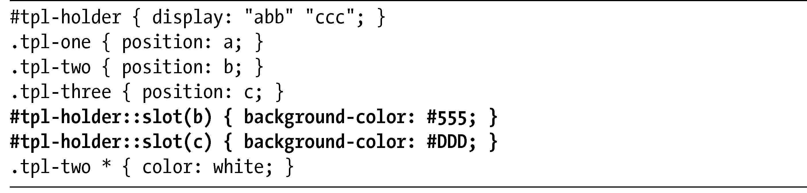
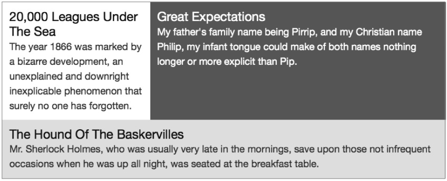
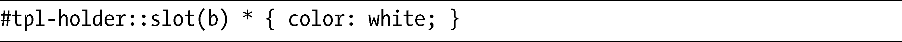
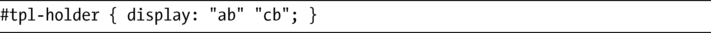
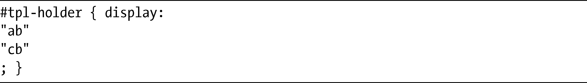
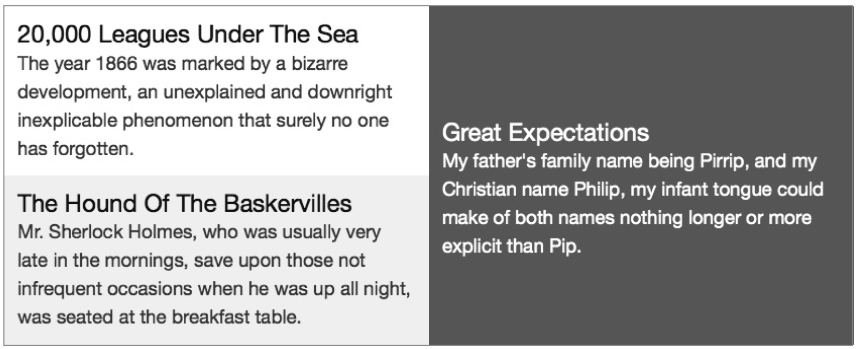
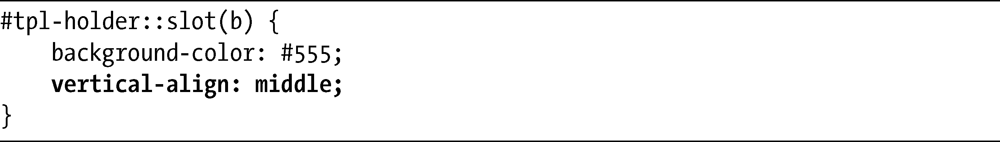

### 16.4　槽与::slot()伪元素

你也可以让元素跨越多行，但在我展示它如何工作之前，需要介绍槽（slots）的概念。行字符串中的字母创建了一个被称为槽的区域，到目前，本章使用的所有例子都有三个槽——位置a、b和c——尽管根据它们在行字符串中占据的位数的不同，槽在大小上有各种变化。在图16-4所示例子中，位置b的元素是位置a的元素的两倍宽，而位置c的元素是位置a的元素的三倍宽，不过，每一个元素都只占据单独一个槽。

> 注意：
> 每一行的高度会根据其中的元素高度自动计算——尽管你也可以手动调整，就像我们在本章后面会看到的。

如果我去掉图16-4的元素边框，稍微改变一下颜色，你就可以更加清晰地看到槽。我会在新的::slot()伪元素的帮助下去实现，这个伪元素能够把一系列（有限的）属性直接地应用到每个槽上。在下面展示的相关代码中，我已经将::slot()突出显示出来：

你可以在图16-5中看到演示的结果。

<b class="my_markdown">图16-5　使用::slot()伪元素使布局槽显露出来</b>

你可以看到，在b槽中的元素应用了深灰色（#555）的background-color，而c槽中的元素有浅灰色（#DDD）的背景。在下面，注意我使用元素的类名而不是槽去应用white文本颜色。你也许想知道我为什么不使用下面这种方法去代替：

这是因为，槽仅仅是一个概念，它没有出现在文档树中，实际上也不是在它里面的元素的父元素。如果你还无法理解也不用担心——你只要知道::slot()伪类不能够用作选择器的一部分就行了，除非选择的是它本身。

现在你应该能够理解槽的概念了，我也可以更轻松地演示元素如何才能跨越多行。这一解释真的是非常简单的：如果元素要跨越多行，那么你可以在这几行相同位置上使用同一个字母。以下是一个直接的例子：

你可以看到，b是两行中的第二个字符。如果你要更清晰地看看这一布局，我们可以把代码调整为另一种格式：

这是一种编写代码非常好的有效方法，顺便说说，如果你要设计更为复杂的布局，也许就要好好考虑这种方法。不管怎样，我们先看看图16-6中这段代码的结果。

位置a和位置c中的元素占据了所在行的一半宽度，而位置b中的元素不仅仅占据了一半宽度，而且还跨越了两行。对于跨越多行的技术，你在使用HTML表格的时候应该比较熟悉了，这里这种技术也是以类似的方式工作的。

<b class="my_markdown">图16-6　跨越多行的槽</b>

你大概注意到，位置b的元素中的内容被垂直对齐到槽的中间。我使用这个属性，是之前提到过的::slot()伪元素所允许的其中一个属性：

所有的background-*属性我们都可以使用，还有vertical-align和overflow。有些人建议把box-shadow和direction添加到候选名单中，但在我写这本书的时候，模块尚未做出改变。

