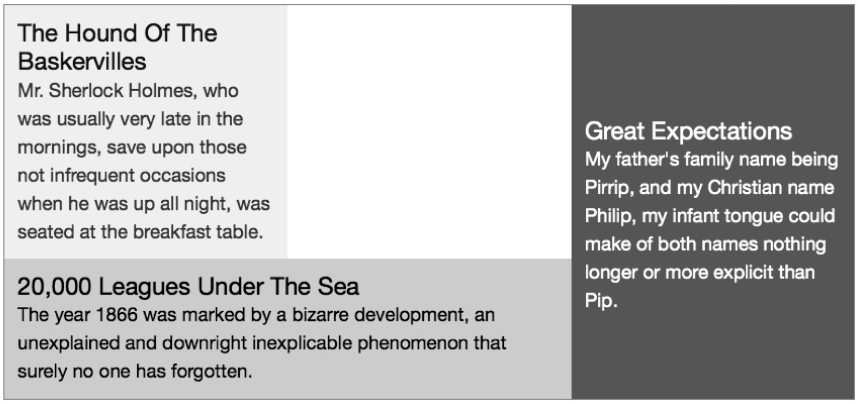

### 16.5　创建空槽

除了字母之外，我们在行字符串中还可以使用几个特别的字符。其中第一个是点号（.），可以用作为隔离区，以创建空的槽，就像下面的例子一样：

你可以在图16-7中看到这一演示。

<b class="my_markdown">图16-7　使用点号创建隔离槽</b>

这个例子有两行，但是被划分为三列（每一列占据了父元素三分之一的宽度）。在这段代码中，第一个行字符串的第二个字符就是一个点号，所以在第一行的中间列产生了一个空的槽，如上所示。

