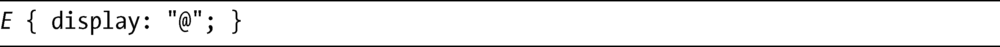
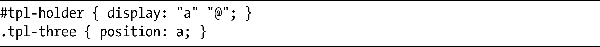
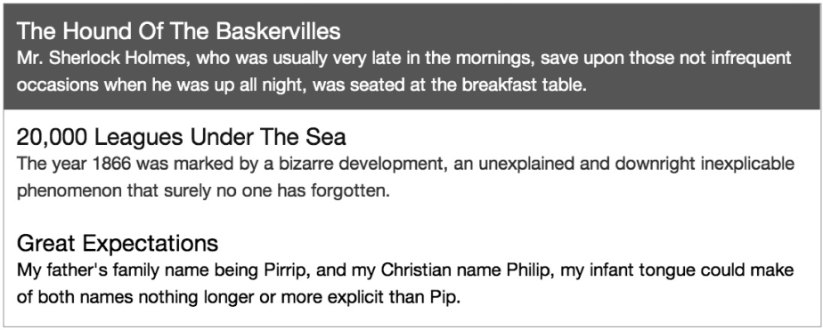
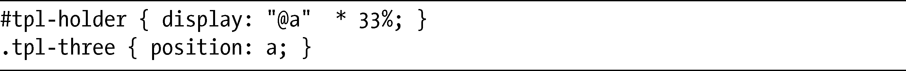
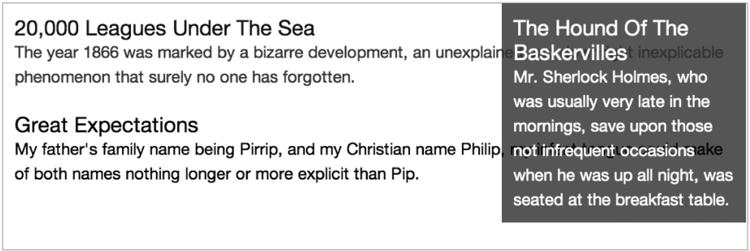
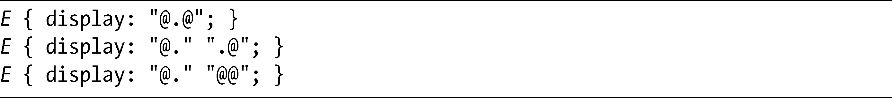

### 16.7　默认内容：@符号

我在本章前面介绍用于间隔的点号（.）时讲过，某些字符可以用在行字符串中。而另外一个允许使用的字符是at符号（@），代表元素中的默认内容，这里指的是所有没有分配到槽中的子元素。这就是它的样子：

这句代码仅仅显示处在原来位置中的内容，也许不是非常有用。但是考虑一个更加实际的例子，就像下面这个演示，利用了我在这一章所使用的示例标记：

你可以在图16-11中看到这是如何起作用的。

<b class="my_markdown">图16-11　原来在位置c中的元素通过使用at号（@）已经移到其他内容的上方</b>

这里的布局由两行组成。第一行中的元素是position值为a的元素，是示例标记中最后一个子元素；第二个行字符串包含了@字符，表示未指定的所有东西，所以任何不在位置a的元素中的内容都会被放置在这一行中。

改变display的值，我们就可以轻松地对元素重新布局：

图16-12展示了这一结果。

<b class="my_markdown">图16-12　@符号把元素定位到默认内容的右侧。</b>

这里，我只有单独的一行，而位置a中的元素，宽度是33%，现在位于元素中其余内容右侧的一列中。

> 警告：
> 在图16-12中，默认内容没有被折叠，而是隐藏在右列的下面。我无法断定该错误是发生在规范中还是在JavaScript的实现中，也许只有到浏览器开始实现这一模块的时候，我们才能把情况弄清楚。

每个布局只可以使用一个@槽（尽管该槽可以跨越多行或多列），并且槽只能是矩形的。所以，下面这些用法都是不允许的：

第一、第二种情况，需要使用两个@槽；而第三种情况，@槽会形成L形。这几个例子全部都是无效的。

