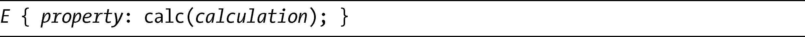
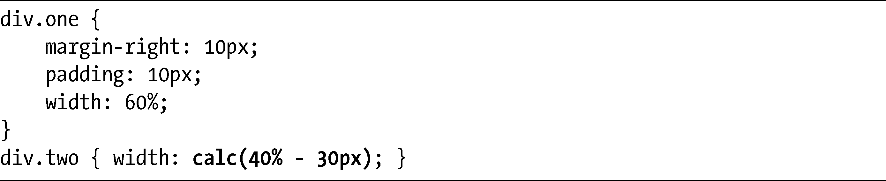
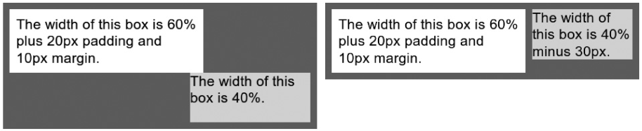
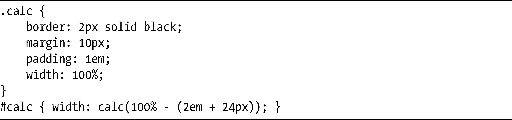
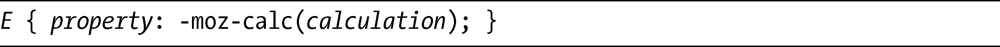
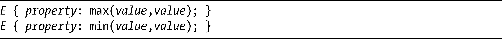
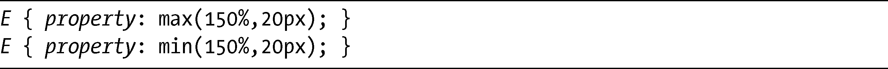
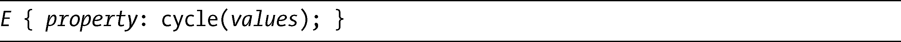
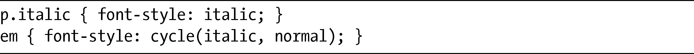
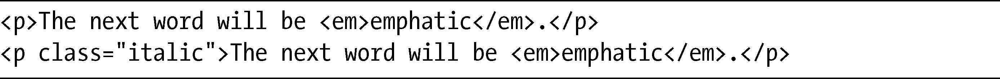

### 17.1　数学运算

我在第10章介绍appearance属性的时候，简单地提到CSS3取值与单位模块（Values and Units Module，<a class="my_markdown" href="['http://www.w3.org/TR/css3-values/']">http://www.w3.org/TR/css3-values/</a>）。尽管该模块当前还在修订当中，甚至还没有进入工作草案状态，但是它的几个有趣的新函数也值得我们在此强调一番。这些函数是个巨大的进步，令CSS完全不仅仅是一种描述性的表现语言，更是朝着编程语言（或者至少是计算语言）的方向发展。因此，任何有编程语言经验（包括JavaScript和PHP在内）的人，在领会我即将介绍的这些概念时，应该都不会有什么障碍。

### 17.1.1　计算函数

在CSS2中，所有长度值都是被声明出来并且是固定的，所以在创建几种长度单位混合在一起的布局的时候就可能会发生问题。比如说，考虑这样一个元素，它的宽度是60%，而margin-right是10px。为了让另一个元素漂浮在它的右侧，必须要知道父元素的宽度——还要得到该元素的宽度——然后在计算的时候再减去10px，就能得到新的浮动元素的width值。加上元素还可能拥有的边框或填充，所以即使在最好的情况下，计算出放置位置也会变得非常棘手并耗费时间，在某些情况下，这更是完全不可能的。

CSS3引入了calc()函数，目的就在于负责计算此类问题，从而能够实现更加动态、灵活的布局。其语法如下：

在代码中我并没有指定一个属性，因为calc()可以应用到所有接受长度值的属性上：border-width、font-size、height、margin、padding，在此仅举几例。calculation值支持简单的算术，可以使用以下5个基本运算符：加（+）、减（–）、乘（*）、除（/）和mod。

> 注意：
> 大家都能够理解前4个运算符，但mod也许还要解释一下。计算模运算的值被写为a mod b，基本上，模运算得到的值是a被b除整数次后留下的值。例如：20模除3等于2，因为20可以被3除6次，余下的值就是2（3 × 6 = 18，20 – 18 = 2）。

这些运算符可以被用于长度值或者是数字，就像下面这些例子一样：

对于我在这一节开头所使用的假设的例子，可以使用calc()去解释第一个元素的margin-right和padding：

结果如图17-1所示。在第一个（左）例子中，方框宽度被设置为40%，但是第二个方框被第一个方框上额外的边距和填充推挤到新的一行。在第二个（右）例子中，提供给calc()的值已经抵消了第一个方框的边距和填充，所以两个方框保持在相同的水平线上。我说过，如果没有calc()的话，我们就必须要知道父元素的精确宽度，才能够做出这样的调整——使得使用弹性宽度进行布局多少失去了意义。

<b class="my_markdown">图17-1　在第二个例子中，我使用calc()函数设置第二列的宽度</b>

不过，你可以进行一些更简单的计算，正如下面的例子所展示的。看看这段代码：

结果如图17-2所示。这里，你会看到两个完全相同的元素，每个元素都赋予了100%的宽度。边框、填充和边距所产生的额外宽度使得左边的例子相对其包含元素来说太宽了一些，而溢出部分会在右边被裁剪。不过在第二个例子中，我使用calc()函数从宽度中减去那些值，所以它在父元素里面会很合适——而真正有用的地方是如果我们这样做的话，就可以把三种不同的长度单位（百分比、em和px）混合起来使用。

尽管Firefox 4 Beta也有带-moz-前缀的实现，但IE9将会是第一个完全实现calc()的浏览器：

<b class="my_markdown">图17-2　我使用calc()函数去设置右边例子的宽度，所以子元素不会溢出到它的父元素之外</b>

另外还有两个计算函数，也可以用在带长度值的元素上，分别是max()和min()。以下是它们的语法：

这两个函数会比较提供给它们的值，然后应用符合规定条件的一个值。也就是说，如果我同时为它们提供一样的两个值，max()函数将会应用最大的值，而min()函数将会应用最小的值。我们来看一个例子：

这两个函数的作用就像是逻辑语句的简写：“应用150%的值或者是20px的值，取其中较大/较小的一个。”所以，如果假定150%等同于15px，max()函数会应用20px到属性上——因为20px要大于15px——因此，min()函数应用的是150%（15px）的值。

max()和min()计算函数当前只存在于取值与单位模块的编辑者草稿中。Firefox的每日构建版本已经使用-moz-前缀实现过这些函数，但之后的构建版本似乎又把它们去掉了。

### 17.1.2　循环

在编程语言中另一个常见的功能是循环（cycling），这是一个重复过程，可以让一系列的值起作用。假定有a、b、c三个值，循环将从a开始，移到b，之后是c，然后又再回到a，接着再次开始这一循环。CSS中循环的方法目前还不在取值与单位模块中，尽管看上去已经计划包含进来了。它的语法非常简单：

values是用逗号隔开的值列表，这些值是指定属性所允许的——例如，你不能够把颜色值应用给font-size属性，这些值之后会按照顺序，根据某种条件进行循环。我们来看一个实际的例子，先看看这个CSS片段：

我会把这个代码片段应用到下面的示例标记上：

第一个句子被当作是“正常的”情况，包含在em元素中的单词把italic值应用到它的font-style属性上，单词应用了cycle()记号中的第一个值。不过在第二个句子中，em元素中的单词已经从它的父元素继承了italic值，所以循环中的下一个值，normal，反而会被应用。

我提到过，cycle当前并没有在规范中，但有望在不久的将来被包含进来。尽管在我写这本书的时候它还没有在任何浏览器中实现，但cycle已经被列出将包含在Firefox以后的版本中。

