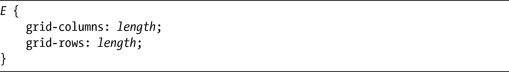
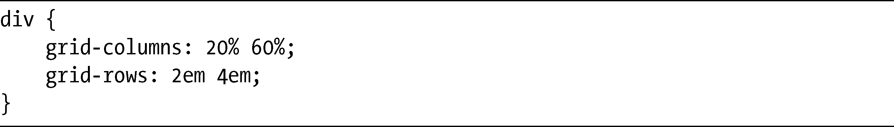
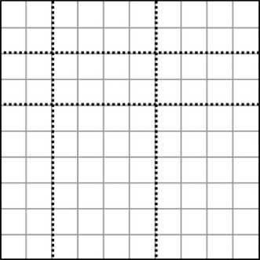
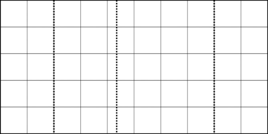
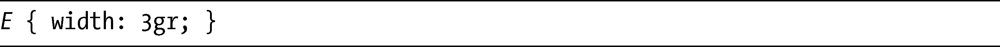
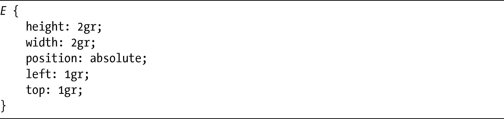
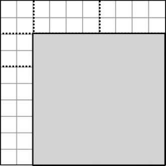
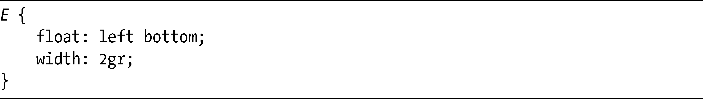

### 17.2　网格定位模块

除了在前面第15章和第16章中推荐的两种被提议的新布局方法以外，还有第三种方法，网格定位模块（Grid Positioning Module，<a class="my_markdown" href="['http://www.w3.org/TR/css3-grid/']">http://www.w3.org/TR/css3-grid/</a>）也已经被提出来——尽管该模块当前还没有在任何浏览器中实现。该模块的主要优势是用来扩展其他的模块或者单独使用。网格定位模块由三个核心概念组成：隐式与显式网格（implicit and explicit grids）、网格单元（grid unit，gr）和扩展浮动（extended floats）。

### 17.2.1　隐式与显式网格

一些HTML和CSS属性创建了自然的网格结构。最明显的例子就是table元素（或者使用CSS声明的display:table进行布局的元素），它提供了整齐的行列数量。但是多列布局（第7章介绍过）也创建了一种网格结构——在一行中拥有多列（以及列之间的间隙，使用column-gap属性进行设置，也被算作是列）。在网格定位模块的语言中，这些网格被称为是隐式网格（implicit grids）。

如果页面布局中的元素没有形成隐式的网格，你就可以使用两个新的提议属性去强制添加一个网格：

网格由划分它们的线进行定义，这两个属性都接受一系列用空格隔开的值——可以是长度单位、百分值或者小数（马上会更详细地讨论）——设置了定义网格行列的线的位置。下面是一个例子：

这个例子创建了一个3乘3的网格，其中列分割线被放置在网格宽度20%和60%的位置上——所以第一列有20%宽，第二和第三列有40%宽。行分割线放置在距元素顶部2em和4em的位置——所以第一行和第二行都是2em高，而第三行则是父元素的剩余高度。假设div是100px宽乘以100px高，而1em相当于10px，该网格如图17-3所示。

<b class="my_markdown">图17-3　产生行列的网格线图示</b>

为了帮助实现更加复杂的网格布局，我们可以使用repeat()，对值进行重复设定以填充父元素的长度。下面是一个例子：

这句代码创建了占据父元素宽度25%的一个网格列，之后剩余的宽度会使用1em和3em宽的列交替填充。

我说过，你也可以使用分数（fraction）作为单位。分数是一个带单位fr的数值——例如，1fr、3fr或者4.5fr——作为一个比值去除未分配的长度（类似我在第15章介绍的弹性方框布局）。为了解释清楚我的意思，看看这个例子：

该代码创建了一个四列的网格。第一条网格线距左侧40px，最后一条距右侧20%，第三条网格线在上述两条线之间的一个点上，这一点就是两线之间的宽度按照2:3划分的点。假设元素有200px宽，第一列和最后一列将有40px宽（200px的20%等于40px）。剩下120px的空间按照2:3的比例分配，意味着第二列是48px，而第三列是72px。结果如图17-4所示。

<b class="my_markdown">图17-4　使用分数值创建网格</b>

在该模块的语法中，我们使用这些属性所形成的网格被称之为显式网格（explicit grid）。

### 17.2.2　网格单元（gr）

有了网格之后，不管是隐式还是显示，你都可以开始把元素放到里面。为此，你需要使用新的网格长度单位，缩写成gr。你可以在任何以长度单位为值的块元素属性上使用gr，它的值是一个用于测量网格单元（或者单元格，如果你喜欢这么叫的话）的数字。所以如果想让一个元素跨越三列，可以使用这句代码：

你也可以使用gr单位，让元素跨越多行，并且作为定位的偏移，如下所示：

上面这个例子有一个跨越了两行和两列的元素，并且被绝对定位在距离左边一列和顶部一行的位置上，如图17-5所示。

<b class="my_markdown">图17-5　使用gr单位定位元素的图示</b>

### 17.2.3　扩展的浮动

网格定位模块的最后一个组件借用了CSS GCPM（Generated Content for Paged Media，分页媒体内容生产）模块的概念（<a class="my_markdown" href="['http://www.w3.org/TR/css3-gcpm/']">http://www.w3.org/TR/css3-gcpm/</a>），这听上去有点绕口。它借用的这个概念其实是float属性的扩展，可以接受更大范围的值，允许把元素放在一个网格中，让内容在它周围流动。

> 注意：
> 在本书中我完全没有谈到GCPM模块，因为它是一种专门用于处理印刷材料或类印刷材料的技术。

正如你所了解的，float当前可以使用的值只有left、right或者none。但在网格定位模块中，你可以赋予更多可能的值，然后使用gr长度单位把这些值组合起来，从而能够更加精细地控制元素的放置。考虑这个例子：

其中的元素将会在底部流动并流到指定的列的左侧，并且将会跨越两列。

预测该模块是否会被实现是非常困难的。这个模块是由微软员工所编写的，所以它有很好的血统，但是从2008年以来就没有更新了，所以它的未来看上去也是不确定的。

