### 17.3　扩展图片的可能性

CSS3引入了许多新的方法去，和那些到现在还在使用图片（圆角边框、阴影，等等）解决的问题做斗争。但是，图片仍然是使用CSS必不可少的一部分，不管从装饰性的背景到CSS精灵方法等诸如此类的东西。在这种情况下，如果真的只有一个方法可以在属性上设置图片，似乎就有点儿局限了：

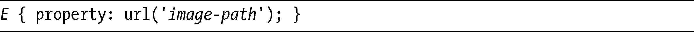
这种方法可以起作用，但不是非常的灵活。一个仍深处发展之中的新规范，图片取值与替换内容模块（Image Values and Replaced Content Module，<a class="my_markdown" href="['http://www.w3.org/TR/css3-images/']">http://www.w3.org/TR/css3-images/</a>，以后会简称为图片模块），目标就是通过扩展CSS中使用图形实现的功能来改变这一现状。

### 17.3.1　图片回退

我们面临的第一个主要的障碍是如果一张指定的图片没有找到或者不支持该图片的文件类型——你就没有回退的选项可用于显示替代图片。有了background-image属性，你就可以选择提供多个值，但这个属性也有它的缺点，它并不是真正用于提供回退机制。例如，如果第一选择的元素有透明的背景，第二选择的元素就会从第一个元素下方显露出来。

现在，有一种提议的解决方案是使用新的image()记号，其语法如下：

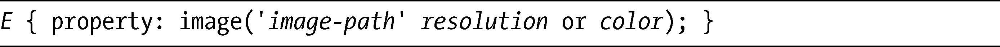
第一个值，image-path，作用和在url()记号中使用的值相同，代表一个指向图片文件的路径。之后，你有一个可选的resolution值和一个可选的关键字or，带有一个color值，如果提供的图片路径无效的话就可以用它作为背景颜色。我们来看看一个实际的例子：

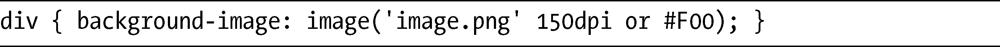
这句代码表示“以150dpi（每英寸点数）的分辨率显示图片image.png，或者把background-color设置为#F00”。你可以在图片和分辨率值之后用逗号隔开，列出更多的图片去添加更多的选择。这种解决方案的作用类似于background-image（带多个值），但将只会显示第一张有效的图片，忽略列表中后续的所有项目。

以下是更进一步展示多图片路径的例子：

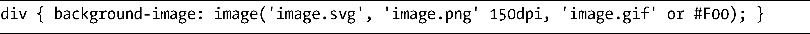
这里，我扩展了前面的例子，所以它的逻辑语句现在是“显示image.svg作为第一个选择，或者150dpi的image.png作为第二选择，或者把image.gif作为第三选择，如果这些图片都不可用的话，就把background-color设置为#F00”。

### 17.3.2　图片切割

回顾第8章，我向你展示了Firefox建议的image-rect()记号，用于定义图片裁剪的区域。CSS3图片模块有一个可选的建议，扩展了url()记号。其语法如下：

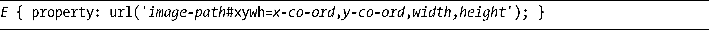
和以前一样，image-path值是指向有效图片的路径，但后面跟着的#xywh和四个整数值：这四个值中的第一对值定义了在图片上创建的矩形的左上角的x 坐标和y 坐标，而第二对值则定义了矩形的宽度和高度。当然，该矩形就是图片将会显示的区域。

考虑这个例子：

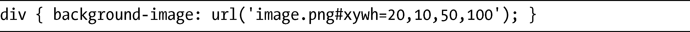
这里，div元素把图片文件image.png设置为它的background-image，但并非使用整张图片，而是只有50px宽、100px高，距离图片文件左边20px、顶部10px的区域才会被显示。

为了更进一步展示，我们回过头来看看第8章图8-7中的第一个例子。在这个例子中，我使用image-rect()语法对一张图片进行了裁剪：

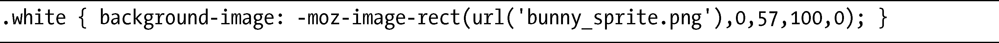
这是我在新的建议语法中实现的：

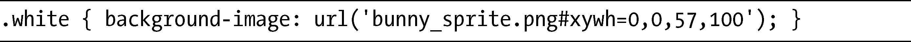
实际上我在两个语句中使用了相同的坐标值，仅仅是顺序不同。这些语句都还没有最终确定（据我所知），我自己感觉image-rect()看上去更符合现有的CSS语法，但毫无疑问上面的替代方案更为简洁一些。

### 17.3.3　图片精灵

图片模块也提到一种专用的图片精灵（Image Sprites）语法，我在第8章简单地提过。该技术有两种候选方案被提出来，但是最终还没有决定哪一种方案将会被实现。第一种提案使用一种新的@sprite规则，该规则定义了一个网格矩阵，这一矩阵可以使用一个唯一的id和矩阵坐标来引用。以下是它的语法：

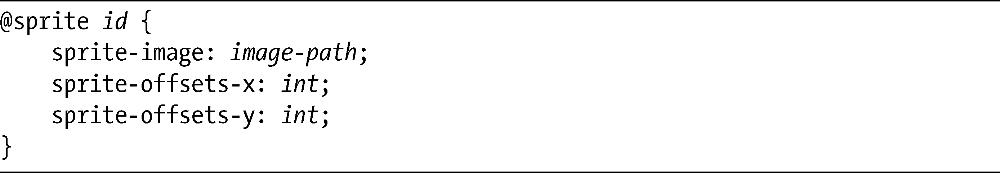
在第一行，我为这个精灵创建了一个唯一的id，以便可以在后面的规则中去引用它；在第二行，我指定了图片文件。最后两行的属性接受一个用空格隔开的整数列表，指定图片上的坐标并创建出一个网格矩阵。

下面是一个简单的例子：

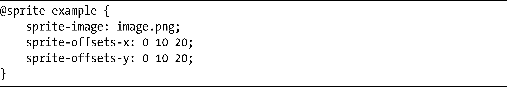
这个例子中，唯一的精灵标识符是example，使用的图片是image.png，对于这个例子，假定宽度和高度都是30px。然后，我把三个x 坐标设置为0、10px和20px，三个y 坐标也设置为同样的值，意味着示例图片被分成一个具有 9 个相同大小的单元格矩阵（10px乘10px），如图17-6所示。

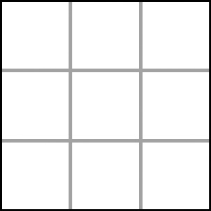

<b class="my_markdown">图17-6　3乘3网格矩阵的图示</b>

下一步我们要引用精灵的id和要在元素上应用这个精灵的矩阵坐标：

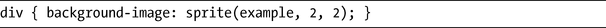
在这个div上，我使用了sprite()记号去引用标识符为example的精灵，然后使用图片上位于矩阵坐标2，2的那一部分。其中每一列和行是都是从0（零）开始顺序编号，所以第一行中的第一列的坐标就是0，0。这样，示例矩阵中位于2，2的单元格就是在右下角，如图17-7所示。这一部分的图片将会显示出来。

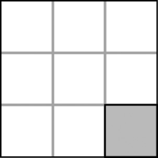

<b class="my_markdown">图17-7　位于矩阵坐标2,2上的单元格</b>

还有第二个提案仍处于研究当中的，所以多少有些不太明确，但该提案也使用了at规则——这次用的是@define记号（它也是CSS变量语法所提议的，我在这一章后面会介绍）。在这个提案中，所有的精灵通过这种语法都被赋予了一个唯一的变量名：

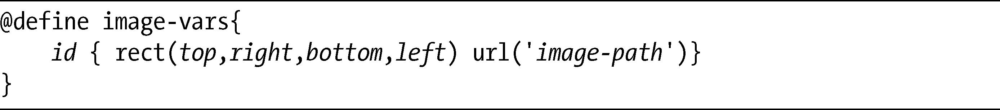
这里，先使用@define规则去调用图片变量，之后给每个变量一个唯一的id，然后用rect()记号定义要使用的图片区域。这四个整数所表示的值分别是图片区域的上、右、下、左，全部都使用像素从左上角开始计算，和CSS2的clip()属性（以及第8章展示的CSS3 image-rect()属性）完全一样。

之后，url()记号定义了要为这个精灵使用哪一张图片，所有需要用到的精灵都可以重复使用这一表示方法，然后在列表中用逗号隔开：

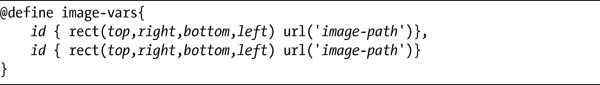
这是一个简单的现实中的例子：

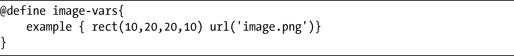
这段代码以标识符example创建了一个变量，然后把一张图片裁剪为10px宽和10px高，距图片image.png的左边和顶部10px——和我用来演示第一个提案的例子完全一样。之后就可以把id指定给要应用精灵的属性：

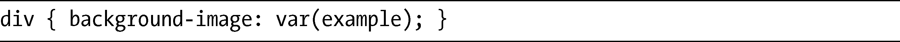
第一个提案的优点是可以做到更加精确和更少的重复，并且对于把单独一张大图片裁切成小片的场景更加适用。第二个提案会有更多重复，但是它的优点是重用了大量的现有语法，如果有许多不同的图片需要裁切的话可能更为适合。至于哪一种会成为官方提案——我就完全不知道了。也许两个都不会呢！

