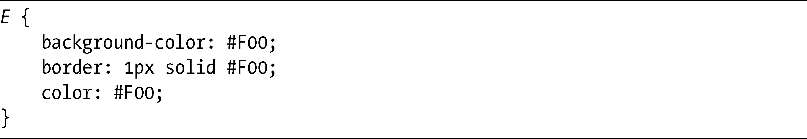
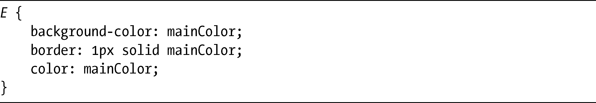
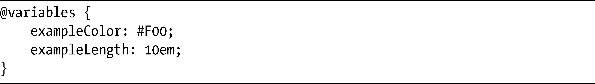
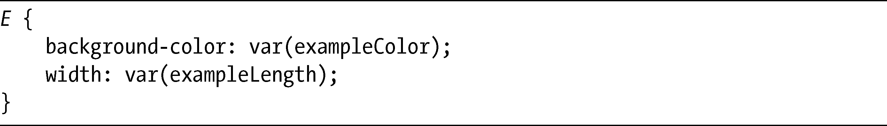
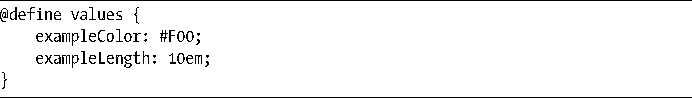
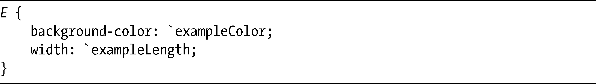
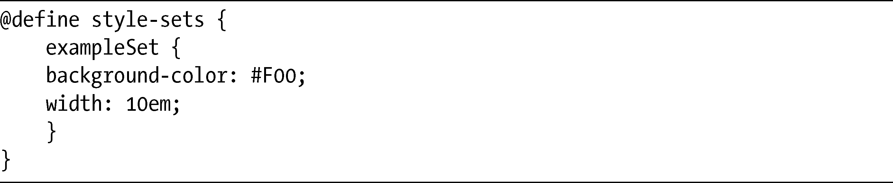
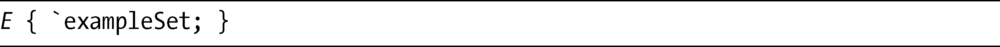
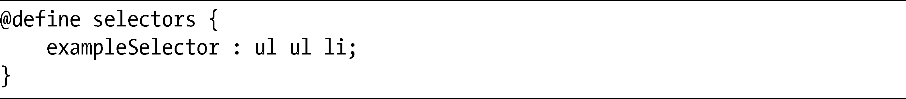

### 17.5　常量和变量

在第10章，我介绍了currentColor，它成为了CSS中的第一个的变量。为了防止你没有编程的背景，在此我要说明一下，变量和常量都是代表数据的字符串，它的值可以被改变（变量）或者是固定的（常量）。我们用实例来说明，考虑相当常见的这样一组声明：

这个相同的颜色值可以用在许多样式表中，但如果你总是要改变它的话，就必须在它出现的每个地方去更新它——至少，也要使用“查找并替换”的方法。但是变量和常量的优点使得你可以定义一个代表该值的字符串——假设你使用字符串mainColor，为它赋值为#F00——然后使用该字符串来代替：

现在，如果你要改变这种颜色，只需要更新mainColor的值，然后新的颜色就会自动应用到所有设置了mainColor的元素上。这就是它的原理。

为CSS中的变量或常量定义语法的想法已经出现了许多次，但一直都没有被CSS工作组所接受。尽管一些坚定的反对似乎来自于CSSWG内部，但是有两个竞争的提案已经被提出。其中第一个提案是由Daniel Glazman（他是CSS工作组的联合主席）和Dave Hyatt（WebKit的重要人物）所提出的，所以该提案具有相当好的血统。他们的CSS变量的概念（<a class="my_markdown" href="['http://www.disruptive-innovations.com/zoo/cssvariables/']">http://www.disruptive-innovations.com/zoo/cssvariables/</a>）在理念上类似于我在这一节的介绍部分使用的例子，它的简单性也非常令人折服，第一步就是使用新的@variables at规则去定义字符串和值对：

这些字符串之后可以被用为var()记号中的值，我们可以把这个值应用到相关的属性上：

第二个提案，CSS常量（<a class="my_markdown" href="['http://fantasai.inkedblade.net/style/specs/constants/']">http://fantasai.inkedblade.net/style/specs/constants/</a>）则是由另外一个CSS工作组的成员所创建的，它更加的灵活，允许有三种不同类型的常量：值、样式集和选择器。其中的第一种常量——值，工作方式类似于我刚刚描述的CSS变量提案，在@define at规则中设置：

在该提案中，需要使用重音符（`）去调用常量：

不过，CSS常量比CSS变量走得更远的地方，是你可以用它们来定义整个样式集，就像在下面的代码示例中这样：

之后你可以把这整个样式集应用到一个属性上，只需要简单地使用常量字符串，同样要带重音符：

这个提案也允许你把多组选择器赋给一个常量：

同样，你可以引用选择器链中的常量（带重音号）：

两个提案不但有语法上的差异，在作用范围上也有所不同：CSS变量中的值会被其他样式表自动地继承，这些样式表可以使用@import规则去调用；而CSS常量中的值在默认情况下则不会被继承，尽管如果需要的话我们也可以选择让它们允许继承。

两个提案都有它们的吸引力——变量的简单性，常量的灵活性，而在现实世界中，我想要看到这两者的混合。我认为选择器常量不是真的有必要，但是值和样式集都是很好的想法，在此也希望CSS工作组能够最终做出决定。

